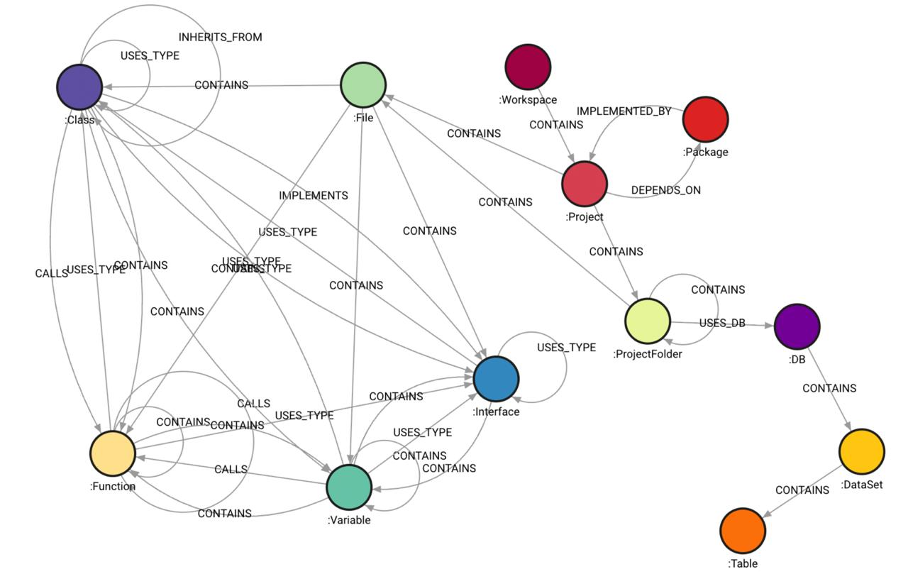

# CodeExplorer 🔍

[](LICENSE)
[](https://dotnet.microsoft.com/download)
[](#docker-deployment)

**CodeExplorer** is an ontology-driven, multi-language codebase parser, indexer, and query service. It processes source repositories into a rich, queryable knowledge graph stored in **Memgraph** (or Neo4j), enabling advanced static analysis, architecture visualization, dependency mapping, and LLM-assisted code understanding.

It also serves as a **Model Context Protocol (MCP)** server, allowing AI agents (such as Gemini, Claude, or ChatGPT) to recursively explore, query, and refactor the repository graph using Cypher.



---

## 🚀 Key Features

*   **Dynamic On-the-Fly Scanning**: Recursively scans directories to detect project boundaries dynamically without hardcoded limits.
*   **Multi-Language AST Parsing**: Full AST-level parsing powered by **Tree-sitter** and Microsoft SQL **ScriptDom**:
    *   **C#** (`.cs`)
    *   **TypeScript** (`.ts`, `.tsx`)
    *   **JavaScript** (`.js`, `.jsx`)
    *   **Go** (`.go`)
    *   **Python** (`.py`)
    *   **SQL & Embedded SQL** (`.sql` scripts, as well as SQL strings embedded inside C#, JS, TS, Python, and Go code)
*   **Rich Ontology Extraction**: Extracts and maps:
    *   *Structural*: Workspaces, Projects, Folders, Files.
    *   *Code Elements*: Classes, Interfaces, Functions, Procedures.
    *   *Data/Database*: Tables, Database nodes, Schemas/DataSets, SQL queries (inserts, selects, deletes, updates, etc.).
    *   *Messaging & APIs*: Service Ingress/Egress, EntryPoints (controllers, subscribers), and ExternalServices (HTTP/HttpClient calls, publishers).
*   **Global Resolution & Late Binding**:
    *   Resolves type inheritance (`INHERITS_FROM`), interface implementations (`IMPLEMENTS`), and function calls (`CALLS`).
    *   Late-binds API endpoints and message queue topics across microservices dynamically once all project scans are completed.
*   **High Performance Ingestion**: Fast bulk/batch uploads enqueuing nodes and relationships in batches of 1000 through asynchronous database channels.
*   **Model Context Protocol (MCP) Server**: Provides specialized tools for AI coding assistants to retrieve dependency maps, project entry points, structural taxonomies, and refactoring opportunities.

---

## 🛠️ Tech Stack & Requirements

*   **Runtime**: [.NET 10.0 SDK](https://dotnet.microsoft.com/download)
*   **Database**: [Memgraph](https://memgraph.com/) (running locally via Docker)
*   **AST Parser**: Tree-Sitter & Microsoft T-SQL ScriptDom
*   **Deployment**: Docker & Docker Compose

---

## 🏁 Getting Started

### 1. Run the Database (Memgraph)
CodeExplorer uses Memgraph as its graph database. Run it via Docker:

```bash
docker run -it -p 7687:7687 -p 7444:7444 memgraph/memgraph-platform
```

You can view the visual graph interface by navigating to `http://localhost:7444` in your browser.

### 2. Build the Project
You can build the project and run all tests using the provided build script:

```bash
# Make the build script executable and run it
chmod +x build.sh
./build.sh
```

### 3. Build & Run via Docker
To compile the application and build a Docker runtime container:

```bash
# Build the Docker image
docker build -t codeexplorer:latest .
```

---

## 💻 CLI Usage

The entry point of the application is the `UI/CodeExplorer` console project. It supports three modes: **ingestion**, **querying**, and **MCP server**.

### A. Ingest/Index a Workspace
Scan a target codebase directory and index it into Memgraph:

```bash
dotnet run --project UI/CodeExplorer/CodeExplorer.csproj -- ingest --dir "/path/to/your/codebase" --clear
```
*   `--dir`: The absolute directory path of the codebase to index.
*   `--clear`: Clears the previous data for this workspace before scanning.
*   `--clear-all`: (Optional) Wipes the entire Memgraph database before scanning.

### B. Execute a Cypher Query
Run custom Cypher queries directly against the graph from the command line:

```bash
dotnet run --project UI/CodeExplorer/CodeExplorer.csproj -- query --query "MATCH (n:Project) RETURN n.name"
```

### C. Start the MCP Server
Launch the Model Context Protocol (MCP) server over SSE (Server-Sent Events) to expose codebase intelligence to AI tools:

```bash
dotnet run --project UI/CodeExplorer/CodeExplorer.csproj -- mcp --port 8085
```

---

## 🤖 Model Context Protocol (MCP) Tools

Once the MCP server is running (e.g. on port `8085`), it registers the following tools for AI assistants:

| Tool Name | Parameters | Description |
| :--- | :--- | :--- |
| `get_taxonomy` | None | Returns a summary of all entity types and relationships current in the graph database. |
| `get_architecture_map` | None | Returns the high-level project structure and dependencies inside the workspace. |
| `execute_custom_read_cypher` | `query` (string) | Executes a read-only Cypher query and formats the results. |
| `get_project_entry_points` | `projectName` (string) | Lists all detected controller endpoints, message subscribers, and handlers in a project. |
| `find_refactoring_opportunities` | `projectName` (string), `metricType` (string) | Automatically scans for anomalies like dead code (uncalled functions/classes). |
| `get_project_dependencies` | None | Lists all internal and external package/project dependencies for all projects. |

---

## 📂 Project Structure

```text
├── Core/
│   └── CodeExplorer.Core/       # Core parsing engines, ontology definitions, database client, and MCP handlers.
├── Parsers/
│   ├── CodeExplorer.Parser.CSharp/       # C# AST Parser
│   ├── CodeExplorer.Parser.Go/           # Go AST Parser
│   ├── CodeExplorer.Parser.Python/       # Python AST Parser
│   ├── CodeExplorer.Parser.SQL/          # SQL ScriptDom Parser
│   └── CodeExplorer.Parser.TypeScript/   # TypeScript/JavaScript AST Parser
├── UI/
│   └── CodeExplorer/            # Command Line Interface (CLI) and Web API (MCP SSE Server) Host.
├── Tests/
│   └── CodeExplorer.Tests/      # End-to-end integration tests and parser validations.
└── build.sh                     # Automated build and test script.
```

---

## 📄 License

This project is licensed under the MIT License - see the [LICENSE](LICENSE) file for details.
