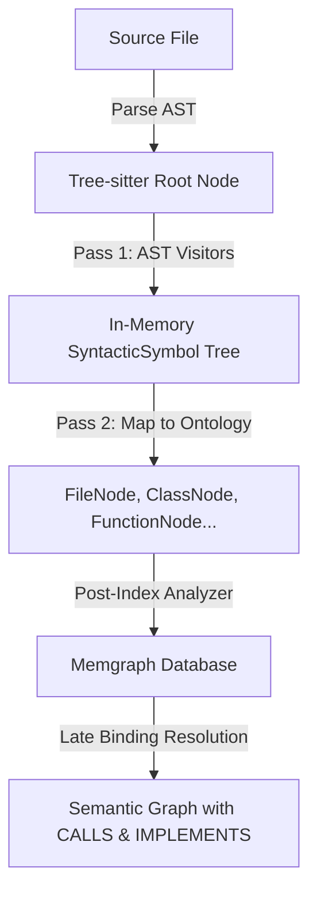

# CodeExplorer 🔍

[](LICENSE)
[](https://dotnet.microsoft.com/download)
[](#docker-deployment)

**CodeExplorer** is an ontology-driven, multi-language codebase parser, indexer, and query service. It processes source repositories into a rich, queryable knowledge graph stored in **Memgraph** (or Neo4j), enabling advanced static analysis, architecture visualization, dependency mapping, and LLM-assisted code understanding.

It also serves as a **Model Context Protocol (MCP)** server, allowing AI agents (such as Gemini, Claude, or ChatGPT) to recursively explore, query, and refactor the repository graph using Cypher.


---

## 🔍 CodeExplorer vs. Classic LSP (Language Server Protocol)

They serve fundamentally different purposes:
* **Classic LSP** is designed for **active human interaction in text editors** (real-time autocompletions, diagnostics, and active inline linting as you type).
* **CodeExplorer** is a **global codebase knowledge graph** designed for structural reasoning, architectural mapping, and multi-hop relationship queries by AI agents and LLMs.

While classic LSPs are optimized for local, real-time editing experiences, CodeExplorer is architected for AI-native code reasoning and cross-project indexing:

| Dimension | Classic LSP (e.g., `gopls`, `Pyright`) | CodeExplorer (Memgraph + MCP) |
| :--- | :--- | :--- |
| **Primary Consumer** | Humans (real-time IDE autocompletion/linting). | **AI Agents / LLMs** (autonomous workspace exploration). |
| **Storage Strategy** | Stateful, in-memory AST caches per editor session. | **Persistent Graph Database** (Memgraph/Neo4j). |
| **Polyglot Scope** | Single-language boundary per server instance. | **Unified Cross-Language Graph** (bridges C#, Go, Python, TS, and SQL). |
| **Querying** | Fixed RPC methods (`goto definition`, `find references`). | **Arbitrary Cypher Queries** (unlimited multi-hop semantic traversal). |
| **Update Loop** | Instantaneous, keystroke-by-keystroke. | Batch ingestion pipeline (triggered via CLI or Webhooks). |

### 🧠 Core Architectural Differences

1. **Language-Agnostic Knowledge Graph vs. Compiler Isolated ASTs**
   * **Classic LSP**: Operates strictly within compile-time boundaries. A C# compiler knows C#, and a database server knows SQL, but they cannot talk to one another.
   * **CodeExplorer**: Normalizes ASTs from multiple languages (via Tree-sitter and SQL ScriptDom) into a single, unified taxonomy inside a graph database. This lets you trace connections from a React frontend HTTP post to an Express route, to a database connection write.

2. **Querying Capabilities**
   * **Classic LSP**: Provides predefined features (Find References, Rename, Signature Help).
   * **CodeExplorer**: Enables graph traversal algorithms. You can write Cypher queries to detect cyclic dependencies, find unreachable code paths, count coupling metrics between folders, and extract semantic context.

3. **LLM-Native Optimization**
   * **Classic LSP**: Emits details focused on IDE presentation (ranges, lines, hovers).
   * **CodeExplorer**: Emits structured JSON representing architectural layout (e.g., Taxonomy, entry points, dependencies) designed to fit directly into the context window of LLM reasoning engines.

---

## 🚀 Key Features

*   **Dynamic On-the-Fly Scanning**: Recursively scans directories to detect project boundaries dynamically without hardcoded limits.
*   **Multi-Language AST Parsing**: Full AST-level parsing powered by **Tree-sitter** and Microsoft SQL **ScriptDom**:
    *   **C#** (`.cs`)
    *   **TypeScript** (`.ts`, `.tsx`)
    *   **JavaScript** (`.js`, `.jsx`)
    *   **Go** (`.go`)
    *   **Python** (`.py`)
    *   **SQL & Embedded SQL** (`.sql` scripts, as well as SQL strings embedded inside C#, JS, TS, Python, and Go code)
*   **Rich Ontology Extraction**: Extracts and maps codebases into three core structural layers (for a detailed specification, see the [Ontology Specification](docs/ontology.md)):
    *   **File & Directory Structure**: Scans and maps workspaces, projects/module boundaries (e.g., `.csproj`, `go.mod`, `package.json`), project folders, and individual source files.
    *   **Code & Class Structure**: Identifies AST-level nodes (classes, interfaces, enums, functions, methods, and variables) along with their code dependencies and inheritance hierarchy (`CALLS`, `IMPLEMENTS`, `INHERITS_FROM`).
    *   **Ingress & Egress (API & Data Boundaries)**: Resolves system boundaries, mapping incoming **Ingress** (HTTP route controllers, queue consumers, CLI stubs), outgoing **Egress** (external HTTP/gRPC client calls), databases (tables, stored procedures, embedded SQL queries), and message brokers.
*   **Global Resolution & Late Binding**:
    *   Resolves type inheritance (`INHERITS_FROM`), interface implementations (`IMPLEMENTS`), and function calls (`CALLS`).
    *   Late-binds API endpoints and message queue topics across microservices dynamically once all project scans are completed.
*   **High Performance Ingestion**: Fast bulk/batch uploads enqueuing nodes and relationships in batches of 1000 through asynchronous database channels.
*   **Model Context Protocol (MCP) Server**: Provides specialized tools for AI coding assistants to retrieve dependency maps, project entry points, structural taxonomies, and refactoring opportunities.

---

## 🏛️ Architecture: Two-Pass Semantic Pipeline

CodeExplorer uses a decoupled two-pass pipeline to ingest and analyze codebases safely, isolating AST parsing from database mapping and resolution.



### 1. Pass 1: Pure Syntactic AST Visitors
AST parsing is performed in isolation. Language-specific visitor classes (e.g., `CSharpFileVisitor`, `TypeScriptFileVisitor`) inherit from `BaseParserVisitor`.
*   **In-Memory Isolation**: Visitors have no access to database classes, file system IO, or ontology nodes. They process the syntax tree entirely in memory.
*   **Node Extensions**: Employs safety-first helper extension methods (via `NodeExtensions`) to query Tree-sitter nodes safely, handle nullable nodes, extract named field text, and resolve function targets cleanly.
*   **Syntactic Symbol Output**: Visitors output a pure in-memory `SyntacticSymbol` tree describing the hierarchical structure of declarations and references found in the AST.

### 2. Pass 2: Ontology Mapping & Resolution
Once the syntactic structure is captured:
*   **Ontology Mapping**: The parser maps `SyntacticSymbol` trees into concrete database ontology models (`FileNode`, `ClassNode`, `EntryPointNode`, `QueryNode`, etc.).
*   **Late-Bound Resolution**: A post-index analysis pass executes Cypher queries to link cross-file, late-bound dependencies (e.g., connecting a frontend HTTP call to its backend controller endpoint, or resolving interface implementations).

---

## 🛠️ Tech Stack & Requirements

*   **Runtime**: [.NET 10.0 SDK](https://dotnet.microsoft.com/download)
*   **Database**: [Memgraph](https://memgraph.com/) (running locally via Docker)
*   **AST Parser**: Tree-Sitter & Microsoft T-SQL ScriptDom
*   **Deployment**: Docker & Docker Compose

---

## 🏁 Getting Started

### 1. Run the Database (Memgraph)
CodeExplorer uses Memgraph as its graph database. Run it via Docker:

```bash
docker run -it -p 7687:7687 -p 7444:7444 memgraph/memgraph-platform
```

You can view the visual graph interface by navigating to `http://localhost:7444` in your browser.

### 2. Build the Project
You can build the project and run all tests using the provided build script:

```bash
# Make the build script executable and run it
chmod +x build.sh
./build.sh
```

### 3. Build & Run via Docker
To compile the application and build a Docker runtime container:

```bash
# Build the Docker image
docker build -t codeexplorer:latest .
```

---

## 💻 CLI Usage

The entry point of the application is the `UI/CodeExplorer` console project. It supports three modes: **ingestion**, **querying**, and **MCP server**.

### A. Ingest/Index a Workspace
Scan a target codebase directory and index it into Memgraph:

```bash
dotnet run --project UI/CodeExplorer/CodeExplorer.csproj -- ingest --dir "/path/to/your/codebase" --clear
```
*   `--dir`: The absolute directory path of the codebase to index.
*   `--clear`: Clears the previous data for this workspace before scanning.
*   `--clear-all`: (Optional) Wipes the entire Memgraph database before scanning.

### B. Execute a Cypher Query
Run custom Cypher queries directly against the graph from the command line:

```bash
dotnet run --project UI/CodeExplorer/CodeExplorer.csproj -- query --query "MATCH (n:Project) RETURN n.name"
```

### C. Start the MCP Server
Launch the Model Context Protocol (MCP) server over SSE (Server-Sent Events) to expose codebase intelligence to AI tools:

```bash
dotnet run --project UI/CodeExplorer/CodeExplorer.csproj -- mcp --port 8085
```

---

## 🤖 Model Context Protocol (MCP) Tools

Once the MCP server is running (e.g. on port `8085`), it registers the following tools for AI assistants. The graph database schema and relationship models used by these tools are described in the [Ontology Specification](docs/ontology.md).

| Tool Name | Parameters | Description |
| :--- | :--- | :--- |
| `get_taxonomy` | None | Retrieves the full structural taxonomy database schema mapping all active node types and their incoming/outgoing relationships. |
| `get_architecture_map` | `projectName` (string, optional) | Returns the high-level infrastructure map of the workspace, including workspace folders, projects, their internal folders, and associated databases. |
| `get_project_dependencies` | `projectFilter` (string, optional) | Retrieves the complete dependency graph between projects, including direct and transitive package/project dependencies. |
| `get_file_outline` | `filePath` (string) | Extracts the internal outline of a specific file (classes, interfaces, functions, variables, queries) without reading the full source text. |
| `find_symbol` | `name` (string), `symbolType` (string, optional) | Searches the semantic graph for code symbols matching a partial or full name, optionally filtered by type. |
| `get_call_chain` | `startFunction` (string), `endFunction` (string), `maxDepth` (int, optional, default: 5) | Traces and builds a sequential execution call path (call graph) between a starting function and a target function. |
| `resolve_call_target` | `interfaceName` (string), `methodName` (string) | Finds all concrete classes implementing a given interface and points to their real physical function implementations. |
| `analyze_code_impact` | `symbolName` (string) | Performs a blast-radius analysis, tracking all incoming structural links to identify files/components affected by refactoring the symbol. |
| `inspect_data_lineage` | `tableName` (string) | Tracks database change blast radius by finding raw SQL texts, source files, and functions that invoke queries targeting a specific table. |
| `get_project_entry_points` | `projectName` (string) | Finds all architectural entry points inside a project (controllers, endpoints, event handlers, etc.). |
| `find_refactoring_opportunities` | `projectName` (string), `metricType` (string, optional, default: "all") | Scans the project for code health anomalies, identifying dead code and god objects. |
| `execute_custom_read_cypher` | `query` (string) | Executes a custom read-only Cypher query (MATCH only) directly against the graph database. |
| `fetch_code_snippets` | `nodesJson` (string) | Fetches actual source code snippets for a list of serialized JSON node/URN contexts (containing file path, start line, and end line). |
| `get_node_definition` | `kind` (string) | Retrieves documentation and schema details for a specific ontological Node Kind. |

---

## 📂 Project Structure

```text
├── Core/
│   └── CodeExplorer.Core/       # Core parsing engines, ontology definitions, database client, and MCP handlers.
├── Parsers/
│   ├── CodeExplorer.Parser.CSharp/       # C# AST Parser
│   ├── CodeExplorer.Parser.Go/           # Go AST Parser
│   ├── CodeExplorer.Parser.Python/       # Python AST Parser
│   ├── CodeExplorer.Parser.SQL/          # SQL ScriptDom Parser
│   └── CodeExplorer.Parser.TypeScript/   # TypeScript/JavaScript AST Parser
├── UI/
│   └── CodeExplorer/            # Command Line Interface (CLI) and Web API (MCP SSE Server) Host.
├── Tests/
│   └── CodeExplorer.Tests/      # End-to-end integration tests and parser validations.
└── build.sh                     # Automated build and test script.
```

---

## 📄 License

This project is licensed under the MIT License - see the [LICENSE](LICENSE) file for details.
