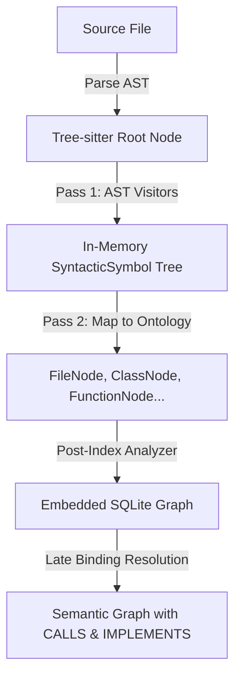

# CodeExplorer (`ce`) 🔍

[](LICENSE)
[](https://dotnet.microsoft.com/download)
[](#-single-file-self-contained-binaries)

**CodeExplorer (`ce`)** is a fast, single-file CLI and Model Context Protocol (MCP) server for deep codebase intelligence. It transforms polyglot repositories into a rich, queryable knowledge graph stored in an **embedded SQLite graph database** (with native Cypher query compilation) — with zero external dependencies, no Docker containers, and no complex configuration.

With `ce`, both developers and AI agents (Claude, Cursor, Copilot, ChatGPT, Antigravity) can perform architectural discovery, trace cross-service dependency topologies, analyze refactoring blast radiuses, and run Cypher graph queries directly from their terminal or editor.


---

## 🔍 CodeExplorer vs. Classic LSP (Language Server Protocol)

They serve fundamentally different purposes:
* **Classic LSP** is designed for **active human interaction in text editors** (real-time autocompletions, diagnostics, and active inline linting as you type).
* **CodeExplorer** is a **global codebase knowledge graph** designed for structural reasoning, architectural mapping, and multi-hop relationship queries by AI agents and LLMs.

While classic LSPs are optimized for local, real-time editing experiences, CodeExplorer is architected for AI-native code reasoning and cross-project indexing:

| Dimension | Classic LSP (e.g., `gopls`, `Pyright`) | CodeExplorer (Embedded SQLite + MCP) |
| :--- | :--- | :--- |
| **Primary Consumer** | Humans (real-time IDE autocompletion/linting). | **AI Agents / LLMs** (autonomous workspace exploration). |
| **Storage Strategy** | Stateful, in-memory AST caches per editor session. | **Embedded Graph Database** (SQLite, zero external dependencies). |
| **Polyglot Scope** | Single-language boundary per server instance. | **Unified Cross-Language Graph** (bridges C#, Go, Python, TS, and SQL). |
| **Querying** | Fixed RPC methods (`goto definition`, `find references`). | **Arbitrary Cypher Queries** (unlimited multi-hop semantic traversal). |
| **Update Loop** | Instantaneous, keystroke-by-keystroke. | Fast index scan via `ce scan` (CLI, CI, or agent task). |

### 🧠 Core Architectural Differences

1. **Language-Agnostic Knowledge Graph vs. Compiler Isolated ASTs**
   * **Classic LSP**: Operates strictly within compile-time boundaries. A C# compiler knows C#, and a database server knows SQL, but they cannot talk to one another.
   * **CodeExplorer**: Normalizes ASTs from multiple languages (via Tree-sitter and SQL ScriptDom) into a single, unified taxonomy inside a graph database. This lets you trace connections from a React frontend HTTP post to an Express route, to a database connection write.

2. **Querying Capabilities**
   * **Classic LSP**: Provides predefined features (Find References, Rename, Signature Help).
   * **CodeExplorer**: Enables graph traversal algorithms. You can write Cypher queries to detect cyclic dependencies, find unreachable code paths, count coupling metrics between folders, and extract semantic context.

3. **LLM-Native Optimization**
   * **Classic LSP**: Emits details focused on IDE presentation (ranges, lines, hovers).
   * **CodeExplorer**: Emits structured JSON representing architectural layout (e.g., Taxonomy, entry points, dependencies) designed to fit directly into the context window of LLM reasoning engines.

---

## 🚀 Key Features

*   **Zero-Dependency Single-File Executable**: Distributed as a self-contained binary (`ce.exe` / `ce`) for Windows, Linux, and macOS. No .NET runtime or SDK installation required.
*   **Local `.codeexplorer` Workspace Auto-Discovery**: Initialized once per repository or mono-repo with `ce init`. Automatically discovered by walking up the directory tree — run commands from any subfolder without specifying paths.
*   **Embedded SQLite Graph with Cypher**: Uses a high-performance embedded SQLite database compiled with custom graph indices and an optimized AST-to-SQL Cypher compiler.
*   **Multi-Language AST Parsing**: Full AST-level parsing powered by **Tree-sitter** and Microsoft SQL **ScriptDom**:
    *   **C#** (`.cs`)
    *   **TypeScript** (`.ts`, `.tsx`)
    *   **JavaScript** (`.js`, `.jsx`)
    *   **Go** (`.go`)
    *   **Python** (`.py`)
    *   **SQL & Embedded SQL** (`.sql` scripts, and inline SQL queries in C#, JS, TS, Python, Go)
*   **Rich Structural Ontology**: Maps codebases across a 5-layer decoupled graph architecture (see [Ontology Model](docs/architecture/ontology-model.md) and [Live Schema Reference](docs/ontology.md)):
    *   *Physical Layer (Layer 1)*: Workspace, projects (`.csproj`, `go.mod`, `package.json`), folders, files, and git topology.
    *   *Project Layer (Layer 2)*: Logical compilation units, project boundaries, and package dependencies.
    *   *Syntactic Layer (Layer 3)*: Classes, interfaces, methods, functions, structs, fields, and calls.
    *   *Semantic Layer (Layer 4)*: Ingress (API endpoints, controllers, event handlers), Egress (HTTP clients, RPC callers), databases, tables, and message queues.
    *   *Late-Bound Layer (Layer 5)*: Cross-project call chains, interface implementations, and service-to-service links.
*   **Built-in & Custom Query Catalog**:
    *   **21 Built-in Queries**: Architecture maps, entry points, dependencies, refactoring (dead code, god objects), symbol lookup, and graph taxonomy.
    *   **Extensible Domain Queries**: Save custom queries in `.codeexplorer/queries/*.cypher` with companion `.json` metadata sidecars, automatically available to CLI and AI agents.
*   **Model Context Protocol (MCP) Server**:
    *   **stdio mode** (default): Seamless integration with Cursor, Claude Desktop, VS Code, Windsurf, and Antigravity.
    *   **HTTP mode** (`--port <p>`): Exposes standard MCP endpoint at `/mcp` with SSE streaming.

---

## 🏛️ Architecture: Two-Pass Semantic Pipeline

CodeExplorer uses a decoupled two-pass pipeline to ingest and analyze codebases safely, isolating AST parsing from database mapping and resolution.



### 1. Pass 1: Pure Syntactic AST Visitors
AST parsing is performed in isolation. Language-specific visitor classes (e.g., `CSharpFileVisitor`, `TypeScriptFileVisitor`) inherit from `BaseParserVisitor`.
*   **In-Memory Isolation**: Visitors have no access to database classes, file system IO, or ontology nodes. They process the syntax tree entirely in memory.
*   **Node Extensions**: Employs safety-first helper extension methods (via `NodeExtensions`) to query Tree-sitter nodes safely, handle nullable nodes, extract named field text, and resolve function targets cleanly.
*   **Syntactic Symbol Output**: Visitors output a pure in-memory `SyntacticSymbol` tree describing the hierarchical structure of declarations and references found in the AST.

### 2. Pass 2: Ontology Mapping & Resolution
Once the syntactic structure is captured:
*   **Ontology Mapping**: The parser maps `SyntacticSymbol` trees into concrete database ontology models (`FileNode`, `ClassNode`, `EntryPointNode`, `QueryNode`, etc.).
*   **Late-Bound Resolution**: A post-index analysis pass executes Cypher queries to link cross-file, late-bound dependencies (e.g., connecting a frontend HTTP call to its backend controller endpoint, or resolving interface implementations).

---

## 🛠️ Tech Stack & Requirements

*   **Runtime**: [.NET 10.0 SDK](https://dotnet.microsoft.com/download)
*   **Database**: **Embedded SQLite** (zero external services or containers required)
*   **AST Parser**: Tree-Sitter & Microsoft T-SQL ScriptDom
*   **Deployment**: Standalone executable / .NET tool

---

## 📦 Installation & Single-File Binaries

CodeExplorer is packaged as a **single-file, self-contained executable** with embedded Tree-sitter parsers and SQLite engine. No .NET runtime or SDK installation is required to run the binary.

### Build the Executables

You can compile standalone single-file binaries for any platform using the included publish scripts:

**Windows (PowerShell / Command Prompt):**
```powershell
# Publish ce.exe for Windows x64 into .Build/bin/ce.exe
.\scripts\publish.cmd

# Or publish for all platforms (Windows, Linux, macOS)
.\scripts\publish.cmd all
```

**Linux / macOS (Bash):**
```bash
# Make script executable and publish for current platform
chmod +x scripts/publish.sh
./scripts/publish.sh

# Or publish for all target platforms
./scripts/publish.sh all
```

Targets produced in `.Build/bin/`:
*   **Windows x64**: `ce.exe`
*   **Linux x64 / ARM64**: `ce`
*   **macOS Apple Silicon (ARM64) / Intel (x64)**: `ce`

Add `ce` (or `ce.exe`) to your system `PATH` to use it from anywhere.

---

## 🏁 Quick Start Workflow

Run `ce` in your terminal to see the interactive status and workspace overview:

```bash
# 1. Initialize a .codeexplorer workspace in your repository root
ce init MyProject

# 2. Scan and index code topology, AST, dependencies, and semantic graph
ce scan

# 3. View workspace health, indexed projects, node kinds, and statistics
ce status

# 4. List all built-in and workspace-custom Cypher queries
ce queries

# 5. Execute a query by name or run ad-hoc Cypher
ce query -n get_architecture_map_workspace
ce query "MATCH (p:Project) RETURN p.name, p.project_type"

# 6. Start the MCP server for AI coding assistants
ce mcp
```

---

## 💻 CLI Command Reference

### `ce init [name]`
Initializes a `.codeexplorer/` workspace directory in the target folder with an empty SQLite graph database and queries catalog.
```bash
ce init
ce init MyProject -d /path/to/repo
```

### `ce scan [path]` *(alias: `ce index`)*
Scans source files, parses ASTs (Tree-sitter & ScriptDom), builds structural relationships, and resolves semantic boundaries.
```bash
ce scan                     # Index entire workspace
ce scan ./src/AuthService   # Index a specific project subfolder
ce scan -c                  # Clear previous data for path before re-indexing
```

### `ce status` *(alias: `ce info`)*
Displays workspace statistics, database size, indexed projects by language, node counts, and available queries.
```bash
ce status
ce status --json            # Output structured JSON for automation
```

### `ce queries` *(alias: `ce query -l`)*
Displays all available Cypher queries grouped into categories (`[Architecture]`, `[Refactoring]`, `[Symbols]`, `[Taxonomy]`) along with any custom workspace queries from `.codeexplorer/queries/`.
```bash
ce queries
ce queries --format json
```

### `ce query [options]`
Executes a read-only Cypher query against the knowledge graph with formatted tabular or JSON output.
```bash
# Execute named built-in or custom query
ce query -n get_architecture_map_workspace -j      # View full structured JSON tree
ce query -n get_project_dependencies_all

# Inspect Cypher source code of any query
ce query --show get_architecture_map_workspace

# Execute raw Cypher string with formatted JSON output
ce query "MATCH (t:Type {kind: 'interface'}) RETURN t.name" -j

# Execute table view without column truncation
ce query "MATCH (p:Project)-[:DEPENDS_ON]->(d) RETURN p.name, d.name" --no-truncate

# Execute query from file
ce query -f ./custom_audit.cypher
```

### `ce mcp [options]`
Starts the Model Context Protocol (MCP) server exposing CodeExplorer graph tools directly to AI assistants.
```bash
ce mcp                      # stdio mode (default for Cursor, Claude, Antigravity)
ce mcp --port 8085          # HTTP mode with SSE endpoint at http://localhost:8085/mcp
```

### `ce clear [path]`
Selectively wipes a subfolder from the index or clears the entire graph database.
```bash
ce clear ./src/OldModule    # Remove specific subfolder
ce clear -y                 # Reset entire graph database
```

---

## 🤖 Model Context Protocol (MCP) Setup

Connect `ce` to your favorite AI development environment:

### Cursor
Add to your Cursor MCP settings (`~/.cursor/mcp.json` or Cursor Settings -> MCP):
```json
{
  "mcpServers": {
    "code-explorer": {
      "command": "ce",
      "args": ["mcp"]
    }
  }
}
```

### Claude Desktop
Add to your `claude_desktop_config.json`:
```json
{
  "mcpServers": {
    "code-explorer": {
      "command": "ce",
      "args": ["mcp"]
    }
  }
}
```

### VS Code (with Roo Code / Continue / Cline)
Configure the tool command as `ce` with arguments `["mcp"]`.

---

## 🛠️ MCP Tools Reference

When running as an MCP server, `ce` registers the following tools for AI assistants:

| Tool Name | Parameters | Description |
| :--- | :--- | :--- |
| `get_taxonomy` | None | Structural taxonomy database schema mapping all active node types and relationship counts. |
| `get_architecture_map` | `projectName` (opt) | Workspace architecture map: projects, dependencies, database nodes, Ingress, and Egress. |
| `get_project_dependencies` | `projectFilter` (opt) | Complete dependency graph between projects, including direct and transitive links. |
| `get_file_outline` | `filePath` | AST outline of a file (classes, interfaces, functions, variables, queries) without reading full text. |
| `find_symbol` | `name`, `symbolType` (opt) | Search semantic graph for symbols (Class, Interface, Function, Struct) matching a pattern. |
| `get_call_chain` | `startFunction`, `endFunction`, `maxDepth` | Trace and return sequential invocation call graph between starting and target function. |
| `resolve_call_target` | `interfaceName`, `methodName` | Find all concrete classes implementing an interface and point to physical method implementations. |
| `analyze_code_impact` | `symbolName` | Downstream blast-radius analysis tracking all files and symbols affected by modifying a symbol. |
| `inspect_data_lineage` | `tableName` | Trace database entity blast radius: SQL queries, functions, and files referencing a table. |
| `get_project_entry_points` | `projectName` | Find architectural entry points (API controllers, HTTP routes, CLI commands, event handlers). |
| `find_refactoring_opportunities` | `projectName`, `metricType` | Detect dead code, unreferenced symbols, and god objects with high coupling. |
| `list_project_queries` | None | Discover custom parameterized project queries saved in `.codeexplorer/queries/`. |
| `save_project_query` | `name`, `description`, `cypher`, `metadata` | Validate syntax/safety and persist reusable domain Cypher query into `.codeexplorer/queries/`. |
| `execute_project_query` | `name`, `parameters` (opt) | Execute a workspace custom or built-in query by name with automatic workspace parameter binding. |
| `execute_custom_read_cypher` | `query`, `parameters` (opt) | Execute arbitrary read-only Cypher (`MATCH` only) directly against the graph database. |
| `fetch_code_snippets` | `nodesJson` | Fetch source code snippets for a list of node URN contexts (file path, start line, end line). |
| `get_node_definition` | `kind` | Retrieve documentation and schema details for an ontological Node Kind. |

---

## 📂 Project Structure

```text
├── docs/                        # Architectural, ontology, and query specifications
├── scripts/                     # Cross-platform single-file publish scripts (publish.cmd, publish.sh, publish.ps1)
├── src/
│   ├── Core/
│   │   └── CodeExplorer.Core/   # Graph database client, ontology definitions, parser pipeline, and MCP tools
│   ├── Cypher/
│   │   └── CodeExplorer.Cypher/ # Cypher query parser, AST transformer, and SQLite SQL compiler
│   ├── Parsers/
│   │   ├── CodeExplorer.Parser.CSharp/       # C# AST Parser (Tree-sitter)
│   │   ├── CodeExplorer.Parser.Go/           # Go AST Parser (Tree-sitter)
│   │   ├── CodeExplorer.Parser.Python/       # Python AST Parser (Tree-sitter)
│   │   ├── CodeExplorer.Parser.SQL/          # SQL ScriptDom Parser
│   │   └── CodeExplorer.Parser.TypeScript/   # TypeScript & JavaScript AST Parser (Tree-sitter)
│   ├── Tools/
│   │   └── CodeExplorer.OntologyGen/         # Ontological markdown generation tool
│   └── UI/
│       └── CodeExplorer/        # 'ce' CLI tool and MCP host (stdio & HTTP)
├── tests/
│   ├── CodeExplorer.Cypher.Tests/ # Cypher compiler unit & regression tests
│   └── CodeExplorer.Tests/        # CLI, indexing, integration, and MCP tests
└── CodeExplorer.slnx            # Solution layout file
```

---

## 📄 License

This project is licensed under the [MIT License](LICENSE).
