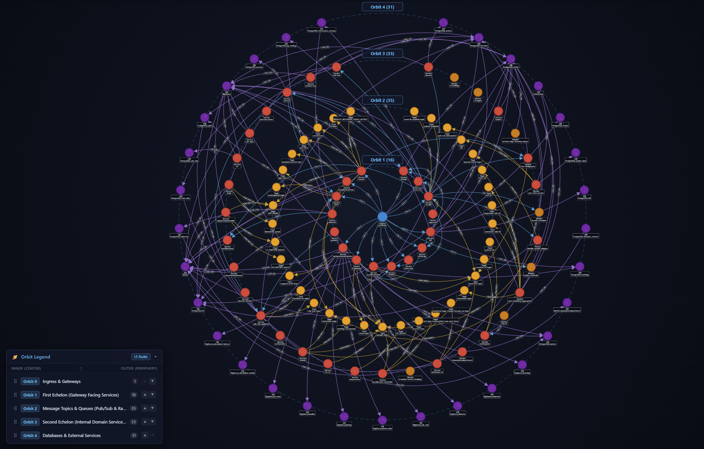
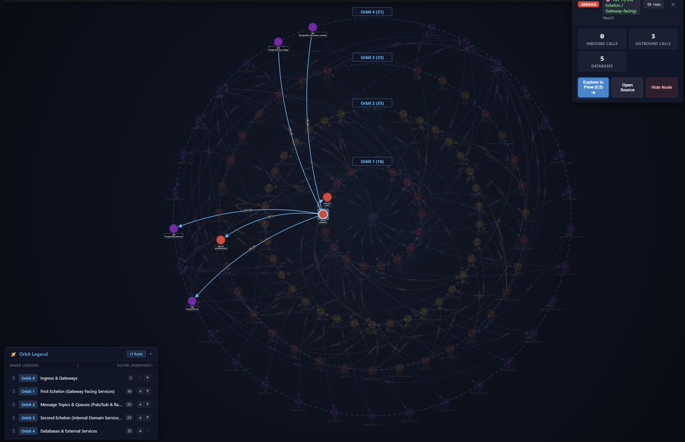
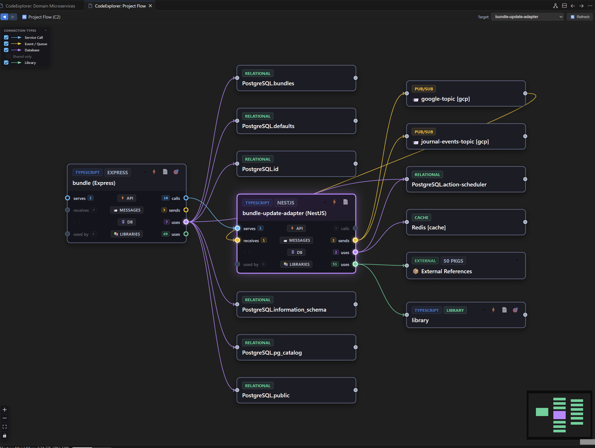
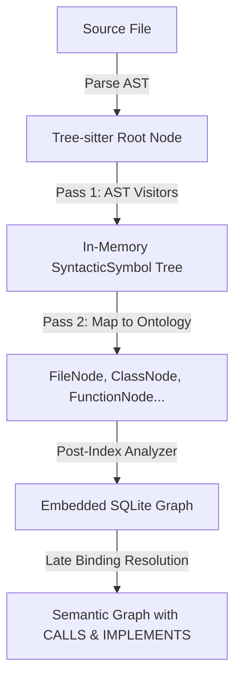

# CodeExplorer (`ce`)

[](https://github.com/vmikhailov/code-explorer/blob/main/LICENSE)
[](https://dotnet.microsoft.com/download)
[](https://www.nuget.org/packages/CodeExplorer.Cli)
[](https://marketplace.visualstudio.com/items?itemName=vmikhailov.code-explorer-vscode)
[](https://open-vsx.org/extension/vmikhailov/code-explorer-vscode)
[-blueviolet.svg)](https://github.com/vmikhailov/code-explorer/releases/latest)
[](https://github.com/vmikhailov/code-explorer)

**A visual knowledge graph and codebase intelligence tool for developers and AI agents.**

CodeExplorer maps complex polyglot repositories, microservices, and monorepos into an **interactive visual knowledge graph**. It is powered by an **embedded SQLite graph database with native Cypher query compilation** and requires no external dependencies, Docker containers, or complex configuration.

It helps architects map event-driven systems, engineers refactor legacy services, and AI coding assistants (such as Cursor, Claude, and Copilot) reason across multi-hop dependencies to improve codebase comprehension.

---

<p align="center">
  
</p>
<p align="center">
  <em>Figure 1: Full-system microservice topology projected across 5 Concentric Architectural Orbits (Tiers 0–4: Ingress Gateways, Public Services, Message Brokers, Domain Services, and Databases) with live transitive dependency routing.</em>
</p>

<p align="center">
  <a href="#what-makes-codeexplorer-unique"><b>Why CodeExplorer</b></a> •
  <a href="#interactive-visual-architecture-vs-code"><b>Visual Studio</b></a> •
  <a href="#key-features"><b>Key Features</b></a> •
  <a href="#automated-diagram-generation"><b>Diagrams</b></a> •
  <a href="#quick-installation"><b>Installation</b></a> •
  <a href="#quick-start-workflow"><b>Quick Start</b></a> •
  <a href="#cli-command-reference"><b>CLI Reference</b></a> •
  <a href="#model-context-protocol-mcp-setup"><b>MCP Setup</b></a>
</p>

---

## What CodeExplorer does?

*   **Interactive Visual Architecture**: Built directly into VS Code. Explore microservice topologies across 5 concentric architectural orbits, swimlanes, bounded context islands, hive plots, and C1/C2 project flow diagrams.
*   **Interactive Orbit Customization**: Drag-and-drop reordering of orbit rings directly inside the legend. Adjust bezier curve routing factors (-200 to +200) to suit your layout.
*   **Directional Transitive Contraction**: Automatically synthesizes clean, dashed transitive links when intermediate brokers (Kafka, RabbitMQ, SQS) are hidden or filtered, preserving architectural fidelity without visual noise.
*   **Model Context Protocol (MCP)**: Standard MCP server giving AI agents access to architectural maps, call chains, downstream blast-radius analysis, and arbitrary Cypher queries without using excessive context tokens on raw file searches.
*   **Embedded SQLite Graph with Cypher**: High-performance embedded graph engine with a native Cypher-to-SQL compiler. No external graph databases are required.
*   **Local Architectural Intent Inference**: Automatically enriches graph nodes with business domains, architectural patterns, and capability tags using an embedded GGUF model (`llama.cpp` with Vulkan GPU acceleration and SHA-256 caching).
*   **Polyglot Support**: Bridges C#, Java, TypeScript, JavaScript, Go, Python, ColdFusion, and SQL into a single unified semantic graph.

---

## Interactive Visual Architecture (VS Code)

CodeExplorer provides an interactive visual architecture view inside VS Code (`Code Graph`). Designed for high-density architectures, it clarifies distributed systems and monoliths:

### 1. Focused Neighborhood & Transitive Contraction

<p align="center">
  
</p>
<p align="center">
  <em>Figure 2: Focused sub-graph inspection with live HUD metrics, orbit reordering, edge curvature sliders, and dashed transitive links resolving broker-mediated message flows.</em>
</p>

*   **Smart Transitive Contraction**: When intermediate message topics or broker nodes are toggled off in the HUD, CodeExplorer detects that Service A publishes to Topic X and Service B subscribes to Topic X, automatically synthesizing a direct **`[SUBSCRIBES (via Topic X)]`** transitive dashed connection.
*   **Custom Orbit Legend Controls**: Reorder orbital tiers by dragging legend badges, allowing you to highlight edge gateways, flip database tiers, or group domain boundaries.
*   **Edge Curvature Tuning**: Interactive bezier curvature factor slider (-200 to +200) with automatic collision avoidance for cross-orbit calls.
*   **Live HUD Filter**: Multi-criteria filtering by node category (Gateways, Services, Topics, Databases, External APIs), search query, and neighborhood depth.

---

### 2. Project Flow & C1 System Context

<p align="center">
  
</p>
<p align="center">
  <em>Figure 3: Project Flow view showing structured service cards, inbound/outbound connection counts, database dependencies, framework tags, and Click-to-Code navigation.</em>
</p>

*   **Interactive Service Cards**: Each project node displays incoming callers, outgoing dependencies, registered databases, and framework metadata.
*   **Click-to-Code Jump**: Double-click any node or click "Jump to Code" in the inspector drawer to navigate immediately to the exact declaration line in your workspace.
*   **Multi-Projection Layouts**:
    *   **Concentric Orbits**: Equispaced, Polar Force, and Domain Sectors.
    *   **Architectural Swimlanes**: Horizontal echelons (Ingress → Core → Data).
    *   **Bounded Context Islands**: Organic clusters based on inferred Domain-Driven Design (DDD) boundaries.
    *   **Hive Plots & Dependency Matrices**: Structural coupling metrics.
    *   **COSE Force**: Physics-based graph layout.

---

## Automated Diagram Generation

CodeExplorer can export visual representations of the graph database directly into Mermaid or C4 syntax via the CLI or MCP.

*   **System Architecture**: High-level C1/C2 project flow and microservice topology diagrams.
*   **Data Lineage**: Maps ORM entities directly to their underlying database tables.
*   **Event Pipelines**: Visualizes CQRS patterns and event-driven flows (Producers → Topics → Consumers).

Example exports:
```bash
# Export system architecture
ce export --format mermaid -o architecture.mmd

# Export C4 container diagram
ce export --format c4 -o c4_containers.mmd

# Export ORM data lineage
ce export --type lineage -o data_lineage.mmd
```

---

## Key Features

*   **Zero-Dependency Single-File Executable**: Distributed as a self-contained binary (`ce.exe` / `ce`) for Windows, Linux, and macOS. No runtime or SDK installation required.
*   **Local `.codeexplorer` Workspace Auto-Discovery**: Initialized once per repository with `ce init`. Automatically discovered by walking up the directory tree.
*   **Embedded SQLite Graph with Cypher**: Uses a high-performance embedded SQLite database compiled with custom graph indices and an optimized AST-to-SQL Cypher compiler.
*   **Multi-Language AST Parsing**: Full AST-level parsing powered by **Tree-sitter** and Microsoft SQL **ScriptDom**:
    *   **C#** (`.cs`)
    *   **Java** (`.java`, Maven `pom.xml`, Gradle `build.gradle` / `build.gradle.kts`)
    *   **TypeScript / JavaScript** (`.ts`, `.tsx`, `.js`, `.jsx`)
    *   **Go** (`.go`)
    *   **Python** (`.py`)
    *   **ColdFusion** (`.cfc`, `.cfm`)
    *   **SQL & Embedded SQL** (`.sql` scripts, and inline SQL queries in C#, Java, JS, TS, Python, Go)
*   **Rich Structural Ontology**: Maps codebases across a 5-layer decoupled graph architecture (see [Ontology Model](docs/architecture/ontology-model.md) and [Live Schema Reference](docs/ontology.md)):
    *   *Physical Layer (Layer 1)*: Workspace, projects (`.csproj`, `pom.xml`, `build.gradle`, `go.mod`, `package.json`), folders, files, configuration files (`appsettings.json`, `.env`), and git topology.
    *   *Project Layer (Layer 2)*: Logical compilation units, project boundaries, and package dependencies.
    *   *Syntactic Layer (Layer 3)*: Classes, interfaces, methods, functions, structs, fields, and calls.
    *   *Semantic Layer (Layer 4)*: Ingress endpoints (REST, gRPC, GraphQL, WebSocket) with security boundaries, Egress callers, Code-First ORM entities mapped to `:Table` nodes, and message queues.
    *   *Late-Bound Layer (Layer 5)*: Cross-project call chains, interface implementations, service-to-service links, and CQRS / Event pipelines (MediatR, Spring Events, NestJS CQRS).
*   **Local Architectural Inference**:
    *   Automatically infers high-level architectural semantics (business domain, layer, pattern, capability tag, intent summary, target entities, emitted events) using an embedded GGUF model via native `llama.cpp` (with Vulkan GPU acceleration & CPU fallback).
    *   File contents are SHA-256 fingerprinted and cached in SQLite. Subsequent scans fast-apply cached intents in <50ms.
*   **Built-in & Custom Query Catalog**:
    *   **22 Built-in Queries**: Architecture maps, entry points, dependencies, CQRS pipelines, refactoring, and symbol lookup.
    *   **Extensible Domain Queries**: Save custom queries in `.codeexplorer/queries/*.cypher` with `.json` metadata sidecars, automatically available to CLI and AI agents.
*   **Model Context Protocol (MCP) Server**:
    *   **stdio mode**: Seamless integration with Cursor, Claude Desktop, VS Code, Windsurf, and Antigravity.
    *   **HTTP mode** (`--port <p>`): Exposes standard MCP endpoint at `/mcp` with SSE streaming.

---

## Architecture: Two-Pass Semantic Pipeline

CodeExplorer uses a decoupled two-pass pipeline to ingest and analyze codebases safely, isolating AST parsing from database mapping and resolution.


```mermaid
graph TD
    A[Source File] -->|Parse AST| B[Tree-sitter Root Node]
    B -->|Pass 1: AST Visitors| C[In-Memory SyntacticSymbol Tree]
    C -->|Pass 2: Map to Ontology| D[FileNode, ClassNode, FunctionNode...]
    D -->|Post-Index Analyzer| E[Embedded SQLite Graph]
    E -->|Late Binding Resolution| F[Semantic Graph with CALLS & IMPLEMENTS]
```

### 1. Pass 1: Pure Syntactic AST Visitors
AST parsing is performed in isolation. Language-specific visitor classes (e.g., `CSharpFileVisitor`) inherit from `BaseParserVisitor`.
*   **In-Memory Isolation**: Visitors have no access to database classes, file system IO, or ontology nodes. They process the syntax tree entirely in memory.
*   **Node Extensions**: Employs safety-first helper extension methods to query Tree-sitter nodes safely, handle nullable nodes, extract named field text, and resolve function targets cleanly.
*   **Syntactic Symbol Output**: Visitors output a pure in-memory `SyntacticSymbol` tree describing the hierarchical structure of declarations and references found in the AST.

### 2. Pass 2: Ontology Mapping & Resolution
Once the syntactic structure is captured:
*   **Ontology Mapping**: The parser maps `SyntacticSymbol` trees into concrete database ontology models (`FileNode`, `ClassNode`, `EntryPointNode`, `QueryNode`, etc.).
*   **Late-Bound Resolution**: A post-index analysis pass executes Cypher queries to link cross-file, late-bound dependencies (e.g., connecting a frontend HTTP call to its backend controller endpoint, or resolving interface implementations).

---

## Tech Stack & Requirements

*   **Runtime**: [.NET 10.0 SDK](https://dotnet.microsoft.com/download)
*   **Database**: **Embedded SQLite** (zero external services or containers required)
*   **AST Parser**: Tree-Sitter & Microsoft T-SQL ScriptDom
*   **Deployment**: Standalone executable / .NET tool

---

## Quick Installation

CodeExplorer is available as both an **Interactive VS Code Extension** and a **zero-dependency, single-file self-contained CLI/MCP binary** with embedded Tree-sitter parsers and SQLite engine. No external database or runtime installation is required.

### 1. VS Code Extension (Recommended for Visual Exploration)

Install directly from the [Visual Studio Marketplace](https://marketplace.visualstudio.com/items?itemName=vmikhailov.code-explorer-vscode) or [Open VSX](https://open-vsx.org/extension/vmikhailov/code-explorer-vscode):

```bash
# Install via VS Code CLI:
code --install-extension vmikhailov.code-explorer-vscode
```

*Or install from VSIX:*
1. Download `code-explorer-*.vsix` from [GitHub Releases](https://github.com/vmikhailov/code-explorer/releases/latest).
2. Open the Extensions view (`Ctrl+Shift+X` / `Cmd+Shift+X`).
3. Click the **`...`** (Views and More Actions) menu in the top-right corner of the Extensions pane.
4. Select **Install from VSIX...** and choose the downloaded file.

4. Open any project workspace and click the **`Code Graph`** button in the status bar or run `CodeExplorer: Show Architecture Graph` from the Command Palette (`Ctrl+Shift+P`).
5. The extension automatically bundles pre-compiled native `ce` binaries for Windows (x64/ARM64), macOS (Apple Silicon/Intel), and Linux (x64/ARM64).

---

### 2. One-Line CLI Install (Recommended for Terminal & MCP)

**macOS & Linux (Bash / Zsh):**
```bash
curl -fsSL https://raw.githubusercontent.com/vmikhailov/code-explorer/main/cli/scripts/install.sh | bash
```

**Windows (PowerShell as Administrator or User):**
```powershell
irm https://raw.githubusercontent.com/vmikhailov/code-explorer/main/cli/scripts/install.ps1 | iex
```

---

### 3. .NET Global Tool

If you have [.NET SDK](https://dotnet.microsoft.com/download) installed:

```bash
# Install globally
dotnet tool install -g CodeExplorer.Cli

# Update to latest version
dotnet tool update -g CodeExplorer.Cli
```

---

### 4. Homebrew (macOS & Linux)

```bash
brew tap vmikhailov/tap
brew install ce
```

---

### 5. Manual Download

Download the pre-compiled binary for your platform from [GitHub Releases](https://github.com/vmikhailov/code-explorer/releases/latest):

| Platform | Architecture | Binary Asset |
| :--- | :--- | :--- |
| **macOS** | Apple Silicon (M1/M2/M3/M4) | `ce-osx-arm64.tar.gz` |
| **macOS** | Intel x64 | `ce-osx-x64.tar.gz` |
| **Linux** | x86_64 | `ce-linux-x64.tar.gz` |
| **Linux** | ARM64 | `ce-linux-arm64.tar.gz` |
| **Windows** | x86_64 | `ce-win-x64.zip` |

---

### 6. Build from Source

If you have [.NET 10.0 SDK](https://dotnet.microsoft.com/download) installed:

```bash
# 1. Build and run all unit tests
./cli/scripts/build.sh

# 2. Publish single-file binary for your current machine
./cli/scripts/publish.sh

# Or publish for all supported platforms
./cli/scripts/publish.sh all
```

Targets produced in `.Build/bin/`:
*   **Windows x64**: `.Build/bin/win-x64/ce.exe`
*   **Linux x64 / ARM64**: `.Build/bin/linux-x64/ce`, `.Build/bin/linux-arm64/ce`
*   **macOS (ARM64 / x64)**: `.Build/bin/osx-arm64/ce`, `.Build/bin/osx-x64/ce`

Add `ce` (or `ce.exe`) to your system `PATH` to use it from anywhere.

---

## Quick Start Workflow

Run `ce` in your terminal to see the interactive status and workspace overview:

```bash
# 1. Initialize a .codeexplorer workspace in your repository root
ce init MyProject

# 2. Scan and index code topology, AST, dependencies, and semantic graph
ce scan

# 3. (Optional) Download local LLM model and enrich graph with architectural intents
ce model download
ce intent

# 4. View workspace health, indexed projects, node kinds, and statistics
ce status

# 5. List all built-in and workspace-custom Cypher queries
ce queries

# 6. Execute a query by name or run ad-hoc Cypher
ce query -n get_architecture_map_workspace
ce query "MATCH (p:Project) RETURN p.name, p.project_type"

# 7. Start the MCP server for AI coding assistants
ce mcp
```

---

## CLI Command Reference

### `ce init [name]`
Initializes a `.codeexplorer/` workspace directory in the target folder with an empty SQLite graph database and queries catalog.
```bash
ce init
ce init MyProject -d /path/to/repo
```

### `ce scan [path]` *(alias: `ce index`)*
Scans source files, parses ASTs (Tree-sitter & ScriptDom), builds structural relationships, and resolves semantic boundaries. Fast-applies already cached architectural intents automatically in <50ms without invoking the LLM.
```bash
ce scan                     # Index workspace (fast-applies cached intents automatically)
ce scan ./src/AuthService   # Index a specific project subfolder
ce scan --clear             # Clear graph topology before re-indexing (preserves intent cache)
ce scan --intent            # Run LLM architectural intent distillation during indexing pass
```

### `ce status` *(alias: `ce info`)*
Displays workspace statistics, database size, indexed projects by language, node counts, and available queries.
```bash
ce status
ce status --json            # Output structured JSON for automation
```

### `ce queries` *(alias: `ce query -l`)*
Displays all available Cypher queries grouped into categories (`[Architecture]`, `[Refactoring]`, `[Symbols]`, `[Taxonomy]`) along with any custom workspace queries from `.codeexplorer/queries/`.
```bash
ce queries
ce queries --format json
```

### `ce query [options]`
Executes a read-only Cypher query against the knowledge graph with formatted tabular or JSON output.
```bash
# Execute named built-in or custom query
ce query -n get_architecture_map_workspace -j      # View full structured JSON tree
ce query -n get_project_dependencies_all

# Inspect Cypher source code of any query
ce query --show get_architecture_map_workspace

# Execute raw Cypher string with formatted JSON output
ce query "MATCH (t:Type {kind: 'interface'}) RETURN t.name" -j

# Execute table view without column truncation
ce query "MATCH (p:Project)-[:DEPENDS_ON]->(d) RETURN p.name, d.name" --no-truncate

# Execute query from file
ce query -f ./custom_audit.cypher
```

### `ce mcp [options]`
Starts the Model Context Protocol (MCP) server exposing CodeExplorer graph tools directly to AI assistants.
```bash
ce mcp                      # stdio mode (default for Cursor, Claude, Antigravity)
ce mcp --port 8085          # HTTP mode with SSE endpoint at http://localhost:8085/mcp
```

### `ce export [options]`
Exports architecture and system topology diagrams directly from the knowledge graph in Mermaid or C4 syntax.
```bash
# Export Mermaid system architecture diagram to terminal or file
ce export --format mermaid
ce export -f mermaid -o architecture.mmd

# Export C4 Container diagram
ce export --format c4 -o c4_containers.mmd

# Export ORM Data Lineage diagram (Entities -> Tables)
ce export --type lineage -o data_lineage.mmd

# Export CQRS & Event Pipeline diagram (Producers -> Topics -> Consumers)
ce export --type cqrs -o event_pipeline.mmd
```

### `ce clear [path]`
Selectively wipes a subfolder from the index or clears the entire graph database (while preserving the incremental intent cache).
```bash
ce clear ./src/OldModule    # Remove specific subfolder
ce clear -y                 # Reset entire graph database
```

### `ce intent [path]`
Runs incremental architectural intent distillation using a local distilled GGUF model via embedded `llama.cpp` (Vulkan GPU accelerated with CPU fallback). Inferred intents (`domain`, `layer`, `pattern`, `capability_tag`, `intent_summary`, `target_entities`, `emitted_events`) are cached by SHA-256 and file timestamps in the SQLite `intents` table, materializing `:Domain` nodes and `:BELONGS_TO_DOMAIN` relationships.
```bash
ce intent                   # Distill intents for all candidate files in workspace
ce intent --limit 20        # Distill intent for up to 20 candidate files
ce intent --reset-errors    # Reset error counter for files that failed distillation
ce intent --clear           # Clear cached intent records for this workspace
```

### `ce model [action]`
Manages local GGUF models used for native architectural intent distillation (powered by [`ce-intent-v2-q4_k_m.gguf`](https://huggingface.co/vmikhailov77/code-intent) — a compact 4-bit quantized distilled model running 100% locally and privately via `llama.cpp`).
```bash
ce model status             # Check model status, file location, and size (~940 MB)
ce model download           # Download the intent model with a console progress bar
ce model download --force   # Force re-download even if already present
```

---

## Model Context Protocol (MCP) Setup

Connect `ce` to your favorite AI development environment:

### Cursor
Add to your Cursor MCP settings (`~/.cursor/mcp.json` or Cursor Settings -> MCP):
```json
{
  "mcpServers": {
    "code-explorer": {
      "command": "ce",
      "args": ["mcp"]
    }
  }
}
```

### Claude Desktop
Add to your `claude_desktop_config.json`:
```json
{
  "mcpServers": {
    "code-explorer": {
      "command": "ce",
      "args": ["mcp"]
    }
  }
}
```

### VS Code (with Roo Code / Continue / Cline)
Configure the tool command as `ce` with arguments `["mcp"]`.

### Google Antigravity / Gemini CLI
Add to your `.gemini/antigravity-ide/mcp/code-explorer` or workspace MCP configuration.

---

## AI Agent Instructions & System Prompts

To enable AI coding agents (Claude, Cursor, Copilot, ChatGPT, Antigravity, Roo Code) to effectively leverage `ce`, add the following instructions to your project's agent rules file (e.g. `.cursorrules`, `CLAUDE.md`, `.windsurfrules`, or `.agents/rules/code-explorer.md`):

### Copy-Pasteable Agent Prompt / Rules

````markdown
# Codebase Exploration with CodeExplorer (`ce`)

This repository uses **CodeExplorer (`ce`)** as an embedded SQLite codebase knowledge graph and MCP server. 

## When and How to Use CodeExplorer MCP Tools:

1. **Architecture Discovery (Start of Task)**:
   - When asked to explore the repository, understand high-level architecture, or find microservice boundaries, **DO NOT** run blind file searches or scan directory trees.
   - Call `get_architecture_map` or `get_architecture_overview` to obtain a structured breakdown of projects, frameworks, dependencies, ingress endpoints, and egress callers.
   - Call `get_project_entry_points` with `projectName` to discover HTTP controllers, routes, CLI commands, and message listeners.

2. **Symbol & File Inspection (Low-Token Context)**:
   - Instead of reading entire files into context, call `get_file_outline` with `filePath` to inspect declared classes, methods, and line numbers.
   - Use `find_symbol` (with optional `symbolType`: `class`, `interface`, `function`) to pinpoint exact symbol locations and signatures.
   - Use `resolve_call_target` to locate concrete implementations of an interface method.

3. **Refactoring & Blast Radius Analysis**:
   - Before modifying or deleting a symbol, class, or method, call `analyze_code_impact` with `symbolName` to identify all downstream files and callers affected.
   - Before altering database queries or schema models, call `inspect_data_lineage` with `tableName` to trace all queries, ORM entities, and functions accessing that table.
   - Call `find_refactoring_opportunities` with `projectName` to detect unreferenced dead code or high-coupling god objects.

4. **Diagram Generation & Event Tracing**:
   - Call `export_architecture_diagram` with `format: "mermaid"` or `"c4"` and `type: "architecture"` | `"lineage"` | `"cqrs"` to generate visual topology diagrams.

5. **Multi-Hop Graph Queries (Custom Cypher)**:
   - Use `execute_custom_read_cypher` to execute read-only `MATCH` queries for complex questions (e.g. cross-project dependency paths, unreferenced interfaces, or circular references).
   - Use `list_project_queries` to inspect saved workspace domain queries, and `execute_project_query` to run them.
   - Run `get_taxonomy` or `get_node_definition` if you need schema details for any graph node or relationship kind.
````

---

## MCP Tools Reference

When running as an MCP server, `ce` registers the following tools for AI assistants:

| Tool Name | Parameters | Description |
| :--- | :--- | :--- |
| `get_taxonomy` | None | Structural taxonomy database schema mapping all active node types and relationship counts. |
| `get_architecture_map` | `projectName` (opt) | Workspace architecture map: projects, dependencies, database nodes, Ingress, and Egress. |
| `get_project_dependencies` | `projectFilter` (opt) | Complete dependency graph between projects, including direct and transitive links. |
| `get_file_outline` | `filePath` | AST outline of a file (classes, interfaces, functions, variables, queries) without reading full text. |
| `find_symbol` | `name`, `symbolType` (opt) | Search semantic graph for symbols (Class, Interface, Function, Struct) matching a pattern. |
| `get_call_chain` | `startFunction`, `endFunction`, `maxDepth` | Trace and return sequential invocation call graph between starting and target function. |
| `resolve_call_target` | `interfaceName`, `methodName` | Find all concrete classes implementing an interface and point to physical method implementations. |
| `analyze_code_impact` | `symbolName` | Downstream blast-radius analysis tracking all files and symbols affected by modifying a symbol. |
| `inspect_data_lineage` | `tableName` | Trace database entity blast radius: SQL queries, functions, and files referencing a table. |
| `export_architecture_diagram` | `format` (opt), `type` (opt), `projectName` (opt) | Generate visual architecture, ORM data lineage, or CQRS/Saga event diagrams in Mermaid or C4 PlantUML. |
| `get_project_entry_points` | `projectName` | Find architectural entry points (REST endpoints, GraphQL Queries/Mutations, gRPC RPCs, event listeners) with strongly-typed request/response payload schemas and security boundaries. |
| `find_refactoring_opportunities` | `projectName`, `metricType` | Detect dead code, unreferenced symbols, and god objects with high coupling. |
| `list_project_queries` | None | Discover custom parameterized project queries saved in `.codeexplorer/queries/`. |
| `save_project_query` | `name`, `description`, `cypher`, `metadata` | Validate syntax/safety and persist reusable domain Cypher query into `.codeexplorer/queries/`. |
| `execute_project_query` | `name`, `parameters` (opt) | Execute a workspace custom or built-in query by name with automatic workspace parameter binding. |
| `execute_custom_read_cypher` | `query`, `parameters` (opt) | Execute arbitrary read-only Cypher (`MATCH` only) directly against the graph database. |
| `fetch_code_snippets` | `nodesJson` | Fetch source code snippets for a list of node URN contexts (file path, start line, end line). |
| `get_node_definition` | `kind` | Retrieve documentation and schema details for an ontological Node Kind. |
| `init_workspace` | `name` (opt), `force` (opt) | Initialize a new `.codeexplorer` workspace in the target folder. |
| `scan_workspace` | `path` (opt), `clear` (opt) | Scan and index/reindex source files, ASTs, and dependencies into the graph database. |
| `get_workspace_status` | None | Get workspace health status, SQLite DB size, indexed projects by language, and node counts. |
| `clear_workspace_index` | `path` (opt) | Clear indexed graph data for a specific subpath or the entire workspace database. |
| `ingest_graph_data` | `nodesJson`, `relationshipsJson` (opt) | Direct batch ingestion of custom/external nodes and relationships into SQLite graph. |

---

## Project Structure

```text
├── cli/                                  # .NET Core Engine, Graph Engine, CLI & MCP Server
│   ├── scripts/                          # Cross-platform installation and single-file build scripts
│   ├── src/
│   │   ├── Core/CodeExplorer.Core/       # SQLite graph client, ontology models, pipeline, llama.cpp intent engine, MCP tools
│   │   ├── Cypher/CodeExplorer.Cypher/   # OpenCypher parser, AST transformer, and SQLite SQL compiler
│   │   ├── Parsers/                      # Polyglot AST parsers (Tree-sitter & ScriptDom for C#, Java, TS, Go, Py, SQL, CF)
│   │   ├── Tools/CodeExplorer.OntologyGen/# Self-descriptive ontology generator
│   │   └── UI/CodeExplorer/              # Single-file 'ce' CLI tool, WebSocket server, and MCP host
│   ├── tests/
│   │   ├── CodeExplorer.Cypher.Tests/    # Cypher compiler unit & regression tests
│   │   └── CodeExplorer.Tests/           # CLI, indexing, integration, and MCP tests
│   └── CodeExplorer.slnx                 # .NET solution layout file
├── vscode-extension/                     # Interactive Architecture Visual Studio (VS Code Extension)
│   ├── src/                              # Extension host, WebSocket client, Cytoscape webview controllers
│   ├── media/                            # Webview UI styles, icons, and bundles
│   └── package.json                      # VS Code extension manifest & settings
├── docs/                                 # Visual screenshots, ontology dictionary, and architecture specifications
└── proto/                                # Protocol buffer contracts for high-speed streaming
```

---

## License

This project is licensed under the [MIT License](LICENSE).
