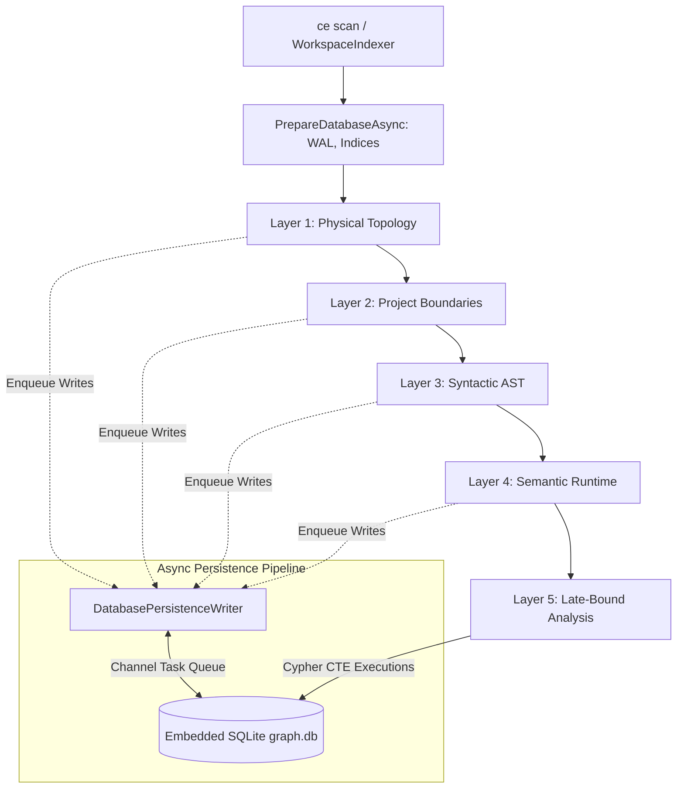

# 5-Stage Ingestion Pipeline & SQLite Persistence

This document details the internal architecture of the **CodeExplorer Ingestion Pipeline**. It explains how source code is discovered, parsed into AST structures, enriched into semantic models, and persisted into an embedded SQLite graph database.

---

## 🏛️ Pipeline Overview

CodeExplorer processes codebases through a decoupled 5-stage sequential pipeline orchestrated by `WorkspaceIndexer`:



### Execution Flow in `WorkspaceIndexer`

```csharp
await using (new DatabasePersistenceWriter(ctx))
{
    await PrepareDatabaseAsync(ctx);
    var l1 = await new Layer1PhysicalParser().ParseAsync(ctx);
    ctx.TriggerProgressReport();
    var l2 = await new Layer2ProjectParser().ParseAsync(l1, ctx);
    ctx.TriggerProgressReport();
    var l3 = await new Layer3SyntacticParser().ParseAsync(l2, ctx);
    ctx.TriggerProgressReport();
    var l4 = await new Layer4SemanticParser().ParseAsync(l3, ctx);
    ctx.TriggerProgressReport();
    await new Layer5AnalysisParser().ParseAsync(l4, ctx);
    ctx.TriggerProgressReport();
}
```

---

## ⚙️ The 5 Pipeline Stages

### Stage 1: Physical Topology (`Layer1PhysicalParser`)
*   **Goal**: Construct the exact filesystem hierarchy of folders and files on disk.
*   **Behavior**:
    *   Walks the directory tree respecting `.gitignore` rules (via `GitIgnoreMatcher`).
    *   Generates `FilesStructure`, `Folder`, and `File` nodes.
    *   Extracts Git metadata (`GitSettings`) such as the current branch and HEAD commit hash without spawning external shell processes.
    *   Computes content hashes to identify unchanged files during incremental scans.

### Stage 2: Project Boundaries (`Layer2ProjectParser`)
*   **Goal**: Detect compilation modules and external dependency boundaries.
*   **Behavior**:
    *   Dispatches to registered `IProjectParser` implementations:
        *   **C#**: `.csproj` files, solution references, and NuGet packages.
        *   **TypeScript/JavaScript**: `package.json` dependencies and workspaces.
        *   **Go**: `go.mod` module definitions and require blocks.
        *   **Python**: `pyproject.toml`, `setup.py`, and `requirements.txt`.
    *   Emits `ProjectsStructure`, `Project`, and `Package` nodes.
    *   Connects projects to folders via `LOCATED_IN` and declares `DEPENDS_ON` edges.

### Stage 3: Syntactic AST Outline (`Layer3SyntacticParser`)
*   **Goal**: Parse source code into pure in-memory syntax trees without database or filesystem I/O.
*   **Behavior**:
    *   Each file is parsed using **Tree-sitter** (C#, TypeScript, JavaScript, Go, Python) or Microsoft **ScriptDom** (SQL).
    *   Language-specific AST visitors (`CSharpFileVisitor`, `TypeScriptFileVisitor`, etc.) extend `BaseParserVisitor`.
    *   **Library Parser Integration**: Before processing language AST nodes, the parser checks registered `ILibraryParser` instances (e.g., `NestJsLibraryParser`, `AspNetCoreLibraryParser`, `RestSharpLibraryParser`).
    *   Produces an in-memory `SyntacticSymbol` tree describing declarations:
        *   Types (classes, interfaces, structs, records, enums) $\rightarrow$ `TypeNode`
        *   Methods, functions, constructors $\rightarrow$ `FunctionNode`
        *   Fields, properties, variables $\rightarrow$ `MemberNode`
    *   Emits `CONTAINS`, `HAS_METHOD`, `HAS_MEMBER`, and `DECLARED_IN` edges.

### Stage 4: Semantic Runtime Interfaces (`Layer4SemanticParser`)
*   **Goal**: Identify entry points, egress calls, databases, and message brokers within each project.
*   **Behavior**:
    *   Inspects annotations and semantic patterns:
        *   **Ingress**: ASP.NET Core `[HttpGet]`/`[Route]` attributes, Minimal APIs `app.MapGroup()`, NestJS `@Controller()`/`@Get()` decorators $\rightarrow$ `EndpointNode`, `EntryPointNode`.
        *   **Egress**: HTTP clients (`HttpClient`, `RestSharp`, `Refit`, `Axios`, `Fetch`) $\rightarrow$ `ExternalServiceNode`.
        *   **Data Lineage**: ORM configurations (`DbContext`, `DbSet<T>`), SQL queries, and table operations $\rightarrow$ `DatabaseNode`, `TableNode`, `QueryNode`.
        *   **Messaging**: MassTransit, RabbitMQ, and Pub/Sub handlers $\rightarrow$ `TopicNode`.
    *   Emits `TRIGGERS`, `EXPOSED_BY`, `QUERIED_BY`, `PUBLISHED_BY`, and `SUBSCRIBED_BY` edges.

### Stage 5: Cross-Project Late-Binding (`Layer5AnalysisParser`)
*   **Goal**: Resolve cross-file and cross-project relationships that require full-graph context.
*   **Behavior**:
    *   Runs pure Cypher queries against the embedded database once all prior layers have been indexed:
        *   **Call Graph Resolution**: Matches `CALLS` references to target `Function` nodes across project boundaries.
        *   **Interface Realization**: Links concrete `Type` nodes to implemented `interface` types via `IMPLEMENTS` edges.
        *   **Cross-Service Integration**: Matches `ExternalService` egress URLs to matching `Endpoint` ingress templates via `CALLS_ENDPOINT` edges.
        *   **Event Pub/Sub Wiring**: Connects event publishers to event subscribers sharing identical message types or topic names.
    *   All queries are deterministic, idempotent, and bounded.

---

## ⚡ High-Throughput Async Persistence

CodeExplorer achieves high indexing speeds (parsing tens of thousands of files in seconds) by completely separating AST parsing from database disk I/O:

1. **`System.Threading.Channels`**:
   * Parsers do not write directly to SQLite. Instead, they write write-actions into an unbounded `Channel<Func<Task>>`.
2. **`DatabasePersistenceWriter`**:
   * A single dedicated background consumer reads from the channel and executes writes in batches within SQLite transactions.
   * `PRAGMA journal_mode = WAL` (Write-Ahead Logging) and `PRAGMA synchronous = NORMAL` eliminate locking bottlenecks between readers and writers.
3. **Idempotent Upserts**:
   * All relationship and node insertions use `ON CONFLICT DO UPDATE` or `INSERT OR REPLACE` to guarantee safe, idempotent re-indexing.

---

## 🎯 Targeted Subtree Scans (`ce scan <subfolder>`)

When running `ce scan src/OrdersService`:
1. `ParsingContext.IsSubtreeScan` is set to `true`.
2. `Layer1PhysicalParser` computes relative URNs against the workspace root, generating virtual parent `Folder` nodes up to the root so the tree remains topologically connected.
3. `Layer3SyntacticParser` limits file discovery exclusively to files within the target subfolder.
4. `Layer5AnalysisParser` selectively updates cross-project connections for the touched entities.
