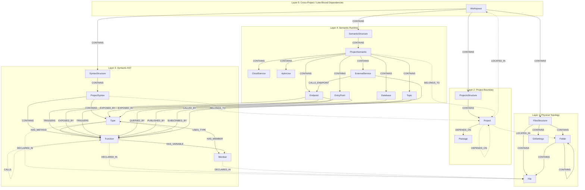

# 5-Layer Graph Ontology Specification

This document defines the official **5-Layer Graph Ontology** architecture for **CodeExplorer**. The ontology decouples physical file layouts, project boundaries, syntactic code structures, runtime semantic interfaces, and cross-project integration links into separate queryable layers connected by uniform reference pointers.

By separating these concerns, CodeExplorer can perform surgical graph updates (such as pruning and re-indexing a single file's syntax tree) without affecting physical directory tracking or cascading deletions across the runtime architecture map.

> [!TIP]
> For the complete, auto-generated list of all 27 node types, 30 relationships, and their properties, refer to the [Live Ontology Reference](../ontology.md).

---

## 🏛️ Architectural Overview

The graph ontology is structured into five distinct, decoupled layers under an umbrella `Workspace` node:



---

## 🏛️ Root Boundary: Workspace

At the absolute top of the hierarchy is the `Workspace`. It is the root container scoping both the physical filesystem tree (`FilesStructure`), the logical project tree (`ProjectsStructure`), the syntax tree (`SyntaxStructure`), and the runtime semantic interface tree (`SemanticStructure`).

*   **`Workspace`**: Root index directory of CodeExplorer. All nodes created during a scan are scoped to a `workspace_id`.
    *   `id`: Workspace database ID (e.g., `"1"`).
    *   `name`: Human-readable name of the workspace directory.
    *   `path`: Absolute filesystem path to the workspace root.

---

## 📂 Layer 1: Physical Topology (Infrastructure & Layout)

Tracks the physical directory and file layout on disk, completely decoupled from compilation units or runtime semantics.

### Nodes
*   **`FilesStructure`**: Structural root representing the workspace folder/file tree.
*   **`Folder`**: Directory within the indexed workspace.
*   **`File`**: Source code file or configuration document, containing file path, language key, and hash.
*   **`GitSettings`**: Git repository settings, branch name, and commit hash.

### Relationships
*   `FilesStructure -[CONTAINS]-> Folder`
*   `FilesStructure -[CONTAINS]-> File`
*   `Folder -[CONTAINS]-> Folder`
*   `Folder -[CONTAINS]-> File`

---

## 📂 Layer 2: Project Boundary

Tracks logical compilation units and module scopes (`.csproj`, `package.json`, `go.mod`, etc.) and external packages.

### Nodes
*   **`ProjectsStructure`**: Structural root representing all projects registered in the workspace.
*   **`Project`**: Logical compilation scope or package boundary with project type / language.
*   **`Package`**: Third-party package dependencies (e.g., NuGet, npm, Go modules) referenced by projects.

### Relationships
*   `ProjectsStructure -[CONTAINS]-> Project`
*   `Project -[DEPENDS_ON]-> Package`
*   `Project -[DEPENDS_ON]-> Project` (Project-to-project reference)

---

## 📂 Layer 3: Syntactic AST (Syntax Outline)

Represents declarations extracted by Tree-sitter and Microsoft SQL ScriptDom visitors. Nodes here describe code definitions and hierarchy in memory, completely isolated from runtime infrastructure.

### Nodes
*   **`SyntaxStructure`**: Structural root representing all syntactic AST structures.
*   **`ProjectSyntax`**: Subtree representing syntactic AST declarations of a specific project.
*   **`Type`**: Classes, interfaces, structs, records, and enums.
*   **`Function`**: Methods, constructors, free functions, and local functions (includes `signature`, `return_type`, `start_line`, `end_line`).
*   **`Member`**: Fields, properties, parameters, or local variable declarations.

### Relationships
*   `SyntaxStructure -[CONTAINS]-> ProjectSyntax`
*   `ProjectSyntax -[CONTAINS]-> Type`
*   `ProjectSyntax -[CONTAINS]-> Function`
*   `ProjectSyntax -[BELONGS_TO]-> Project`
*   `Type -[HAS_METHOD]-> Function`
*   `Type -[HAS_MEMBER]-> Member`
*   `Function -[HAS_VARIABLE]-> Member`

---

## 📂 Layer 4: Semantic Runtime (Logical Architecture)

Captures runtime entry points, external API boundaries, databases, and message queue topics. These nodes map the microservice and distributed system architecture.

### Nodes
*   **`SemanticStructure`**: Structural root for all runtime semantic elements.
*   **`ProjectSemantic`**: Groups runtime semantic elements belonging to a specific project.
*   **`Endpoint`**: HTTP API endpoint routes (`http_method`, `route_template`).
*   **`Database`**: Database engine instance, catalog, or schema (`name`, `db_type`).
*   **`Topic`**: Message queue, event exchange, or topic boundary (`name`, `broker_type`).
*   **`EntryPoint`**: Non-HTTP execution triggers (gRPC services, CLI commands, cron jobs, queue listeners).
*   **`CloudService`**: Cloud services utilized by projects (e.g., AWS S3, Azure Blob, GCP PubSub).
*   **`ApiInUse`**: External APIs and client SDKs used within projects (e.g., Stripe, SendGrid).
*   **`ExternalService`**: External HTTP host or egress service target.

### Relationships
*   `SemanticStructure -[CONTAINS]-> ProjectSemantic`
*   `ProjectSemantic -[CONTAINS]-> Endpoint | Database | Topic | EntryPoint | CloudService | ApiInUse | ExternalService`
*   `ProjectSemantic -[BELONGS_TO]-> Project`

---

## 📂 Layer 5: Cross-Project / Late-Bound Dependencies

System bindings contain cross-cutting relationships connecting Layers 1–4 into an integrated semantic map.

### 1. Project Boundaries to Physical Topology
*   `Project -[LOCATED_IN]-> Folder`
*   `Project -[LOCATED_IN]-> Workspace`

### 2. Syntactic AST to Physical Files
*   `Type -[DECLARED_IN]-> File`
*   `Function -[DECLARED_IN]-> File`
*   `Member -[DECLARED_IN]-> File`

### 3. Runtime Semantics to Syntactic AST
*   `Endpoint -[EXPOSED_BY]-> Function | Type` (API ingress routing)
*   `Endpoint -[TRIGGERS]-> Function` (Request handler execution)
*   `EntryPoint -[TRIGGERS]-> Function` (CLI / gRPC handler execution)
*   `Database -[QUERIED_BY]-> Function` (Data persistence access)
*   `Topic -[PUBLISHED_BY]-> Function` (Asynchronous event publishing)
*   `Topic -[SUBSCRIBED_BY]-> Function` (Asynchronous event handling)

### 4. Intra-Project Compiler Connections
*   `Type -[INHERITS_FROM]-> Type` (Inheritance / Interface implementations)
*   `Function -[CALLS]-> Function` (Direct method invocation)
*   `Function -[USES_TYPE]-> Type` (Type references)

### 5. Inter-Project & Cross-Service Integrations
*   `ExternalService -[CALLED_BY]-> Function` (Egress client function call)
*   `ExternalService -[CALLS_ENDPOINT]-> Endpoint` (Late-bound cross-project HTTP call)

---

## 🏷️ Uniform Resource Name (URN) & ID Schemes

Every node identifier is prefixed with `{workspaceId}` to guarantee isolation:

| Layer | Node Label | ID / URN Scheme | Example |
| :--- | :--- | :--- | :--- |
| **Root** | **`Workspace`** | `{workspaceId}` | `1` |
| **Layer 1** | **`FilesStructure`** | `{workspaceId}:files_structure` | `1:files_structure` |
| **Layer 1** | **`Folder`** | `{workspaceId}:folder:{absoluteFolderPath}` | `1:folder:/work/repo/src` |
| **Layer 1** | **`File`** | `{workspaceId}:file:{relativeFilePath}` | `1:file:src/OrdersService.cs` |
| **Layer 2** | **`ProjectsStructure`**| `{workspaceId}:projects_structure` | `1:projects_structure` |
| **Layer 2** | **`Project`** | `{workspaceId}:project:{relativeProjectDir}:` | `1:project:src/:` |
| **Layer 2** | **`Package`** | `{workspaceId}:package:{packageId}` | `1:package:Newtonsoft.Json` |
| **Layer 3** | **`SyntaxStructure`** | `{workspaceId}:syntax_structure` | `1:syntax_structure` |
| **Layer 3** | **`ProjectSyntax`** | `{workspaceId}:project:{relativeProjectDir}:project_syntax` | `1:project:src/:project_syntax` |
| **Layer 3** | **`Type`** | `{workspaceId}:symbol:{relativeFilePath}:Type:{name}:{line}` | `1:symbol:src/Orders.cs:Type:Orders:12` |
| **Layer 3** | **`Function`** | `{workspaceId}:symbol:{relativeFilePath}:Function:{name}:{line}` | `1:symbol:src/Orders.cs:Function:Get:25` |
| **Layer 3** | **`Member`** | `{workspaceId}:symbol:{relativeFilePath}:Member:{name}:{line}` | `1:symbol:src/Orders.cs:Member:id:26` |
| **Layer 4** | **`SemanticStructure`**| `{workspaceId}:semantic_structure` | `1:semantic_structure` |
| **Layer 4** | **`ProjectSemantic`** | `{workspaceId}:project:{relativeProjectDir}:project_semantic` | `1:project:src/:project_semantic` |
| **Layer 4** | **`Endpoint`** | `{workspaceId}:endpoint:{http_method}:{route}` | `1:endpoint:GET:/api/orders` |
| **Layer 4** | **`Database`** | `{workspaceId}:db:{db_type}:{name}` | `1:db:sqlserver:ProductionDb` |
| **Layer 4** | **`Topic`** | `{workspaceId}:topic:{broker_type}:{name}` | `1:topic:rabbitmq:order-events` |
| **Layer 4** | **`ExternalService`** | `{workspaceId}:externalservice:{protocol}:{host}` | `1:externalservice:http:api.stripe.com` |

---

## ⚡ Incremental Indexing & Surgical Pruning

The 5-layer separation enables targeted and surgical workspace operations:

1. **Surgical File Invalidation**: When a single source file changes, CodeExplorer purges only its declared syntactic outline without touching other files:
   ```cypher
   MATCH (n) WHERE n.id STARTS WITH '1:symbol:src/OrdersService.cs:' DETACH DELETE n
   ```
2. **Subtree Scans (`ce scan <subfolder>`)**: `Layer1PhysicalParser` and `Layer2ProjectParser` generate intermediate container nodes up to the workspace root, isolating indexing to the target folder while preserving global URN integrity.
3. **Late-Binding Reconnection**: Running `Layer5AnalysisParser` re-computes cross-file links for newly indexed symbols idempotently via `INSERT OR REPLACE` / `ON CONFLICT DO UPDATE`.
