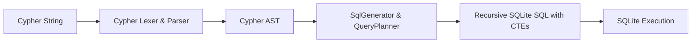

# SQLite Graph Engine & Cypher-to-SQL Compiler

This document explains how **CodeExplorer** stores graph data in an embedded SQLite database and executes graph queries via its in-house **Cypher-to-SQL Compiler** (`CodeExplorer.Cypher`).

---

## 🏛️ Storage Engine: Embedded SQLite

CodeExplorer stores the entire codebase knowledge graph in an embedded SQLite database (`<workspaceRoot>/.codeexplorer/graph.db`). This eliminates external database servers, Docker containers, network latency, and version incompatibility.

### Database Schema

The graph schema consists of two fundamental tables:

```sql
-- Vertices / Entities
CREATE TABLE IF NOT EXISTS nodes (
    id TEXT PRIMARY KEY NOT NULL,
    kind TEXT NOT NULL,
    properties TEXT NOT NULL -- Stored as compact JSON
);

-- Directed Relationships
CREATE TABLE IF NOT EXISTS edges (
    from_id TEXT NOT NULL,
    to_id TEXT NOT NULL,
    kind TEXT NOT NULL,
    properties TEXT,         -- Stored as compact JSON (nullable)
    PRIMARY KEY (from_id, to_id, kind)
);
```

### Performance Optimizations
*   **Write-Ahead Logging (WAL)**: `PRAGMA journal_mode = WAL` allows concurrent reads while indexing writes proceed in the background.
*   **B-Tree Indexes**:
    *   `CREATE INDEX IF NOT EXISTS idx_nodes_kind ON nodes(kind);`
    *   `CREATE INDEX IF NOT EXISTS idx_edges_from_kind ON edges(from_id, kind);`
    *   `CREATE INDEX IF NOT EXISTS idx_edges_to_kind ON edges(to_id, kind);`
    *   `CREATE UNIQUE INDEX IF NOT EXISTS idx_edges_unique ON edges(from_id, to_id, kind);`
*   **Memory Pragmas**: `PRAGMA synchronous = NORMAL;` and `PRAGMA cache_size = -64000;` (64 MB cache).

---

## 🔄 Cypher-to-SQL Compiler (`CodeExplorer.Cypher`)

Rather than forcing developers or AI agents to write multi-table SQL joins or complex recursive CTEs, CodeExplorer provides an AST-based **Cypher compiler**.

### Compiler Pipeline



### Supported Cypher Language Features
*   **Clauses**: `MATCH`, `OPTIONAL MATCH`, `WHERE`, `WITH`, `RETURN`, `ORDER BY`, `LIMIT`, `SKIP`, `UNWIND`.
*   **Expressions & Predicates**: String operations (`STARTS WITH`, `ENDS WITH`, `CONTAINS`), list operations (`IN`, `any()`, `all()`), Boolean logic (`AND`, `OR`, `NOT`), regex matching (`=~`).
*   **Aggregations & JSON Functions**: `count()`, `collect()`, `DISTINCT`, `json_extract()`, `json_group_array()`, `json_object()`.
*   **Variable-Length Path Traversal**: Patterns such as `[:CONTAINS*1..4]` or `[:CALLS*1..5]` are automatically compiled into SQLite `WITH RECURSIVE` Common Table Expressions.
*   **Subqueries & Pattern Comprehensions**: Translates Cypher subqueries into correlated SQL scalar subqueries.

---

## 🛡️ Traversal Bounding & Timeout Resilience

Unbounded graph traversals (e.g., `[:CONTAINS*0..]` or `[:CALLS*]`) on graphs with 200k+ nodes can lead to exponential recursive expansion in SQL CTEs. CodeExplorer enforces strict execution guarantees:

### 1. Depth-Bounded Traversal
All built-in queries enforce finite path boundaries:
*   Project tree traversal: `[:CONTAINS*1..5]`
*   Call chain traversal: `[:CALLS*1..6]`
*   Inheritance resolution: `[:INHERITS_FROM|IMPLEMENTS*1..3]`

### 2. Suffix Search Optimization
Full-table scans using string suffixes (`f.path ENDS WITH $filePath`) are replaced with direct indexed lookups or normalized relative path queries (`WHERE f.path = $filePath OR f.name = $filePath`).

### 3. Strict Command Timeout & Cancellation
*   `SqliteGraphClient` configures a **15-second `CommandTimeout`** on all `SqliteCommand` executions.
*   MCP handlers and CLI commands propagate `CancellationToken` throughout the async execution stack.
*   If a query exceeds the deadline, it throws a descriptive `TimeoutException` with actionable tuning guidance instead of locking the process.

---

## 📁 Extensible Query Catalog

Queries are organized into two tiers:

1. **21 Built-in System Queries**: Embedded inside `CodeExplorer.Core/Resources/Queries/` covering architecture maps, entry points, dependencies, blast-radius analysis, and ontology discovery.
2. **Workspace-Specific Domain Queries**: Placed in `<workspaceRoot>/.codeexplorer/queries/*.cypher` with companion `.json` metadata files:
   ```json
   {
     "name": "find_slow_queries",
     "category": "Audit",
     "description": "Finds queries without index hints",
     "parameters": {
       "thresholdMs": 500
     }
   }
   ```
   These queries are automatically discovered by `ce queries` and exposed to AI agents via MCP tools `list_project_queries` and `execute_project_query`.
