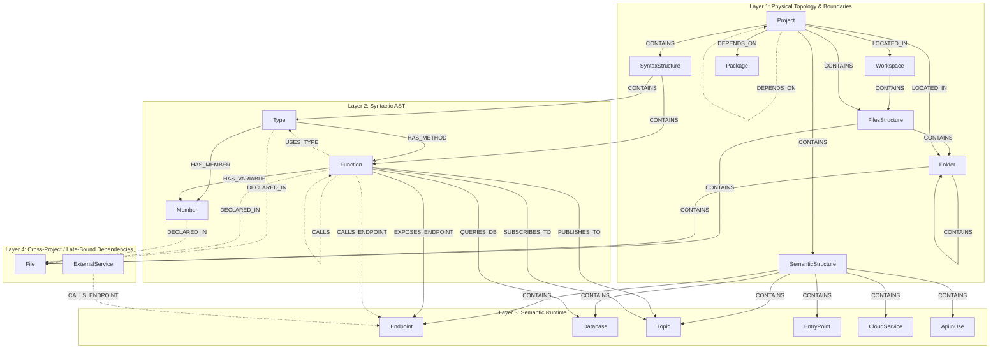

# CodeExplorer 4-Layers Decoupled Graph Ontology Specification

This document defines the official 4-Layer Graph Ontology architecture for CodeExplorer. The ontology is designed to decouple physical file layouts and project boundaries, syntactic code structures, runtime semantic interfaces, and cross-project integration links into separate queryable layers connected by uniform reference pointers.

By separating these responsibilities, CodeExplorer can perform surgical graph updates (e.g., pruning and re-indexing a single file's syntax tree) without affecting physical directory tracking or cascading deletions across the runtime architecture map.

---

## 🏛️ Architectural Overview

The graph ontology is structured into four distinct, decoupled layers:



---

## 🏛️ Root Boundary: Workspace

At the absolute top of the hierarchy is the `Workspace`. This does not belong to any layer; it is the root/umbrella container that holds all physical folder structures, and acts as the boundaries scope.

### Nodes

#### 1. **`Workspace`**
*   **Description:** The root index directory of CodeExplorer. All nodes created during a scan are scoped to a workspace ID.
*   **Properties:**
    *   `id` (int/string): Auto-incremented unique workspace database ID.
    *   `name` (string): The human-readable name of the workspace directory.
    *   `path` (string): Absolute host filesystem path to the workspace root.

---

## 📂 Layer 1: Physical Topology & Boundaries (Infrastructure & Layout)

Tracks the exact directory layout of the workspace on disk and logical compilation/module scopes (projects and packages).

### Nodes

#### 1. **`FilesStructure`**
*   **Description:** A structural grouping node representing the physical folder and file tree of a project or workspace.
*   **Properties:**
    *   `id` (string): Unique URN ending in `:files_structure`.
    *   `name` (string): `"FilesStructure"`.

#### 2. **`Folder`**
*   **Description:** A directory within the indexed workspace.
*   **Properties:**
    *   `id` (string): Folder URN based on absolute path.
    *   `name` (string): Unqualified name of the folder.
    *   `path` (string): Absolute path to the folder.

#### 3. **`File`**
*   **Description:** A source code file or configuration document.
*   **Properties:**
    *   `id` (string): File URN based on relative path.
    *   `name` (string): Filename with extension (basename).
    *   `path` (string): Absolute filesystem path to the file.
    *   `language` (string): Language key (`csharp`, `go`, `python`, `typescript`, `sql`).
    *   `hash` (string): Content hash (e.g., MD5) to verify if the file has changed since the last index.

#### 4. **`GitSettings`**
*   **Description:** Tracks Git repository settings and status for a directory.
*   **Properties:**
    *   `id` (string): Unique GitSettings URN.
    *   `branch` (string): Current active Git branch.
    *   `commit_hash` (string): Last commit hash.

#### 5. **`Project`**
*   **Description:** A logical package boundary or compilation scope.
*   **Properties:**
    *   `id` (string): Unique Project URN.
    *   `name` (string): Project name.
    *   `language` (string): Primary language scope (`csharp`, `go`, `python`, `typescript`).
    *   `path` (string): Absolute directory path containing the project config/manifest.

#### 6. **`Package`**
*   **Description:** Third-party package dependencies (e.g., NuGet, NPM, Go modules) referenced by projects.
*   **Properties:**
    *   `id` (string): Unique Package URN.
    *   `name` (string): Package name.

### Relationships
*   `FilesStructure -[CONTAINS]-> Folder`
*   `FilesStructure -[CONTAINS]-> File`
*   `Folder -[CONTAINS]-> Folder`
*   `Folder -[CONTAINS]-> File`
*   `Project -[LOCATED_IN]-> Folder`
*   `Project -[LOCATED_IN]-> Workspace`
*   `Project -[CONTAINS]-> FilesStructure`
*   `Project -[DEPENDS_ON]-> Package`

---

## 📂 Layer 2: Syntactic AST (Syntax Outline)

This layer represents the declarations found inside AST parser visitors. Nodes in this layer represent source code definitions and syntax outlines, completely isolated from runtime infrastructure.

### Nodes

#### 1. **`SyntaxStructure`**
*   **Description:** A structural grouping node representing all AST syntax structures declared in a project.
*   **Properties:**
    *   `id` (string): Unique URN ending in `:syntax_structure`.
    *   `name` (string): `"SyntaxStructure"`.

#### 2. **`Type`**
*   **Description:** A type declaration (Class, Interface, Struct, Record, Enum, or Union type).
*   **Properties:**
    *   `id` (string): URN specifying declaring path, type name, and line.
    *   `name` (string): Unqualified name of the type.
    *   `kind` (string): Specific sub-type (`class`, `interface`, `struct`, `record`, `enum`).
    *   `file_path` (string): Cached absolute path to the declaring file.
    *   `start_line` (int): 1-indexed starting line.
    *   `end_line` (int): 1-indexed ending line.

#### 3. **`Function`**
*   **Description:** A callable declaration (Method, Constructor, Free Function, or Local Function).
*   **Properties:**
    *   `id` (string): URN specifying declaring path, function name, and line.
    *   `name` (string): Unqualified name of the function/method.
    *   `signature` (string): Text-level declaration signature.
    *   `return_type` (string): The declared return type name.
    *   `file_path` (string): Cached absolute path to the declaring file.
    *   `start_line` (int): 1-indexed starting line.
    *   `end_line` (int): 1-indexed ending line.

#### 4. **`Member`**
*   **Description:** Fields, properties, parameters, or local variable declarations.
*   **Properties:**
    *   `id` (string): URN specifying declaring path, member name, and line.
    *   `name` (string): Member name.
    *   `type_name` (string): Declared type name.
    *   `kind` (string): Specific sub-type (`field`, `property`, `parameter`, `variable`).
    *   `start_line` (int): 1-indexed starting line.
    *   `end_line` (int): 1-indexed ending line.

### Relationships
*   `Project -[CONTAINS]-> SyntaxStructure`
*   `SyntaxStructure -[CONTAINS]-> Type`
*   `SyntaxStructure -[CONTAINS]-> Function`
*   `Type -[HAS_METHOD]-> Function`
*   `Type -[HAS_MEMBER]-> Member`
*   `Function -[HAS_VARIABLE]-> Member` (for local variables and method parameters)

---

## 📂 Layer 3: Semantic Runtime (Logical Architecture)

The semantic model captures runtime entry points, external API boundaries, databases, and message queue topics. These nodes map the logical architecture of the microservices workspace.

### Nodes

#### 1. **`SemanticStructure`**
*   **Description:** A structural grouping node representing logical semantic runtime elements of a project.
*   **Properties:**
    *   `id` (string): Unique URN ending in `:semantic_structure`.
    *   `name` (string): `"SemanticStructure"`.

#### 2. **`Endpoint`**
*   **Description:** An exposed HTTP API endpoint route.
*   **Properties:**
    *   `id` (string): HTTP method + route template.
    *   `http_method` (string): HTTP Verb (`GET`, `POST`, `PUT`, `DELETE`).
    *   `route_template` (string): Declared route path.

#### 3. **`Database`**
*   **Description:** A database engine instance, catalog, or physical schema.
*   **Properties:**
    *   `id` (string): URN scoped database type + name.
    *   `name` (string): Database/catalog name.
    *   `db_type` (string): Database system type (`sqlserver`, `postgres`, `sqlite`, `mongodb`, `neo4j`).

#### 4. **`Topic`**
*   **Description:** A message queue, event exchange, or topic boundary.
*   **Properties:**
    *   `id` (string): Queue/Exchange topic name.
    *   `name` (string): Topic name.
    *   `broker_type` (string): Broker engine (`rabbitmq`, `kafka`, `sqs`, `in-memory`).

#### 5. **`EntryPoint`**
*   **Description:** Non-HTTP execution triggers (e.g., gRPC services, CLI command definitions, Cron schedules, queue subscribers).
*   **Properties:**
    *   `id` (string): EntryPoint URN.
    *   `entry_type` (string): Specifier (`grpc`, `cli`, `cron`, `queue-listener`).

#### 6. **`CloudService`**
*   **Description:** Cloud-native services utilized by the microservices (e.g., AWS S3, Azure Blob, GCP PubSub).
*   **Properties:**
    *   `id` (string): Unique CloudService URN.
    *   `name` (string): Service identifier.

#### 7. **`ApiInUse`**
*   **Description:** External APIs and client libraries used within projects (e.g., Stripe API, HttpClient).
*   **Properties:**
    *   `id` (string): Unique ApiInUse URN.
    *   `name` (string): Library/API name.

### Relationships
*   `Project -[CONTAINS]-> SemanticStructure`
*   `SemanticStructure -[CONTAINS]-> Endpoint`
*   `SemanticStructure -[CONTAINS]-> Database`
*   `SemanticStructure -[CONTAINS]-> Topic`
*   `SemanticStructure -[CONTAINS]-> EntryPoint`
*   `SemanticStructure -[CONTAINS]-> CloudService`
*   `SemanticStructure -[CONTAINS]-> ApiInUse`

---

## 📂 Layer 4: Cross-Project / Late-Bound Dependencies (SystemBindings)

System bindings contain cross-cutting relationships that connect the separate buckets of Layers 1-3 into a unified semantic map. By separating these into a dedicated relational layer:
1. Syntactic nodes are linked back to physical file descriptors for IDE navigation.
2. Abstract compiler symbols are bound to logical runtime models.
3. Call graphs and data lineages can traverse cross-project boundaries seamlessly.

### Links: Syntactic AST to Physical Topology
*   `Type -[DECLARED_IN]-> File`
*   `Function -[DECLARED_IN]-> File`
*   `Member -[DECLARED_IN]-> File`

### Links: Syntactic AST to Runtime Semantics
*   `Function -[EXPOSES_ENDPOINT]-> Endpoint` (API ingress routing)
*   `Function -[QUERIES_DB]-> Database` (Data persistence mapping)
*   `Function -[PUBLISHES_TO]-> Topic` (Asynchronous event output)
*   `Function -[SUBSCRIBES_TO]-> Topic` (Asynchronous event input)

### Links: Code-Level Compiler Connections (Intra-Project)
*   `Type -[INHERITS_FROM]-> Type` (Inheritance / Interface implementations)
*   `Member -[OF_TYPE]-> Type` (Variable type declarations)
*   `Function -[CALLS]-> Function` (Direct method invocation)
*   `Function -[USES_TYPE]-> Type` (Instantiation / Casting / Parameter usage)

### Links: Microservice Integration Connections (Inter-Project)
*   `Function -[CALLS_ENDPOINT]-> Endpoint` (API egress via HttpClient / Axios)
*   `ExternalService -[CALLS_ENDPOINT]-> Endpoint` (Integration map)

---

## 🏷️ Uniform Resource Name (URN) & ID Schemes

To maintain integrity across multiple workspaces, every node identifier must be prefixed with the unique integer identifier `{workspaceId}` assigned to the active workspace scan. 

| Layer | Node Label | ID / URN Scheme | Example |
| :--- | :--- | :--- | :--- |
| **Umbrella** | **`Workspace`** | `{workspaceId}` (int) | `1` |
| **Layer 1** | **`Project`** | `{workspaceId}:project:{relativeProjectDir}:` | `1:project:Core/:` |
| **Layer 1** | **`FilesStructure`** | `{workspaceId}:project:{relativeProjectDir}:files_structure` | `1:project:Core/:files_structure` |
| **Layer 2** | **`SyntaxStructure`** | `{workspaceId}:project:{relativeProjectDir}:syntax_structure` | `1:project:Core/:syntax_structure` |
| **Layer 3** | **`SemanticStructure`** | `{workspaceId}:project:{relativeProjectDir}:semantic_structure` | `1:project:Core/:semantic_structure` |
| **Layer 1** | **`Folder`** | `{workspaceId}:folder:{absoluteFolderPath}` | `1:folder:/Work/Personal/code-explorer/Core` |
| **Layer 1** | **`File`** | `{workspaceId}:file:{relativeFilePath}` | `1:file:Core/OrdersService.cs` |
| **Layer 2** | **`Type`** | `{workspaceId}:symbol:{relativeFilePath}:Type:{name}:{line}` | `1:symbol:Core/OrdersService.cs:Type:OrdersService:5` |
| **Layer 2** | **`Function`** | `{workspaceId}:symbol:{relativeFilePath}:Function:{name}:{line}` | `1:symbol:Core/OrdersService.cs:Function:SubmitOrder:10` |
| **Layer 2** | **`Member`** | `{workspaceId}:symbol:{relativeFilePath}:Member:{name}:{line}` | `1:symbol:Core/OrdersService.cs:Member:logger:7` |
| **Layer 3** | **`Endpoint`** | `{workspaceId}:endpoint:{http_method}:{route}` | `1:endpoint:POST:/api/v1/orders` |
| **Layer 3** | **`Database`** | `{workspaceId}:db:{db_type}:{name}` | `1:db:sqlserver:commerce_db` |
| **Layer 3** | **`Topic`** | `{workspaceId}:topic:{broker_type}:{name}` | `1:topic:kafka:order-events` |
| **Layer 3** | **`EntryPoint`**| `{workspaceId}:entrypoint:{entry_type}:{name}` | `1:entrypoint:cli:ingest` |
| **Layer 3** | **`CloudService`** | `{workspaceId}:cloud:{serviceId}` | `1:cloud:aws-s3` |
| **Layer 3** | **`ApiInUse`** | `{workspaceId}:api:{apiId}` | `1:api:stripe` |
| **Layer 1** | **`Package`** | `{workspaceId}:package:{packageId}` | `1:package:nestjs-common` |

---

## 💡 Benefits for Surgical Pruning & Indexing

The 4-Layer model simplifies incremental file parsing:
1. **Zero Cascade Risk**: When `File` `1:file:Core/OrdersService.cs` is modified, CodeExplorer finds all nodes matching:
   ```cypher
   MATCH (n:Entity) WHERE n.id STARTS WITH '1:symbol:Core/OrdersService.cs:' DETACH DELETE n
   ```
   This immediately clears out all types, methods, and variables declared within that file, without breaking physical `Folder` structures, and without deleting logical `Endpoint` or `Database` nodes that other projects might refer to.
2. **Post-Index Binding**: Re-indexing simply writes the new AST outline (Layer 2) for the file. The `PostIndexAnalyzer` runs to rebuild Layer 4 bindings (e.g. mapping the new `Function` URN to the logical `Endpoint` or `Database`), ensuring system integration references are kept current without index bloat.
