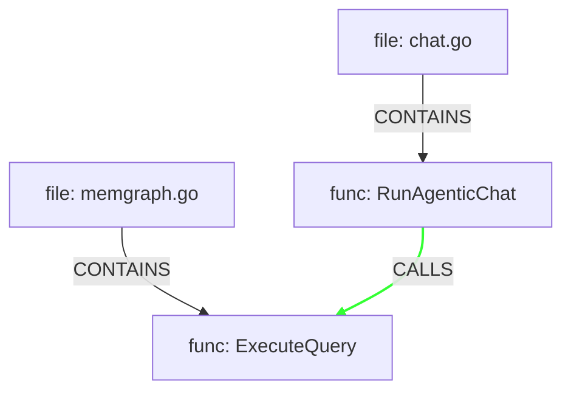
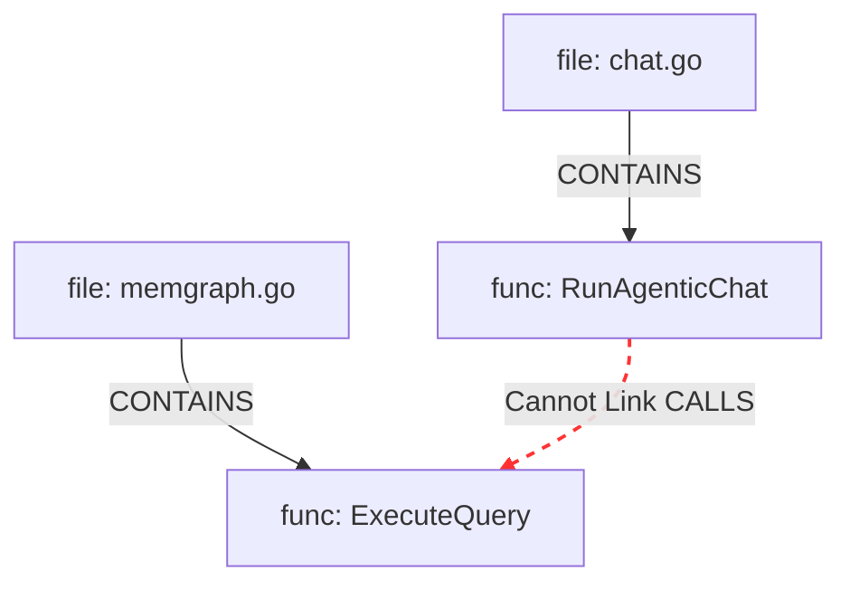

## SCIP Feeder (Connected Semantic Graph)

```mermaid
graph TD
    FileA_S["file: chat.go"] -->|CONTAINS| FuncA_S["func: RunAgenticChat"]
    FileB_S["file: memgraph.go"] -->|CONTAINS| FuncB_S["func: ExecuteQuery"]
    FuncA_S -->|CALLS| FuncB_S
    linkStyle 2 stroke:#33ff33,stroke-width:2px;
```

## Tree-sitter Feeder (Disconnected Syntactic Graph)

```mermaid
graph TD
    FileA_T["file: chat.go"] -->|CONTAINS| FuncA_T["func: RunAgenticChat"]
    FileB_T["file: memgraph.go"] -->|CONTAINS| FuncB_T["func: ExecuteQuery"]
    FuncA_T -.->|Cannot Link CALLS| FuncB_T
    linkStyle 2 stroke:#ff3333,stroke-width:2px,stroke-dasharray:5;
```
