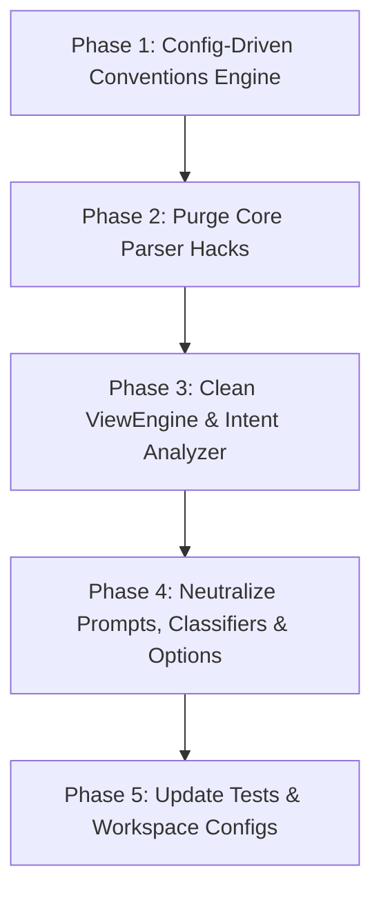

# Generic Architecture & Codebase De-Hack Plan

## 1. Problem Statement & Motivation

During recent domain analysis and intent distillation work, several project-specific hacks, heuristics, and hardcoded keywords targeting the `ATS` repository and `CodeExplorer` itself were inadvertently embedded directly into the core engine (`WorkspaceConventions.cs`, `ArchitectureViewEngine.cs`, `Layer5AnalysisParser.cs`, `CodeIntentAnalyzer.cs`, `ResourceReconciliationService.cs`, `ProjectLayerClassifier.cs`, etc.).

### Why this is unacceptable:
1. **Loss of Neutrality:** A code graph analysis tool must be completely domain-agnostic and reusable across any C#, TypeScript, Python, Java, or Go repository.
2. **Fragility:** Hardcoding specific service names (e.g. `tbmap`, `domvains`, `adhub`, `settler`), table names (e.g. `browser_version_types`), or engine quirks (e.g. BigQuery `.default` -> `.defaults`) masks bugs in graph clustering and breaks on other codebases.
3. **Architectural Confusion:** Solution-space entities (services, workers, APIs) and database tables should never be hard-coded into problem-space Macro-Domains in the engine binary.

---

## 2. Core Architectural Principles

1. **Configuration Over Hardcoding:**
   - Any enterprise-specific or repository-specific knowledge (domain names, service-to-domain mappings, path globs, custom routing functions, custom service prefixes) **must** reside in `.codeexplorer/domains.json` and `.codeexplorer/conventions.json` inside the target workspace.
2. **Graph-Native Algorithmic Fallback:**
   - When no user configuration is present, CodeExplorer must cluster projects using **pure graph topology** (Disjoint Set Union on shared database tables, event streams/topics, and direct service calls) combined with directory namespaces (e.g., `services/billing/*` -> `Billing`).
   - Only universal software engineering layers (`UserInterface`, `SharedKernel`, `DeveloperTooling`, `TestingInfrastructure`) may be inferred algorithmically without user configuration.
3. **Clean Separation of Concerns:**
   - **Bounded Context (Solution Space):** A specific service, worker, or application with clear technical boundaries.
   - **Business Domain (Problem Space):** A high-level business area configured by the user or synthesized from architectural clusters.
   - **Database Tables / Topics:** Technical persistence and communication resources; they must never become domains.

---

## 3. Inventory of Hacks to Remove

| # | File | Line(s) | Hardcoded Hack | Generic Replacement |
|---|------|---------|----------------|---------------------|
| 1 | `WorkspaceConventions.cs` | 17–20 | `RouteFunctionRegex` contains `getServiceDomainByRoute` | Configurable `route_functions` array in `conventions.json`; default regex matches standard patterns (`resolveRoute`, `serviceRoute`, `routeFor`). |
| 2 | `WorkspaceConventions.cs` | 470–475 | `clean.StartsWith("ats-") \|\| clean.StartsWith("ats_")` | Configurable `service_prefixes` list in `conventions.json` (e.g. `["ats-", "ats_"]`). Engine only strips generic technical prefixes (`internal-service-`, `integration-service-`, `service-`, `srv-`). |
| 3 | `WorkspaceConventions.cs` | 501–576 | Keyword sets containing `tbmap`, `adhub`, `smartcpa`, `settler`, `domvain`, `kvv2`, `cfworker`, `browserversiontypes`, `epm`, `bundl` | Completely remove these keyword dictionaries. Domain keyword scoring belongs in `.codeexplorer/domains.json` per workspace. |
| 4 | `WorkspaceConventions.cs` | 647–656 | Hardcoded alias checks in `CanonicalizeDomain` (`AdHub`, `Tbmap`, `Domvains`, `KvV2`, `Calc`, `Approval`, `Notifier`, etc.) | Delete all project-specific alias branches. Match against user-configured domains, globs/patterns, and universal technical roles. |
| 5 | `Layer5AnalysisParser.cs` | 1069 | `Regex.Replace(normP, @"^(internal-service-\|integration-service-\|internal-bundle-\|ats)", "")` | Call `WorkspaceConventions.NormalizeServiceName(normP)` uniformly. |
| 6 | `ArchitectureViewEngine.cs` | 2803 | `Regex.Replace(normP, @"^(internal-service-\|integration-service-\|internal-bundle-\|ats)", ...)` | Call `WorkspaceConventions.NormalizeServiceName(normP)`. |
| 7 | `ArchitectureViewEngine.cs` | 3575–3591 | Hardcoded domain icons for `settler`, `domvain`, `calc`, `approval`, `notifier`, `kv`, `binding` | Icons configured via `domains.json` (`"icon": "💳"`) or fall back to generic domain hash palette. |
| 8 | `CodeIntentAnalyzer.cs` | 1000 | `"ats"` in generic words blacklist | Remove `"ats"`. Keep only standard generic words (`service`, `api`, `worker`, `app`, `core`, etc.). |
| 9 | `ResourceReconciliationService.cs` | 84–88, 343–346 | BigQuery `.default` -> `.defaults` replacement | Remove. Dataset aliases should be configured in `conventions.json` (`"database_aliases": { "BigQuery.default": "BigQuery.defaults" }`). |
| 10 | `NativeIntentPredictor.cs` | 473–476 | Prompts containing `ApprovalManagement`, `EpmCalculation`, `ApprovalRequest` | Replace with generic DDD examples: `OrderManagement`, `PaymentProcessing`, `CustomerProfile`. |
| 11 | `ProjectLayerClassifier.cs` | 298 | `lowerName.Equals("codeexplorer")` in `IsIngress` | Remove. CodeExplorer CLI project is classified via manifest evidence or CLI entrypoints, not hardcoded name. |
| 12 | `ProjectLayerClassifier.cs` | 389 | `lowerName.EndsWith("notifier")` in `IsEgress` | Remove. Egress classification must be based on outbound external HTTP / message dependencies and manifest roles. |
| 13 | `IntentOptions.cs` | 11 | `internal-service-approval,ats-tbmap` in CLI help text | Replace with generic placeholder: `-s order-service,payment-gateway`. |

---

## 4. Target Architecture for Workspace Configuration

### 4.1. `.codeexplorer/domains.json` Schema
The workspace configures business domains, pattern matches, service mappings, and visual icons:

```json
{
  "domains": [
    {
      "name": "AdvertisingAndPartners",
      "icon": "📢",
      "description": "Ad management, partner integrations, and conversion tracking.",
      "patterns": ["*adhub*", "*tbmap*"],
      "services": ["internal-service-tbmap", "adhub-cf-worker"],
      "keywords": ["ad", "advertising", "partner", "campaign", "conversion"]
    },
    {
      "name": "BillingAndPayments",
      "icon": "💳",
      "description": "Financial transactions, billing, settlements, and invoicing.",
      "patterns": ["*settler*", "*billing*", "*payout*"],
      "services": ["internal-service-settler"]
    },
    {
      "name": "OperationsAndWorkflows",
      "icon": "🔄",
      "description": "Approval workflows, notifications, and scheduled background tasks.",
      "patterns": ["*approval*", "*notifier*"],
      "services": ["internal-service-approval", "internal-service-notifier"]
    }
  ],
  "overrides": {
    "internal-service-domvains": "DomainManagement",
    "cf-gateway": "TrafficAndRouting"
  }
}
```

### 4.2. `.codeexplorer/conventions.json` Schema
Workspace-level naming conventions, technical prefixes, and custom routing helpers:

```json
{
  "service_prefixes": ["ats-", "ats_", "internal-bundle-"],
  "route_functions": ["getServiceDomainByRoute", "resolveRoute"],
  "database_aliases": {
    "BigQuery.default": "BigQuery.defaults"
  },
  "topics": {
    "APPROVAL_EVENTS": "approval-events"
  }
}
```

---

## 5. Execution & Refactoring Phases



### Phase 1: Config-Driven Conventions Engine
- Complete the work started in `WorkspaceConventions.cs`:
  - Support `service_prefixes` from `conventions.json` in `NormalizeServiceName`.
  - Support `route_functions` from `conventions.json` in `TryMatchRouteFunction`.
  - Ensure `TryGetConfiguredDomain` checks `ServiceOverrides` -> `Exact Match` -> `PatternToDomain` (Globs) -> `Path Substring`.
- Delete all hardcoded keyword hashsets (`BillingKeywords`, etc.) and hardcoded alias switches in `CanonicalizeDomain`.

### Phase 2: Purge Core Parser Hacks
- `Layer5AnalysisParser.cs`: replace regex with `WorkspaceConventions.NormalizeServiceName(...)`.
- `ResourceReconciliationService.cs`: remove `.default` -> `.defaults` BigQuery patch; query `conventions.json` database aliases.

### Phase 3: Clean ViewEngine & Intent Analyzer
- `ArchitectureViewEngine.cs`:
  - Remove regex with `ats` and `internal-bundle-`.
  - Clean `ResolveDomainIcon`: use `WorkspaceConventions.TryGetDomainIcon(...)` and generic hash palette fallback.
- `CodeIntentAnalyzer.cs`:
  - Remove `"ats"` from `GetSignificantPrefixStem`.
  - In `DetermineClusterDomainName`: rely strictly on:
    1. User configuration (`TryGetConfiguredDomain`).
    2. Directory namespace stem (`services/billing/` -> `Billing`).
    3. Dominant shared entity / table / topic name from graph.

### Phase 4: Neutralize Prompts, Classifiers & CLI Options
- `ProjectLayerClassifier.cs`: delete `lowerName.Equals("codeexplorer")` and `lowerName.EndsWith("notifier")`.
- `NativeIntentPredictor.cs`: replace ATS examples with generic e-commerce/SaaS domain examples.
- `IntentOptions.cs`: replace ATS service names with generic placeholders.

### Phase 5: Update Tests & ATS Configuration
- Create `.codeexplorer/domains.json` and `.codeexplorer/conventions.json` in `c:\Work\ATS\src\services` with full domain definitions, globs, prefixes, and route functions.
- Refactor unit tests in `cli/tests/CodeExplorer.Tests` to use clean synthetic names (e.g. `OrderService`, `PaymentGateway`, `InventoryWorker`) instead of ATS service names.
- Verify compilation with `<TreatWarningsAsErrors>true</TreatWarningsAsErrors>`.
- Run full test suite (460+ unit tests, 220+ Cypher tests).

---

## 6. Verification Criteria
1. **Zero Hardcoded Project Strings:** Searching for `ats-`, `tbmap`, `domvain`, `adhub`, `smartcpa`, `settler`, `kvv2` in `cli/src/` returns 0 code results.
2. **Clean External Configuration:** Running `ce intent` in ATS yields the exact same 11 canonical domains, but powered entirely by `.codeexplorer/domains.json` and `.codeexplorer/conventions.json`.
3. **Universal Portability:** Running `ce intent` on an arbitrary, unconfigured repository (e.g., CodeExplorer itself, or an open-source repo) produces clean, sensible structural clusters based purely on directory namespaces and graph connectivity without crashes or spurious domain mappings.
