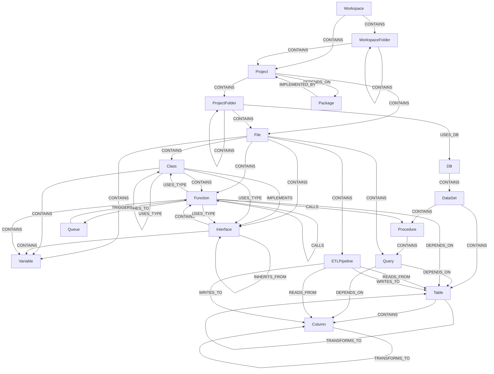

# CodeExplorer Graph Topology & Hierarchy Specification

This document specifies the taxonomy, nodes, properties, and relationships collected at each level of the CodeExplorer workspace hierarchy.

---

## 1. Hierarchy & Topology Map

The system parses workspaces into two interconnected semantic hierarchies: **Code/Workspace Hierarchy** and **Database/Data Lineage Hierarchy**.

---

## 2. Nodes & Attributes Collection

### Level 1: Workspace Roots
* **`Workspace`**
  * **Description**: The absolute root directory representing the opened codebase.
  * **Properties collected**:
    * `id` (string): Absolute filesystem path of the workspace.
    * `name` (string): Name of the root directory.
    * `path` (string): Absolute filesystem path of the workspace.
* **`WorkspaceFolder`**
  * **Description**: Subdirectories sitting directly under the workspace before project boundaries.
  * **Properties collected**:
    * `id` (string): Absolute filesystem path of the folder.
    * `name` (string): Name of the folder.
    * `path` (string): Relative filesystem path from the parent workspace/folder.

### Level 2: Project Declarations
* **`Project`**
  * **Description**: A buildable module, solution component, or package root (e.g. `.csproj`, `go.mod`, `package.json`).
  * **Properties collected**:
    * `id` (string): Absolute path to the project descriptor file/folder.
    * `name` (string): Project or module name.
    * `path` (string): Relative directory path from the workspace root.
    * `project_type` (string): Language type (`csharp`, `go`, `python`, `typescript`, `sql`).
* **`ProjectFolder`**
  * **Description**: Subdirectories inside a project structure containing source code files.
  * **Properties collected**:
    * `id` (string): Absolute path of the project subdirectory.
    * `name` (string): Folder name.
    * `path` (string): Relative path from the declaring project parent.
* **`Package`**
  * **Description**: External package or library referenced as dependencies (e.g. NuGet packages, npm packages, Go modules).
  * **Properties collected**:
    * `id` (string): Unique package key (`type:name:version`).
    * `name` (string): Library name.
    * `version` (string): Installed version.
    * `type` (string): Registry ecosystem (`nuget`, `npm`, `go`).

### Level 3: Files & General Containers
* **`File`**
  * **Description**: Individual source files that contain code or database queries.
  * **Properties collected**:
    * `id` (string): Absolute path to the file.
    * `name` (string): Filename basename (including extension).
    * `path` (string): Relative path from the workspace root.

### Level 4: Object-Oriented Structures (AST Types)
* **`Class`**
  * **Description**: Struct, class, or object definition parsed from AST.
  * **Properties collected**:
    * `id` (string): Fully qualified symbol name scoping the type.
    * `name` (string): Unqualified name of the class/struct.
    * `symbol` (string): Fully qualified name/symbol scope.
    * `file_path` (string): Workspace-relative path to the containing file.
    * `start_line` / `end_line` (int): Code definition bounds.
    * `start_col` / `end_col` (int): Character index column bounds.
* **`Interface`**
  * **Description**: Abstract interface contract declarations.
  * **Properties collected**:
    * `id` (string): Fully qualified interface symbol.
    * `name` (string): Interface name.
    * `symbol` (string): Fully qualified symbol scope.
    * `file_path` (string): Relative path of the containing file.
    * `start_line` / `end_line` (int): Code bounds.
    * `start_col` / `end_col` (int): Column bounds.

### Level 5: Code Executables & AST Symbols
* **`Function`**
  * **Description**: Methods, functions, constructors, or AST routines.
  * **Properties collected**:
    * `id` (string): Fully qualified method symbol.
    * `name` (string): Unqualified function name.
    * `symbol` (string): Fully qualified symbol path.
    * `file_path` (string): Relative path of the containing file.
    * `start_line` / `end_line` (int): Method bounds.
    * `start_col` / `end_col` (int): Column bounds.
* **`Variable`**
  * **Description**: Public fields, class properties, or globally exported variables. All private fields, protected fields, method parameters, and local variables are strictly excluded from the graph to focus on public interfaces and minimize graph noise.
  * **Properties collected**:
    * `id` (string): Fully qualified property or field symbol.
    * `name` (string): Variable name.
    * `symbol` (string): Fully qualified symbol scope.
    * `file_path` (string): Relative path of the containing file.
    * `start_line` / `end_line` (int): Location bounds.
    * `start_col` / `end_col` (int): Column bounds.

### Level 6: Database & Data Schema Nodes
* **`DB`**
  * **Description**: Database server or schema instance.
  * **Properties collected**:
    * `id` (string): Unique identifier (e.g. connection-string derived or database name).
    * `name` (string): Database name.
    * `path` (string): Relative file path (for local SQLite/Access files) or connection host.
* **`DataSet`**
  * **Description**: Schema or dataset logical grouping inside the database.
  * **Properties collected**:
    * `id` (string): Unique schema identifier.
    * `name` (string): Schema name (e.g. `dbo`, `public`).
    * `path` (string): Schema path identifier.
* **`Table`**
  * **Description**: Database physical tables or views.
  * **Properties collected**:
    * `id` (string): Fully qualified table name (`db.schema.table`).
    * `name` (string): Unqualified table name.
    * `path` (string): Source file path defining the schema (e.g. `.dbml`, `.edmx`, `.sql` script).
* **`Column`**
  * **Description**: Database table column.
  * **Properties collected**:
    * `id` (string): Fully qualified column name (`db.schema.table.column`).
    * `name` (string): Column name.
    * `data_type` (string): SQL data type (e.g., `bigint`, `nvarchar(50)`).
    * `is_primary_key` (bool): True if this column is part of the table's primary key.
    * `can_be_null` (bool): True if the column is nullable.
* **`Procedure`**
  * **Description**: Database stored procedures, views, or functions.
  * **Properties collected**:
    * `id` (string): Fully qualified procedure symbol.
    * `name` (string): Procedure name.
    * `path` (string): File path to migration/definition script or C# DbContext mapping if tracked.
* **`Query`**
  * **Description**: Embedded raw SQL statement, ORM query block, or execution block.
  * **Properties collected**:
    * `id` (string): Unique query node ID.
    * `name` (string): Generated query label (e.g., `"SELECT Query #1"`).
    * `query_text` (string): Raw SQL/ORM query string (truncated if exceeding bounds).
    * `path` (string): File path where the query is embedded.

### Level 7: ETL Pipelines & Message Broker Nodes
* **`ETLPipeline`**
  * **Description**: Data migration or Extract-Transform-Load (ETL) pipeline (e.g. SSIS `.dtsx` package, data factory mapping).
  * **Properties collected**:
    * `id` (string): Unique path-based pipeline ID.
    * `name` (string): Pipeline/Package name.
    * `path` (string): Relative path to the `.dtsx` package.
* **`Queue`**
  * **Description**: Message queue or publish-subscribe channel (e.g. RabbitMQ queue, Kafka topic, or internal in-memory queue like C# `InMemQueue`).
  * **Properties collected**:
    * `id` (string): Unique queue ID.
    * `name` (string): Queue or topic name.
    * `type` (string): Broker type (`rabbitmq`, `kafka`, `in-memory`).

---

## 3. Node URN / ID Schemes

To guarantee uniqueness across multi-project workspaces and multiple database instances, CodeExplorer uses structured Uniform Resource Names (URNs) for node IDs. The table below lists the ID schemes and their scope:

| Node Label | ID / URN Scheme | Uniqueness Scope | Description / Example |
| :--- | :--- | :--- | :--- |
| **`Workspace`** | `workspace:{absoluteWorkspacePath}` | Global | `workspace:/Users/slava/Projects/Personal/CodeExplorer` |
| **`WorkspaceFolder`** | `workspacefolder:{absoluteWorkspacePath}:{relativeDir}` | Workspace | `workspacefolder:/Users/slava/Projects/Personal/CodeExplorer:docs` |
| **`Project`** | `project:{absoluteProjectPath}:` | Workspace | `project:/Users/slava/Projects/Personal/CodeExplorer/Core/CodeExplorer.Core:` |
| **`ProjectFolder`** | `projectfolder:{absoluteWorkspacePath}:{relativeDir}` | Workspace | `projectfolder:/Users/slava/Projects/Personal/CodeExplorer:Core/CodeExplorer.Core/Mcp` |
| **`Package`** | `{type}:{name}:{version}` | Ecosystem | `nuget:Neo4j.Driver:6.1.2` or `npm:react:18.2.0` |
| **`File`** | `file:{absoluteWorkspacePath}:{relativeFilePath}` | Workspace | `file:/Users/slava/Projects/Personal/CodeExplorer:Core/CodeExplorer.Core/Mcp/McpServer.cs` |
| **`Class`** | `symbol:{absoluteWorkspacePath}:{relativeFilePath}:Class:{name}:{startLine}` | File | `symbol:/Users/slava/Projects/Personal/CodeExplorer:Core/CodeExplorer.Core/Mcp/McpServer.cs:Class:McpServer:7` |
| **`Interface`** | `symbol:{absoluteWorkspacePath}:{relativeFilePath}:Interface:{name}:{startLine}` | File | `symbol:/Users/slava/Projects/Personal/CodeExplorer:Core/CodeExplorer.Core/Parser/IFileParser.cs:Interface:IFileParser:5` |
| **`Function`** | `symbol:{absoluteWorkspacePath}:{relativeFilePath}:Function:{name}:{startLine}` | File | `symbol:/Users/slava/Projects/Personal/CodeExplorer:Core/CodeExplorer.Core/Mcp/McpServer.cs:Function:StartAsync:9` |
| **`Variable`** | `symbol:{absoluteWorkspacePath}:{relativeFilePath}:Variable:{name}:{startLine}` | File | `symbol:/Users/slava/Projects/Personal/CodeExplorer:Core/CodeExplorer.Core/Parser/FileLevelParser.cs:Variable:_filePath:10` |
| **`DB`** | `db:{dbKind}:{databaseName}` | Global DB | `db:pg:defaultdb` or `db:mssql:orders_db` (forced lowercase) |
| **`DataSet`** | `db:{dbKind}:{databaseName}:dataset:{schemaName}` | Database | `db:mssql:defaultdb:dataset:dbo` (forced lowercase schema name) |
| **`Table`** | `db:{dbKind}:{databaseName}:dataset:{schemaName}:table:{tableName}` | Schema | `db:mssql:defaultdb:dataset:dbo:table:orders` (forced lowercase table name) |
| **`Column`** | `db:{dbKind}:{databaseName}:dataset:{schemaName}:table:{tableName}:column:{columnName}` | Table | `db:mssql:defaultdb:dataset:dbo:table:orders:column:id` |
| **`Procedure`** | `db:{dbKind}:{databaseName}:dataset:{schemaName}:procedure:{procedureName}` | Schema | `db:mssql:defaultdb:dataset:dbo:procedure:get_orders` |
| **`Query`** | `{containingParentId}:query:{queryCounter}` | Parent Scope | `db:mssql:defaultdb:dataset:dbo:procedure:get_orders:query:1` (for queries nested inside stored procedures) or `file:/Users/slava/Projects/Personal/CodeExplorer:sql/query.sql:query:1` (for files) |
| **`ETLPipeline`** | `etlpipeline:{absoluteWorkspacePath}:{relativeFilePath}` | Workspace | `etlpipeline:/Users/slava/Projects/DA/Kiron/BetManVSBS:VSBS.DataWarehouse/Dimensions.dtsx` |
| **`Queue`** | `queue:{type}:{queueName}` | Workspace | `queue:rabbitmq:FinalizeSlip` or `queue:in-memory:EventPending` |

---

## 4. Relationships & Edges Definition

CodeExplorer's graph relationships are detailed below, organized by their **Source Node** to show all outbound edges:

| Source Node | Relationship Type | Target Node(s) | Description |
| :--- | :--- | :--- | :--- |
| **`Workspace`** | `CONTAINS` | `WorkspaceFolder`, `Project`, `File` | Logical nested directories, solution files, or projects in the root. |
| **`WorkspaceFolder`** | `CONTAINS` | `WorkspaceFolder`, `Project`, `File` | Subdirectories and workspace files. |
| **`Project`** | `CONTAINS` | `ProjectFolder`, `File` | Folders and source files inside project boundary. |
| | `DEPENDS_ON` | `Project`, `Package` | Inter-project dependencies and package references. |
| | `EXPOSES` | `EntryPoint` | HTTP endpoints, RPC service stubs, CLI verbs. |
| | `USES_DB` | `DB` | Main database schema connections configured. |
| **`ProjectFolder`** | `CONTAINS` | `ProjectFolder`, `File` | Nested directory scopes inside projects. |
| | `USES_DB` | `DB` | DB configs scoped to specific subdirectory. |
| **`Package`** | `IMPLEMENTED_BY` | `Project` | Links external package dependency to internal source project if available. |
| **`File`** | `CONTAINS` | `Class`, `Interface`, `Function`, `Variable`, `Query`, `ETLPipeline` | AST structures, declarations, inline queries, or ETL configurations. |
| **`Class`** | `CONTAINS` | `Function`, `Variable` | Class methods and public member fields/properties. |
| | `IMPLEMENTS` | `Interface` | Concrete class implementing abstract interface contract. |
| | `INHERITS_FROM` | `Class` | Base class inheritance link. |
| | `USES_TYPE` | `Class`, `Interface` | Structural references (field declarations, instantiation). |
| **`Interface`** | `CONTAINS` | `Function`, `Variable` | Interface method and property declarations. |
| | `INHERITS_FROM` | `Interface` | Interface inheritance/extensions. |
| | `USES_TYPE` | `Class`, `Interface` | Structural types referenced in contract parameters. |
| **`Function`** | `CONTAINS` | `Function`, `Variable`, `Query` | Nested local routines, variables, or inline SQL queries. |
| | `CALLS` | `Function`, `Procedure`, `ExternalService`, `CloudService` | Invocations (code-to-code, code-to-procedure mapped via attributes or ORMs, external API, or cloud services). |
| | `DEPENDS_ON` | `CloudService` | Cloud SDK storage/compute service dependency. |
| | `PUBLISHES_TO` | `CloudService`, `Queue` | Event or message publishing (Kafka, RabbitMQ, SQS, or internal queues). |
| | `USES_TYPE` | `Class`, `Interface` | Type referencing in parameter arguments or return types. |
| **`Variable`** | `CALLS` | `Function` | Invoking delegates or function callbacks. |
| | `USES_TYPE` | `Class`, `Interface` | Field, property, or constant type mapping. |
| **`EntryPoint`** | `TRIGGERS` | `Function` | Maps incoming API HTTP routes or message topics to handler code methods. |
| **`Queue`** | `TRIGGERS` | `Function` | Queue consumer triggering code handler functions. |
| **`DB`** | `CONTAINS` | `DataSet` | Databases scoping logical datasets/schemas. |
| **`DataSet`** | `CONTAINS` | `Table`, `Procedure` | Schemas containing tables and stored procedures. |
| **`Table`** | `CONTAINS` | `Column` | Database table columns. |
| | `TRANSFORMS_TO` | `Table` | High-level data lineage mapping source table to target table. |
| **`Column`** | `REFERENCES` | `Column` | Foreign key relationship between columns. |
| | `TRANSFORMS_TO` | `Column` | Granular data lineage mapping source column to target column. |
| **`Procedure`** | `CONTAINS` | `Query` | SQL statements contained inside a database stored procedure. |
| **`Query`** | `DEPENDS_ON` | `Table`, `Column` | Static SQL statements reading/writing to tables and columns. |
| **`ETLPipeline`** | `READS_FROM` | `Table`, `Column` | ETL input sources. |
| | `WRITES_TO` | `Table`, `Column` | ETL output/target warehouse tables and columns. |

---

## 5. Proposed Extensions & Primitives

To support deeper architectural mapping and code navigation, we propose the following expansion of nodes, relationships, and primitives.

### A. Direct Project-to-Construct Relationships

Currently, checking if a `Class`, `Interface`, or `Function` belongs to a `Project` requires variable-length path traversal:
`MATCH (p:Project)-[:CONTAINS*1..]->(f:File)-[:CONTAINS*1..]->(c:Class)`

We propose adding direct reference relationships to bypass file-level hierarchy for high-level queries:

*   **`DECLARES`**: `(Project)-[:DECLARES]->(Class|Interface|Enum|Namespace)`
    *   *Purpose*: Instantly retrieve all top-level logical declarations belonging to a project, bypassing file-system folders.
*   **`EXPORTS`**: `(Project)-[:EXPORTS]->(Class|Interface|Function)`
    *   *Purpose*: Maps public API/export boundaries of a project or library component.

### B. Extended Code Primitives

To capture logical scopes, decorator patterns, and advanced constructs, we propose expanding language primitives:

1.  **`Namespace` / `Module`**
    *   *Purpose*: Logical namespace bounds (distinct from directory nesting). E.g. `namespace CodeExplorer.Parser` or Go package scopes.
    *   *URN Scheme*: `namespace:{workspacePath}:{name}`
    *   *Relationships*: `(Namespace)-[:CONTAINS]->(Class|Interface|Function)`
2.  **`Enum` & `EnumMember`**
    *   *Purpose*: Custom enum types and their selectable choices.
    *   *URN Scheme*:
        *   Enum: `symbol:{workspacePath}:{relativeFilePath}:Enum:{name}:{startLine}`
        *   EnumMember: `symbol:{workspacePath}:{relativeFilePath}:EnumMember:{enumName}.{memberName}:{startLine}`
    *   *Relationships*: `(Enum)-[:CONTAINS]->(EnumMember)`
3.  **`TypeAlias` / `Type`**
    *   *Purpose*: Structural type aliases in TypeScript (`type ID = string;`) or Go type declarations.
    *   *URN Scheme*: `symbol:{workspacePath}:{relativeFilePath}:TypeAlias:{name}:{startLine}`
4.  **`Annotation` / `Decorator` / `Attribute`**
    *   *Purpose*: Metadata decorations that drive frameworks (e.g. C# `[ApiController]`, TS/NestJS `@Injectable()`, Java `@RestController`). These are crucial for entry point routing, dependency injection, and data models.
    *   *URN Scheme*: `symbol:{workspacePath}:{relativeFilePath}:Annotation:{name}:{startLine}`
    *   *Relationships*: `(Class|Function|Variable)-[:DECORATED_WITH]->(Annotation)`
5.  **`Import` / `Export`**
    *   *Purpose*: File-level import statements to trace syntactic compilation dependencies.
    *   *URN Scheme*: `import:{workspacePath}:{relativeFilePath}:{importedName}:{line}`
    *   *Relationships*: `(File)-[:IMPORTS]->(Import)`

### C. Extended Database & Schema Primitives

To support enterprise databases, data warehousing, and ETL lineage:

1.  **`Column`**
    *   *Purpose*: Database table columns, tracking names, data types, and nullability.
    *   *URN Scheme*: `{tableNodeId}:column:{columnName}`
    *   *Relationships*:
        *   `(Table)-[:CONTAINS]->(Column)`
        *   `(Query)-[:DEPENDS_ON]->(Column)` (tracks column-level data lineage)
        *   `(Column)-[:REFERENCES]->(Column)` (tracks foreign-key constraints/associations)

2.  **`ETLPipeline`**
    *   *Purpose*: Traces data migration paths, warehouse transformations, and ETL package runs (e.g. SSIS `.dtsx` packages).
    *   *URN Scheme*: `etlpipeline:{workspacePath}:{relativeFilePath}`
    *   *Relationships*:
        *   `(File)-[:CONTAINS]->(ETLPipeline)`
        *   `(ETLPipeline)-[:READS_FROM]->(Table|Column)`
        *   `(ETLPipeline)-[:WRITES_TO]->(Table|Column)`
        *   `(Table|Column)-[:TRANSFORMS_TO]->(Table|Column)` (transitive lineage edge representing data flow)

3.  **Schema Mappings via XML DBML / EDMX**
    *   *Purpose*: Parses database table, column, and foreign key definitions statically from LINQ-to-SQL `.dbml` and Entity Framework `.edmx` files, avoiding raw SQL schema script parsing.
    *   *Mapping*: Creates `Table` and `Column` nodes and `Column -[:REFERENCES]-> Column` relationships based on `<Table>` elements and `<Association>` elements in the XML files.

4.  **Stored Procedure Attributes Mapping**
    *   *Purpose*: Connects C# DbContext stub methods to physical SQL stored procedures using C# metadata attributes (e.g. `[Function(Name = "dbo.rep_RequestLogs")]`).
    *   *Mapping*: Creates a `(Function)-[:CALLS]->(Procedure)` edge when the static analyzer matches a method decorated with `[Function]` (or similar ORM attributes) to the corresponding `Procedure` node.

---

## 6. DB & Cloud Services Detection Strategy

To map the connection between code functions and external resources (Databases, Cloud Services, and ETL Pipelines), we use static analysis heuristics based on package imports, client type instantiations, configuration usages, and string literal parsing.

### A. Database (DB) Detection Heuristics

We track data access lineages using four main signals:

1.  **Static SQL Parsing (String Literal Scanning)**:
    *   **Action**: Scan AST string literals inside functions for standard SQL keywords (`SELECT`, `INSERT`, `UPDATE`, `DELETE`, `MERGE`, `FROM`, `JOIN`).
    *   **Table Resolution**: Extract matching tokens following `FROM` or `JOIN` to map table/column dependencies:
        *   `MATCH (q:Query)-[:DEPENDS_ON]->(t:Table)`
    *   **Query Scope**: Connect the query node to its enclosing code block:
        *   `(Function)-[:CONTAINS]->(Query)`
2.  **ORM / Database Driver Client Tracing (Type Reference Matches)**:
    *   **Action**: Trace calls on known database connection types (e.g. C# `DbContext`, `SqlCommand`, `DbConnection`; Go `gorm.DB`, `sql.DB`, `pgx.Conn`; Node/TS `pg.Client`, `TypeORMRepository`).
    *   **Call Linking**: Whenever a function invokes methods (like `.Query()`, `.Execute()`, `.SaveChangesAsync()`) on these types, map a dependency:
        *   `(Function)-[:DEPENDS_ON]->(Table)` (if table type can be resolved from ORM generic arguments like `DbSet<Order>`).
3.  **Static Schema Extraction (DBML / EDMX)**:
    *   **Action**: Parse DBML (`.dbml`) and Entity Framework (`.edmx`) XML files for `<Table>` and `<Association>` elements.
    *   **Table/Column Extraction**: Populate the database topology with exact tables, column schemas, types, nullability, and primary keys.
    *   **ForeignKey Extraction**: Link tables and columns using `Column -[:REFERENCES]-> Column` edges.
4.  **Connection Configuration Analysis**:
    *   **Action**: Parse app configuration files (e.g. `appsettings.json`, `.env`, YAML charts) for database connection keys (`ConnectionStrings:DefaultConnection`, `DATABASE_URL`, `DB_HOST`).
    *   **Instance Linking**: Match these configurations to the project to instantiate a `DB` node and associate it:
        *   `(Project)-[:USES_DB]->(DB)`

### B. Cloud Services & Messaging Detection Heuristics

We represent external cloud services and messaging channels using `CloudService` and `Queue` nodes.

1.  **SDK Client Package Imports (Dependency Mapping)**:
    *   **Action**: Check project package configuration files (`.csproj`, `go.mod`, `package.json`) and import headers for known Cloud SDK libraries.
    *   **Ecosystem Catalog**:
        *   *AWS SDK*: `AWSSDK.S3`, `AWSSDK.SQS`, `@aws-sdk/client-s3`.
        *   *GCP SDK*: `Google.Cloud.PubSub.V1`, `cloud.google.com/go/pubsub`.
        *   *Azure SDK*: `Azure.Storage.Blobs`, `@azure/storage-blob`.
        *   *Message Brokers*: `Confluent.Kafka`, `RabbitMQ.Client`, `github.com/segmentio/kafka-go`.
2.  **SDK Instantiation & Method Calls (AST Usages)**:
    *   **Action**: Match instantiations and call references of specific SDK Client classes in the AST (e.g., calling `.PutObjectAsync()` on `AmazonS3Client`, or `.PublishAsync()` on `PublisherClient`).
    *   **Mapping**: Trace these calls back to the invoking function:
        *   `(Function)-[:CALLS]->(CloudService)` (e.g. `cloudservice:aws_s3:bucket_name` or general `cloudservice:aws_s3:default`).
3.  **Config-Driven Queue & Broker Resolution**:
    *   **Action**: Trace calls to custom message queue wrappers (e.g. `VSBS.RabbitMQ.Publisher.Add` or `Consumer.Receive`) and configuration files containing host names and queue configurations (e.g., `RabbitMQ:HostName`).
    *   **Mapping**: Instantiate a `Queue` node named after the queue/topic literal and build relationships:
        *   `(Function)-[:PUBLISHES_TO]->(Queue)` (for publisher calls)
        *   `(Queue)-[:TRIGGERS]->(Function)` (for consumer subscriptions)
4.  **Environment Variable & Config Correlative Parsing**:
    *   **Action**: Identify code references retrieving configuration parameters carrying cloud-specific keys (e.g. `S3_BUCKET_NAME`, `KAFKA_BROKERS`, `AZURE_STORAGE_CONNECTION_STRING`).
    *   **Resource Mapping**: Resolve the configuration value to name the specific resource:
        *   A function reading `config.Get("S3_BUCKET_NAME")` is linked directly: `(Function)-[:DEPENDS_ON]->(CloudService { type: "aws_s3", name: resolvedBucketName })`.

### C. SSIS ETL Pipeline Detection Heuristics

To trace database data lineage across multiple database boundaries (such as transaction databases feeding transactional data warehouses):

1.  **DTSX XML Package Parsing**:
    *   **Action**: Parse SQL Server Integration Services (SSIS) `.dtsx` files to find connection managers, data flow executables (`Microsoft.Pipeline`), sources (`Microsoft.OLEDBSource`), destinations (`Microsoft.OLEDBDestination`), and transformation steps.
2.  **Connection-to-DB Resolution**:
    *   **Action**: Map OLEDB/ADO.NET Connection Managers to their target `DB` nodes using connection string catalog values (e.g., `Initial Catalog=VSBS_BetManager` maps to `db:vsbs_betmanager`).
3.  **Data Lineage Mapping**:
    *   **Action**: For every data flow component:
        *   Extract source query (`SqlCommand` property) or source table (`OpenRowset` property) and map to source table columns.
        *   Extract destination table (`OpenRowset` property) and map destination columns.
        *   Generate lineage edges:
            *   `(ETLPipeline)-[:READS_FROM]->(SourceTable)`
            *   `(ETLPipeline)-[:WRITES_TO]->(DestinationTable)`
            *   `(SourceColumn)-[:TRANSFORMS_TO]->(DestinationColumn)` (derived from the output-column to input-column connections in the pipeline XML)

---

## 7. Project Ingress & Egress (External Interfaces)

To map how a project communicates with the outside world (other microservices, consumers, event publishers), CodeExplorer defines explicit nodes for Ingress (Entry Points) and Egress (External Services).

### A. Ingress (Incoming Calls & Event Consumption)

We represent external triggers using a dedicated node **`EntryPoint`** (URN Scheme: `entrypoint:{projectName}:{protocol}:{route_or_topic}`).

#### Types of Entry Points:
1.  **HTTP / REST APIs**:
    *   *Source Code Target*: Controller methods decorated with routing attributes (C# `[HttpPost("charge")]`, NestJS `@Post('charge')`) or registered routing endpoints (Go `r.POST("/charge", Handler)`).
    *   *URN Example*: `entrypoint:BillingService:http:POST:/charge`
2.  **Message & Event Consumers (Asynchronous Ingress)**:
    *   *Source Code Target*: Event handlers subscribing to a queue or message topic (e.g. methods decorated with `@QueuePattern('order-created')` or listening to Kafka topics).
    *   *URN Example*: `entrypoint:BillingService:event:order-created`
3.  **gRPC / RPC Handlers**:
    *   *Source Code Target*: Methods implementing Protobuf-generated service interfaces.
    *   *URN Example*: `entrypoint:BillingService:grpc:GetBalance`
4.  **CLI Command Entrypoints**:
    *   *Source Code Target*: Application startup scripts or console argument handlers (`Program.Main` or command-line verbs).
    *   *URN Example*: `entrypoint:BillingService:cli:migrate-db`

#### Ingress Relationships:
*   **`EXPOSES`**: `(Project)-[:EXPOSES]->(EntryPoint)`
*   **`TRIGGERS`**: `(EntryPoint)-[:TRIGGERS]->(Function)` (links the external boundary directly to the code method that executes the request).

---

### B. Egress (Outgoing Calls to External Services)

We represent other microservices or external APIs called by the project using a dedicated node **`ExternalService`** (URN Scheme: `externalservice:{protocol}:{domain_or_service_name}`).

#### Detection Heuristics:
1.  **HTTP / REST Client Invocation**:
    *   *Action*: Scan for HTTP clients (`HttpClient` in C#, `axios` in JS/TS, `http.Client` in Go) invoking remote URLs or service discovery names.
    *   *Host Extraction*: Parse URL endpoints or client configuration templates to extract the target service name or domain (e.g., `api.stripe.com` or `AuthService`).
2.  **gRPC Client Stubs**:
    *   *Action*: Scan for gRPC client class instantiations (e.g. `PaymentGatewayClient`).

#### Egress Relationships:
*   **`CALLS`**: `(Function)-[:CALLS]->(ExternalService)` (e.g. `(chargeFunction)-[:CALLS]->(externalservice:http:api.stripe.com)`).
*   **`PUBLISHES_TO`**: `(Function)-[:PUBLISHES_TO]->(CloudService)` (e.g. publishing message to Kafka / AWS SNS topics).
    *   *Relationship*: `(Function)-[:PUBLISHES_TO]->(CloudService { type: "kafka_topic", name: "invoice-billed" })`
