<!-- AUTO-GENERATED — do not edit manually. Re-generated on every build by OntologyGen. -->

# CodeExplorer Ontology

> This document is generated from source annotations during the build.
> Edit the `[OntologyNode]`, `[OntologyEdge<>]`, `[OntologyProperty]`, and `[OntologyRelationship]` attributes in the source files to update it.

---

## 📊 Architectural Overview (Mermaid Diagram)

```mermaid
graph TD
    SemanticStructure["SemanticStructure"]
    Workspace["Workspace"]

    subgraph Layer1 ["Layer 1: Physical Topology"]
        Counter["Counter"]
        File["File"]
        FilesStructure["FilesStructure"]
        Folder["Folder"]
        GitSettings["GitSettings"]
    end

    subgraph Layer2 ["Layer 2: Project Boundary"]
        Package["Package"]
        Project["Project"]
        ProjectsStructure["ProjectsStructure"]
    end

    subgraph Layer3 ["Layer 3: Syntactic Structure"]
        Function["Function"]
        Member["Member"]
        ProjectSyntax["ProjectSyntax"]
        SyntaxStructure["SyntaxStructure"]
        Type["Type"]
    end

    subgraph Layer4 ["Layer 4: Semantic Structure"]
        ApiInUse["ApiInUse"]
        App["App"]
        CliTool["CliTool"]
        CloudService["CloudService"]
        Database["Database"]
        DataSet["DataSet"]
        Endpoint["Endpoint"]
        EntryPoint["EntryPoint"]
        ExternalService["ExternalService"]
        Library["Library"]
        Procedure["Procedure"]
        Query["Query"]
        Service["Service"]
        Table["Table"]
        Topic["Topic"]
        Worker["Worker"]
    end

    App -->|LOCATED_IN| Folder
    App -->|LOCATED_IN| Workspace
    App -->|DEPLOYED_BY| Project
    App -->|SERVICE_CALL| Service
    App -->|SERVICE_CALL| ExternalService
    App -->|CONTAINS| EntryPoint
    App -->|CONTAINS| Endpoint
    App -->|CONTAINS| ApiInUse
    CliTool -->|LOCATED_IN| Folder
    CliTool -->|LOCATED_IN| Workspace
    CliTool -->|DEPLOYED_BY| Project
    CliTool -->|SERVICE_CALL| Service
    CliTool -->|SERVICE_CALL| ExternalService
    CliTool -->|USES_DB| Database
    CliTool -->|CONTAINS| EntryPoint
    Database -->|QUERIED_BY| Function
    Database -->|QUERIED_BY| Query
    DataSet -->|CONTAINS| Table
    Endpoint -->|TRIGGERS| Function
    Endpoint -->|EXPOSED_BY| Type
    Endpoint -->|EXPOSED_BY| Function
    EntryPoint -->|TRIGGERS| Function
    EntryPoint -->|EXPOSED_BY| Type
    ExternalService -->|CALLS_ENDPOINT| Endpoint
    ExternalService -->|CALLED_BY| Function
    FilesStructure -->|CONTAINS| Folder
    FilesStructure -->|CONTAINS| File
    Folder -->|CONTAINS| Folder
    Folder -->|CONTAINS| File
    Folder -->|CONTAINS| GitSettings
    Function -->|DECLARED_IN| File
    Function -->|CALLS| Function
    Function -->|USES_TYPE| Type
    Library -->|LOCATED_IN| Folder
    Library -->|LOCATED_IN| Workspace
    Library -->|DEPLOYED_BY| Project
    Library -->|CONTAINS| Type
    Library -->|CONTAINS| Function
    Member -->|DECLARED_IN| File
    Member -->|OF_TYPE| Type
    Package -->|IMPLEMENTED_BY| Project
    Procedure -->|CONTAINS| Query
    Project -->|LOCATED_IN| Folder
    Project -->|LOCATED_IN| Workspace
    Project -->|DEPENDS_ON| Project
    Project -->|DEPENDS_ON| Package
    Project -->|DEPLOYS| Service
    Project -->|DEPLOYS| App
    Project -->|DEPLOYS| Worker
    Project -->|DEPLOYS| Library
    Project -->|DEPLOYS| CliTool
    ProjectsStructure -->|CONTAINS| Project
    ProjectSyntax -->|CONTAINS| Type
    ProjectSyntax -->|CONTAINS| Function
    ProjectSyntax -->|BELONGS_TO| Project
    Query -->|DEPENDS_ON| Table
    SemanticStructure -->|CONTAINS| App
    SemanticStructure -->|CONTAINS| Service
    SemanticStructure -->|CONTAINS| Worker
    SemanticStructure -->|CONTAINS| Library
    SemanticStructure -->|CONTAINS| CliTool
    SemanticStructure -->|CONTAINS| Database
    SemanticStructure -->|CONTAINS| Topic
    SemanticStructure -->|CONTAINS| ExternalService
    SemanticStructure -->|CONTAINS| CloudService
    Service -->|LOCATED_IN| Folder
    Service -->|LOCATED_IN| Workspace
    Service -->|DEPLOYED_BY| Project
    Service -->|SERVICE_CALL| Service
    Service -->|SERVICE_CALL| ExternalService
    Service -->|USES_DB| Database
    Service -->|PUBLISHES_TO| Topic
    Service -->|SUBSCRIBES_TO| Topic
    Service -->|CONTAINS| EntryPoint
    Service -->|CONTAINS| Endpoint
    Service -->|CONTAINS| CloudService
    Service -->|CONTAINS| ApiInUse
    SyntaxStructure -->|CONTAINS| ProjectSyntax
    Table -->|QUERIED_BY| Function
    Table -->|QUERIED_BY| Query
    Table -->|PERSISTED_IN| Type
    Topic -->|PUBLISHED_BY| Function
    Topic -->|SUBSCRIBED_BY| Function
    Topic -->|PUBLISHED_BY| Service
    Topic -->|SUBSCRIBED_BY| Service
    Topic -->|SUBSCRIBED_BY| Worker
    Topic -->|TRIGGERS| Project
    Topic -->|SUBSCRIBED_BY| Project
    Type -->|DECLARED_IN| File
    Type -->|USES_TYPE| Type
    Type -->|IMPLEMENTS| Type
    Type -->|INHERITS_FROM| Type
    Type -->|POTENTIAL_TYPE| Type
    Type -->|HAS_METHOD| Function
    Type -->|HAS_MEMBER| Member
    Type -->|PERSISTED_IN| Table
    Worker -->|LOCATED_IN| Folder
    Worker -->|LOCATED_IN| Workspace
    Worker -->|DEPLOYED_BY| Project
    Worker -->|SERVICE_CALL| Service
    Worker -->|SERVICE_CALL| ExternalService
    Worker -->|USES_DB| Database
    Worker -->|PUBLISHES_TO| Topic
    Worker -->|SUBSCRIBES_TO| Topic
    Worker -->|CONTAINS| EntryPoint
    Workspace -->|CONTAINS| FilesStructure
    Workspace -->|CONTAINS| ProjectsStructure
    Workspace -->|CONTAINS| SyntaxStructure
    Workspace -->|CONTAINS| SemanticStructure
```

---

## 📂 Layered Definitions

### 🌐 Root System Umbrella

#### `SemanticStructure`

> Represents an intermediate node grouping all runtime workloads, databases, endpoints, cloud services, and APIs used in the entire workspace.

**Outbound edges:**

| Relationship | To |
| :--- | :--- |
| `CONTAINS` | `App` |
| `CONTAINS` | `Service` |
| `CONTAINS` | `Worker` |
| `CONTAINS` | `Library` |
| `CONTAINS` | `CliTool` |
| `CONTAINS` | `Database` |
| `CONTAINS` | `Topic` |
| `CONTAINS` | `ExternalService` |
| `CONTAINS` | `CloudService` |

**Incoming edges** *(derived from other nodes' declarations)*:

| From | Relationship |
| :--- | :--- |
| `Workspace` | `CONTAINS` |

**Properties:**

| Property | Type | Description |
| :--- | :--- | :--- |
| `Name` | `string` | The name of the entity. |
| `Path` | `string` | The path of the folder or file relative to its parent container. |

---

#### `Workspace`

> Represents the absolute root of the workspace directory hierarchy.

**Outbound edges:**

| Relationship | To |
| :--- | :--- |
| `CONTAINS` | `FilesStructure` |
| `CONTAINS` | `ProjectsStructure` |
| `CONTAINS` | `SyntaxStructure` |
| `CONTAINS` | `SemanticStructure` |

**Incoming edges** *(derived from other nodes' declarations)*:

| From | Relationship |
| :--- | :--- |
| `App` | `LOCATED_IN` |
| `CliTool` | `LOCATED_IN` |
| `Library` | `LOCATED_IN` |
| `Project` | `LOCATED_IN` |
| `Service` | `LOCATED_IN` |
| `Worker` | `LOCATED_IN` |

**Properties:**

| Property | Type | Description |
| :--- | :--- | :--- |
| `Name` | `string` | The name of the entity. |
| `Path` | `string` | The path of the folder or file relative to its parent container. |

---

### 📂 Layer 1: Physical Topology

#### `Counter`

> Represents an internal database counter used for auto-incrementing identifiers.

**Properties:**

| Property | Type | Description |
| :--- | :--- | :--- |
| `Name` | `string` | The name of the counter. |
| `Value` | `int` | The current counter value. |
| `Path` | `string` | The path of the folder or file relative to its parent container. |

---

#### `File`

> Represents a source code file containing parsable content.

**Incoming edges** *(derived from other nodes' declarations)*:

| From | Relationship |
| :--- | :--- |
| `FilesStructure` | `CONTAINS` |
| `Folder` | `CONTAINS` |
| `Function` | `DECLARED_IN` |
| `Member` | `DECLARED_IN` |
| `Type` | `DECLARED_IN` |

**Properties:**

| Property | Type | Description |
| :--- | :--- | :--- |
| `Name` | `string` | The name of the entity. |
| `Path` | `string` | The path of the folder or file relative to its parent container. |

---

#### `FilesStructure`

> Represents an intermediate node grouping the physical folder and file tree of the entire workspace.

**Outbound edges:**

| Relationship | To |
| :--- | :--- |
| `CONTAINS` | `Folder` |
| `CONTAINS` | `File` |

**Incoming edges** *(derived from other nodes' declarations)*:

| From | Relationship |
| :--- | :--- |
| `Workspace` | `CONTAINS` |

**Properties:**

| Property | Type | Description |
| :--- | :--- | :--- |
| `Name` | `string` | The name of the entity. |
| `Path` | `string` | The path of the folder or file relative to its parent container. |

---

#### `Folder`

> Represents a directory within the indexed workspace.

**Outbound edges:**

| Relationship | To |
| :--- | :--- |
| `CONTAINS` | `Folder` |
| `CONTAINS` | `File` |
| `CONTAINS` | `GitSettings` |

**Incoming edges** *(derived from other nodes' declarations)*:

| From | Relationship |
| :--- | :--- |
| `App` | `LOCATED_IN` |
| `CliTool` | `LOCATED_IN` |
| `FilesStructure` | `CONTAINS` |
| `Folder` | `CONTAINS` |
| `Library` | `LOCATED_IN` |
| `Project` | `LOCATED_IN` |
| `Service` | `LOCATED_IN` |
| `Worker` | `LOCATED_IN` |

**Properties:**

| Property | Type | Description |
| :--- | :--- | :--- |
| `Name` | `string` | The name of the folder. |
| `Path` | `string` | The path to the folder. |

---

#### `GitSettings`

> Represents the Git repository configuration settings for the workspace.

**Incoming edges** *(derived from other nodes' declarations)*:

| From | Relationship |
| :--- | :--- |
| `Folder` | `CONTAINS` |

**Properties:**

| Property | Type | Description |
| :--- | :--- | :--- |
| `Name` | `string` | The name of the entity. |
| `Branch` | `string` | The currently checked-out branch name. |
| `OriginUrl` | `string` | The remote origin repository URL. |
| `UserName` | `string` | The git user name. |
| `UserEmail` | `string` | The git user email address. |
| `Path` | `string` | The path of the folder or file relative to its parent container. |

---

### 📂 Layer 2: Project Boundary

#### `Package`

> Represents an external dependency package or workspace package referenced or produced by projects.

**Outbound edges:**

| Relationship | To |
| :--- | :--- |
| `IMPLEMENTED_BY` | `Project` |

**Incoming edges** *(derived from other nodes' declarations)*:

| From | Relationship |
| :--- | :--- |
| `Project` | `DEPENDS_ON` |

**Properties:**

| Property | Type | Description |
| :--- | :--- | :--- |
| `Name` | `string` | The name of the entity. |
| `Version` | `string` | The package version. |
| `Type` | `string` | The package type or entity type. |
| `Path` | `string` | The path of the folder or file relative to its parent container. |
| `IsExternal` | `bool` | Whether this package is an external third-party dependency. |

---

#### `Project`

> Represents a buildable/compilable module or package directory (e.g. C# project, Go module, TS library, Python package).

**Outbound edges:**

| Relationship | To |
| :--- | :--- |
| `LOCATED_IN` | `Folder` |
| `LOCATED_IN` | `Workspace` |
| `DEPENDS_ON` | `Project` |
| `DEPENDS_ON` | `Package` |
| `DEPLOYS` | `Service` |
| `DEPLOYS` | `App` |
| `DEPLOYS` | `Worker` |
| `DEPLOYS` | `Library` |
| `DEPLOYS` | `CliTool` |

**Incoming edges** *(derived from other nodes' declarations)*:

| From | Relationship |
| :--- | :--- |
| `App` | `DEPLOYED_BY` |
| `CliTool` | `DEPLOYED_BY` |
| `Library` | `DEPLOYED_BY` |
| `Package` | `IMPLEMENTED_BY` |
| `Project` | `DEPENDS_ON` |
| `ProjectsStructure` | `CONTAINS` |
| `ProjectSyntax` | `BELONGS_TO` |
| `Service` | `DEPLOYED_BY` |
| `Topic` | `TRIGGERS` |
| `Topic` | `SUBSCRIBED_BY` |
| `Worker` | `DEPLOYED_BY` |

**Properties:**

| Property | Type | Description |
| :--- | :--- | :--- |
| `Name` | `string` | The name of the entity. |
| `Path` | `string` | The path of the folder or file relative to its parent container. |
| `ProjectType` | `string` | The language/signature identifier (e.g. 'csharp', 'go', 'python', 'typescript'). |
| `Role` | `string` | Architectural role of the project (e.g. Service, SharedLibrary, FrontendApp, Worker, CliTool, Test). |
| `IsLibrary` | `bool` | Indicates whether the project is a shared library rather than an executable application. |

---

#### `ProjectsStructure`

> Represents an intermediate node grouping all logical projects in the workspace.

**Outbound edges:**

| Relationship | To |
| :--- | :--- |
| `CONTAINS` | `Project` |

**Incoming edges** *(derived from other nodes' declarations)*:

| From | Relationship |
| :--- | :--- |
| `Workspace` | `CONTAINS` |

**Properties:**

| Property | Type | Description |
| :--- | :--- | :--- |
| `Name` | `string` | The name of the entity. |
| `Path` | `string` | The path of the folder or file relative to its parent container. |

---

### 📂 Layer 3: Syntactic Structure

#### `Function`

> Represents a parsed method, function, subroutine, or procedure.

**Outbound edges:**

| Relationship | To |
| :--- | :--- |
| `DECLARED_IN` | `File` |
| `CALLS` | `Function` |
| `USES_TYPE` | `Type` |

**Incoming edges** *(derived from other nodes' declarations)*:

| From | Relationship |
| :--- | :--- |
| `Database` | `QUERIED_BY` |
| `Endpoint` | `TRIGGERS` |
| `Endpoint` | `EXPOSED_BY` |
| `EntryPoint` | `TRIGGERS` |
| `ExternalService` | `CALLED_BY` |
| `Function` | `CALLS` |
| `Library` | `CONTAINS` |
| `ProjectSyntax` | `CONTAINS` |
| `Table` | `QUERIED_BY` |
| `Topic` | `PUBLISHED_BY` |
| `Topic` | `SUBSCRIBED_BY` |
| `Type` | `HAS_METHOD` |

**Properties:**

| Property | Type | Description |
| :--- | :--- | :--- |
| `Name` | `string` | The name of the entity. |
| `Symbol` | `string` | A globally unique ID for this symbol scope. |
| `FilePath` | `string` | The relative path of the declaring file. |
| `Path` | `string` | The path of the folder or file relative to its parent container. |
| `StartLine` | `int` | The starting line number (1-indexed) of the declaration. |
| `EndLine` | `int` | The ending line number (1-indexed) of the declaration. |
| `StartCol` | `int` | The starting column number of the declaration. |
| `EndCol` | `int` | The ending column number of the declaration. |

---

#### `Member`

> Represents a declared field, property, parameter, or local variable.

**Outbound edges:**

| Relationship | To |
| :--- | :--- |
| `DECLARED_IN` | `File` |
| `OF_TYPE` | `Type` |

**Incoming edges** *(derived from other nodes' declarations)*:

| From | Relationship |
| :--- | :--- |
| `Type` | `HAS_MEMBER` |

**Properties:**

| Property | Type | Description |
| :--- | :--- | :--- |
| `Name` | `string` | The name of the entity. |
| `Symbol` | `string` | A globally unique ID for this symbol scope. |
| `FilePath` | `string` | The relative path of the declaring file. |
| `Path` | `string` | The path of the folder or file relative to its parent container. |
| `StartLine` | `int` | The starting line number (1-indexed) of the declaration. |
| `EndLine` | `int` | The ending line number (1-indexed) of the declaration. |
| `StartCol` | `int` | The starting column number of the declaration. |
| `EndCol` | `int` | The ending column number of the declaration. |
| `MemberKind` | `string` | The specific member kind (field, property, parameter, variable). |

---

#### `ProjectSyntax`

> Represents an intermediate node grouping AST/syntactic declarations of a specific project.

**Outbound edges:**

| Relationship | To |
| :--- | :--- |
| `CONTAINS` | `Type` |
| `CONTAINS` | `Function` |
| `BELONGS_TO` | `Project` |

**Incoming edges** *(derived from other nodes' declarations)*:

| From | Relationship |
| :--- | :--- |
| `SyntaxStructure` | `CONTAINS` |

**Properties:**

| Property | Type | Description |
| :--- | :--- | :--- |
| `Name` | `string` | The name of the entity. |
| `Path` | `string` | The path of the folder or file relative to its parent container. |

---

#### `SyntaxStructure`

> Represents an intermediate node grouping all AST/syntactic declarations of the entire workspace.

**Outbound edges:**

| Relationship | To |
| :--- | :--- |
| `CONTAINS` | `ProjectSyntax` |

**Incoming edges** *(derived from other nodes' declarations)*:

| From | Relationship |
| :--- | :--- |
| `Workspace` | `CONTAINS` |

**Properties:**

| Property | Type | Description |
| :--- | :--- | :--- |
| `Name` | `string` | The name of the entity. |
| `Path` | `string` | The path of the folder or file relative to its parent container. |

---

#### `Type`

> Represents a type declaration (Class, Interface, Struct, Record, Enum, or Union type).

**Outbound edges:**

| Relationship | To |
| :--- | :--- |
| `DECLARED_IN` | `File` |
| `USES_TYPE` | `Type` |
| `IMPLEMENTS` | `Type` |
| `INHERITS_FROM` | `Type` |
| `POTENTIAL_TYPE` | `Type` |
| `HAS_METHOD` | `Function` |
| `HAS_MEMBER` | `Member` |
| `PERSISTED_IN` | `Table` |

**Incoming edges** *(derived from other nodes' declarations)*:

| From | Relationship |
| :--- | :--- |
| `Endpoint` | `EXPOSED_BY` |
| `EntryPoint` | `EXPOSED_BY` |
| `Function` | `USES_TYPE` |
| `Library` | `CONTAINS` |
| `Member` | `OF_TYPE` |
| `ProjectSyntax` | `CONTAINS` |
| `Table` | `PERSISTED_IN` |
| `Type` | `USES_TYPE` |
| `Type` | `IMPLEMENTS` |
| `Type` | `INHERITS_FROM` |
| `Type` | `POTENTIAL_TYPE` |

**Properties:**

| Property | Type | Description |
| :--- | :--- | :--- |
| `Name` | `string` | The name of the entity. |
| `Symbol` | `string` | A globally unique ID for this symbol scope. |
| `FilePath` | `string` | The relative path of the declaring file. |
| `Path` | `string` | The path of the folder or file relative to its parent container. |
| `StartLine` | `int` | The starting line number (1-indexed) of the declaration. |
| `EndLine` | `int` | The ending line number (1-indexed) of the declaration. |
| `StartCol` | `int` | The starting column number of the declaration. |
| `EndCol` | `int` | The ending column number of the declaration. |
| `TypeKind` | `string` | The specific type kind (class, interface, struct, record, enum). |

---

### 📂 Layer 4: Semantic Structure

#### `ApiInUse`

> Represents an external API library or client service used by the project (e.g. NestJS, Axios, HttpClient).

**Incoming edges** *(derived from other nodes' declarations)*:

| From | Relationship |
| :--- | :--- |
| `App` | `CONTAINS` |
| `Service` | `CONTAINS` |

**Properties:**

| Property | Type | Description |
| :--- | :--- | :--- |
| `Name` | `string` | The name of the entity. |
| `Path` | `string` | The path of the folder or file relative to its parent container. |

---

#### `App`

> Represents a single-page application, web frontend, mobile client, or desktop app (e.g. React, Next.js, Vue, Angular, Electron).

**Outbound edges:**

| Relationship | To |
| :--- | :--- |
| `LOCATED_IN` | `Folder` |
| `LOCATED_IN` | `Workspace` |
| `DEPLOYED_BY` | `Project` |
| `SERVICE_CALL` | `Service` |
| `SERVICE_CALL` | `ExternalService` |
| `CONTAINS` | `EntryPoint` |
| `CONTAINS` | `Endpoint` |
| `CONTAINS` | `ApiInUse` |

**Incoming edges** *(derived from other nodes' declarations)*:

| From | Relationship |
| :--- | :--- |
| `Project` | `DEPLOYS` |
| `SemanticStructure` | `CONTAINS` |

**Properties:**

| Property | Type | Description |
| :--- | :--- | :--- |
| `Name` | `string` | The application name. |
| `Path` | `string` | The path of the application directory relative to the workspace. |
| `ProjectType` | `string` | The project type or language. |

---

#### `CliTool`

> Represents a command-line tool, developer script, or administrative CLI utility.

**Outbound edges:**

| Relationship | To |
| :--- | :--- |
| `LOCATED_IN` | `Folder` |
| `LOCATED_IN` | `Workspace` |
| `DEPLOYED_BY` | `Project` |
| `SERVICE_CALL` | `Service` |
| `SERVICE_CALL` | `ExternalService` |
| `USES_DB` | `Database` |
| `CONTAINS` | `EntryPoint` |

**Incoming edges** *(derived from other nodes' declarations)*:

| From | Relationship |
| :--- | :--- |
| `Project` | `DEPLOYS` |
| `SemanticStructure` | `CONTAINS` |

**Properties:**

| Property | Type | Description |
| :--- | :--- | :--- |
| `Name` | `string` | The CLI tool name. |
| `Path` | `string` | The path of the tool directory relative to the workspace. |
| `ProjectType` | `string` | The project type or language. |

---

#### `CloudService`

> Represents a cloud provider service used by the project (e.g. AWS S3, Stripe, Firebase).

**Incoming edges** *(derived from other nodes' declarations)*:

| From | Relationship |
| :--- | :--- |
| `SemanticStructure` | `CONTAINS` |
| `Service` | `CONTAINS` |

**Properties:**

| Property | Type | Description |
| :--- | :--- | :--- |
| `Name` | `string` | The name of the entity. |
| `Type` | `string` | The package type or entity type. |
| `Path` | `string` | The path of the folder or file relative to its parent container. |

---

#### `Database`

> Represents a database instance, catalog, or physical schema.

**Outbound edges:**

| Relationship | To |
| :--- | :--- |
| `QUERIED_BY` | `Function` |
| `QUERIED_BY` | `Query` |

**Incoming edges** *(derived from other nodes' declarations)*:

| From | Relationship |
| :--- | :--- |
| `CliTool` | `USES_DB` |
| `SemanticStructure` | `CONTAINS` |
| `Service` | `USES_DB` |
| `Worker` | `USES_DB` |

**Properties:**

| Property | Type | Description |
| :--- | :--- | :--- |
| `Name` | `string` | The database engine or catalog name. |
| `Path` | `string` | The path of the folder or file relative to its parent container. |
| `DbType` | `string` | The database system type (sqlserver, postgres, sqlite, mongodb, neo4j). |

---

#### `DataSet`

> Represents a collection of data tables or datasets.

**Outbound edges:**

| Relationship | To |
| :--- | :--- |
| `CONTAINS` | `Table` |

---

#### `Endpoint`

> Represents an exposed HTTP API endpoint route.

**Outbound edges:**

| Relationship | To |
| :--- | :--- |
| `TRIGGERS` | `Function` |
| `EXPOSED_BY` | `Type` |
| `EXPOSED_BY` | `Function` |

**Incoming edges** *(derived from other nodes' declarations)*:

| From | Relationship |
| :--- | :--- |
| `App` | `CONTAINS` |
| `ExternalService` | `CALLS_ENDPOINT` |
| `Service` | `CONTAINS` |

**Properties:**

| Property | Type | Description |
| :--- | :--- | :--- |
| `Name` | `string` | The HTTP endpoint name (e.g. GET /api/orders). |
| `Path` | `string` | The path of the folder or file relative to its parent container. |
| `HttpMethod` | `string` | The HTTP Verb (GET, POST, PUT, DELETE, ALL). |
| `RouteTemplate` | `string` | The declared route template. |
| `Protocol` | `string` | The API protocol (REST, gRPC, GraphQL). |
| `IsAnonymous` | `bool` | Whether endpoint allows unauthenticated anonymous access. |
| `RequiredRoles` | `string?` | Comma-separated required roles or permissions. |
| `Policies` | `string?` | Authorization policies guarding the endpoint. |
| `RequestType` | `string?` | The request payload type (e.g. StartRideRequest, CreateOrderDto). |
| `ResponseType` | `string?` | The response payload type (e.g. RideDto, OrderResponse). |
| `OperationType` | `string?` | The operation type for GraphQL (Query, Mutation, Subscription) or gRPC (Unary, Streaming). |

---

#### `EntryPoint`

> Represents non-HTTP execution triggers (e.g. gRPC services, CLI command definitions, Cron schedules, queue subscribers).

**Outbound edges:**

| Relationship | To |
| :--- | :--- |
| `TRIGGERS` | `Function` |
| `EXPOSED_BY` | `Type` |

**Incoming edges** *(derived from other nodes' declarations)*:

| From | Relationship |
| :--- | :--- |
| `App` | `CONTAINS` |
| `CliTool` | `CONTAINS` |
| `Service` | `CONTAINS` |
| `Worker` | `CONTAINS` |

**Properties:**

| Property | Type | Description |
| :--- | :--- | :--- |
| `Name` | `string` | The name of the entry point. |
| `Path` | `string` | The path of the folder or file relative to its parent container. |
| `EntryType` | `string` | The specifier type (grpc, cli, cron, queue-listener). |

---

#### `ExternalService`

> Represents a physical/logical external host dependency.

**Outbound edges:**

| Relationship | To |
| :--- | :--- |
| `CALLS_ENDPOINT` | `Endpoint` |
| `CALLED_BY` | `Function` |

**Incoming edges** *(derived from other nodes' declarations)*:

| From | Relationship |
| :--- | :--- |
| `App` | `SERVICE_CALL` |
| `CliTool` | `SERVICE_CALL` |
| `SemanticStructure` | `CONTAINS` |
| `Service` | `SERVICE_CALL` |
| `Worker` | `SERVICE_CALL` |

---

#### `Library`

> Represents a shared library, utility module, DTO package, or domain contract reused across services.

**Outbound edges:**

| Relationship | To |
| :--- | :--- |
| `LOCATED_IN` | `Folder` |
| `LOCATED_IN` | `Workspace` |
| `DEPLOYED_BY` | `Project` |
| `CONTAINS` | `Type` |
| `CONTAINS` | `Function` |

**Incoming edges** *(derived from other nodes' declarations)*:

| From | Relationship |
| :--- | :--- |
| `Project` | `DEPLOYS` |
| `SemanticStructure` | `CONTAINS` |

**Properties:**

| Property | Type | Description |
| :--- | :--- | :--- |
| `Name` | `string` | The library name. |
| `Path` | `string` | The path of the library directory relative to the workspace. |
| `ProjectType` | `string` | The project type or language. |

---

#### `Procedure`

> Represents a stored procedure in a database.

**Outbound edges:**

| Relationship | To |
| :--- | :--- |
| `CONTAINS` | `Query` |

---

#### `Query`

> Represents a SQL query.

**Outbound edges:**

| Relationship | To |
| :--- | :--- |
| `DEPENDS_ON` | `Table` |

**Incoming edges** *(derived from other nodes' declarations)*:

| From | Relationship |
| :--- | :--- |
| `Database` | `QUERIED_BY` |
| `Procedure` | `CONTAINS` |
| `Table` | `QUERIED_BY` |

---

#### `Service`

> Represents an executable backend service, microservice, or API daemon (e.g. ASP.NET Core Web API, NestJS, Express, Go HTTP server).

**Outbound edges:**

| Relationship | To |
| :--- | :--- |
| `LOCATED_IN` | `Folder` |
| `LOCATED_IN` | `Workspace` |
| `DEPLOYED_BY` | `Project` |
| `SERVICE_CALL` | `Service` |
| `SERVICE_CALL` | `ExternalService` |
| `USES_DB` | `Database` |
| `PUBLISHES_TO` | `Topic` |
| `SUBSCRIBES_TO` | `Topic` |
| `CONTAINS` | `EntryPoint` |
| `CONTAINS` | `Endpoint` |
| `CONTAINS` | `CloudService` |
| `CONTAINS` | `ApiInUse` |

**Incoming edges** *(derived from other nodes' declarations)*:

| From | Relationship |
| :--- | :--- |
| `App` | `SERVICE_CALL` |
| `CliTool` | `SERVICE_CALL` |
| `Project` | `DEPLOYS` |
| `SemanticStructure` | `CONTAINS` |
| `Service` | `SERVICE_CALL` |
| `Topic` | `PUBLISHED_BY` |
| `Topic` | `SUBSCRIBED_BY` |
| `Worker` | `SERVICE_CALL` |

**Properties:**

| Property | Type | Description |
| :--- | :--- | :--- |
| `Name` | `string` | The service name. |
| `Path` | `string` | The path of the service directory relative to the workspace. |
| `ProjectType` | `string` | The project type or language. |

---

#### `Table`

> Represents a physical database table.

**Outbound edges:**

| Relationship | To |
| :--- | :--- |
| `QUERIED_BY` | `Function` |
| `QUERIED_BY` | `Query` |
| `PERSISTED_IN` | `Type` |

**Incoming edges** *(derived from other nodes' declarations)*:

| From | Relationship |
| :--- | :--- |
| `DataSet` | `CONTAINS` |
| `Query` | `DEPENDS_ON` |
| `Type` | `PERSISTED_IN` |

---

#### `Topic`

> Represents a message queue, event exchange, or topic boundary.

**Outbound edges:**

| Relationship | To |
| :--- | :--- |
| `PUBLISHED_BY` | `Function` |
| `SUBSCRIBED_BY` | `Function` |
| `PUBLISHED_BY` | `Service` |
| `SUBSCRIBED_BY` | `Service` |
| `SUBSCRIBED_BY` | `Worker` |
| `TRIGGERS` | `Project` |
| `SUBSCRIBED_BY` | `Project` |

**Incoming edges** *(derived from other nodes' declarations)*:

| From | Relationship |
| :--- | :--- |
| `SemanticStructure` | `CONTAINS` |
| `Service` | `PUBLISHES_TO` |
| `Service` | `SUBSCRIBES_TO` |
| `Worker` | `PUBLISHES_TO` |
| `Worker` | `SUBSCRIBES_TO` |

**Properties:**

| Property | Type | Description |
| :--- | :--- | :--- |
| `Name` | `string` | The name of the topic or exchange. |
| `Path` | `string` | The path of the folder or file relative to its parent container. |
| `BrokerType` | `string` | The broker system type (rabbitmq, kafka, sqs, in-memory). |

---

#### `Worker`

> Represents a background job processor, queue consumer, or scheduled task (e.g. Hangfire, Celery, Worker Service).

**Outbound edges:**

| Relationship | To |
| :--- | :--- |
| `LOCATED_IN` | `Folder` |
| `LOCATED_IN` | `Workspace` |
| `DEPLOYED_BY` | `Project` |
| `SERVICE_CALL` | `Service` |
| `SERVICE_CALL` | `ExternalService` |
| `USES_DB` | `Database` |
| `PUBLISHES_TO` | `Topic` |
| `SUBSCRIBES_TO` | `Topic` |
| `CONTAINS` | `EntryPoint` |

**Incoming edges** *(derived from other nodes' declarations)*:

| From | Relationship |
| :--- | :--- |
| `Project` | `DEPLOYS` |
| `SemanticStructure` | `CONTAINS` |
| `Topic` | `SUBSCRIBED_BY` |

**Properties:**

| Property | Type | Description |
| :--- | :--- | :--- |
| `Name` | `string` | The worker name. |
| `Path` | `string` | The path of the worker directory relative to the workspace. |
| `ProjectType` | `string` | The project type or language. |

---

## 📂 Layer 5: SystemBindings (Integration Links)

> This layer contains the relationship edges that connect nodes across layers into a unified semantic map.

| Relationship Label | Description |
| :--- | :--- |
| `BELONGS_TO` | Links an entity to its parent project or container. |
| `CALLED_BY` | Links an external service or database to the function that invokes or queries it. |
| `CALLS` | Links a calling function to the function it directly invokes. |
| `CALLS_ENDPOINT` | Links an external API call to the target HTTP endpoint it invokes. |
| `CONFIGURES` | Links a configuration or infrastructure file to the semantic node (database, message broker, cloud or external service) it configures. |
| `CONTAINS` | Represents directory structure containment or syntactic scoping of elements. |
| `DECLARED_IN` | Links a syntactic type, function, or member declaration to its physical declaring source file. |
| `DECLARES` | Indicates that a container entity declares a sub-entity. |
| `DECLARES_TYPE` | Indicates that a project declares a specific type. |
| `DEFINES` | Indicates that an entity defines a particular property or configuration. |
| `DEPENDS_ON` | Represents a dependency relationship between projects, packages, or other entities. |
| `EXPOSED_BY` | Links an entrypoint or endpoint to the type or function that exposes it. |
| `HAS_MEMBER` | Links a type declaration to its declared member variables or fields. |
| `HAS_METHOD` | Links a type declaration to its declared methods or functions. |
| `HAS_VARIABLE` | Links a function scope to its declared local variables or parameters. |
| `IMPLEMENTED_BY` | Links a library package to the project that implements or encapsulates it. |
| `IMPLEMENTS` | Links a class/struct declaration to the interface it implements. |
| `INHERITS_FROM` | Links a class/interface to its base class or inherited interface. |
| `LOCATED_IN` | Links a project to the physical folder or files structure where it is located. |
| `OF_TYPE` | Links a member variable or field to its declared type. |
| `PERSISTED_IN` | Links an ORM entity or model class to its physical database table. |
| `POTENTIAL_TYPE` | Links a variable or parameter to concrete classes that implement its declared interface type. |
| `PUBLISHED_BY` | Links a topic to the function that publishes to it. |
| `PUBLISHES_TO` | Links a service or function to a message queue or topic it publishes messages or events to. |
| `QUERIED_BY` | Links a database or table to the function or query that accesses it. |
| `SERVICE_CALL` | Represents an HTTP, RPC, or message-based remote service invocation between services or to an external API. |
| `SUBSCRIBED_BY` | Links a topic to the function that subscribes to it. |
| `SUBSCRIBES_TO` | Links a service or handler function to a message queue or topic it listens to or consumes events from. |
| `TRANSFORMS_TO` | Links a data model or dataset representing a transformation step to its destination structure. |
| `TRIGGERS` | Links an entry point or API endpoint to the handler function it triggers. |
| `USES_API` | Links a project, file, or class to an external API library or client model. |
| `USES_CLOUD` | Links a project, file, or class to a cloud service resource. |
| `USES_DB` | Links a project to a database catalog or instance it utilizes. |
| `USES_GIT` | Links the workspace to its repository configuration. |
| `USES_TYPE` | Links a calling function or type reference to the type it instantiates or references. |

---

## 🏷️ Uniform Resource Name (URN) & ID Schemes

> Every node in the CodeExplorer graph has a structured ID (URN) that guarantees uniqueness across projects and workspaces.

| Layer | Node Label | ID / URN Scheme |
| :--- | :--- | :--- |
| Root / Umbrella | `SemanticStructure` | `{workspaceId}:sem` |
| Root / Umbrella | `Workspace` | `{workspaceId}` |
| Layer 1: Physical Topology | `Counter` | `workspace_id` |
| Layer 1: Physical Topology | `File` | `{workspaceId}:f:{relativeFilePath}` |
| Layer 1: Physical Topology | `FilesStructure` | `{workspaceId}:fs` |
| Layer 1: Physical Topology | `Folder` | `{workspaceId}:dir:{relativeDirectoryPath}` |
| Layer 1: Physical Topology | `GitSettings` | `{workspaceId}:git` |
| Layer 2: Project Boundary | `Package` | `{workspaceId}:pkg:{packageName}` |
| Layer 2: Project Boundary | `Project` | `{workspaceId}:p:{relativeProjectDir}:` |
| Layer 2: Project Boundary | `ProjectsStructure` | `{workspaceId}:ps` |
| Layer 3: Syntactic Structure | `Function` | `{workspaceId}:sym:{filePath}:Function:{name}:{line}` |
| Layer 3: Syntactic Structure | `Member` | `{workspaceId}:sym:{filePath}:Member:{name}:{line}` |
| Layer 3: Syntactic Structure | `ProjectSyntax` | `{workspaceId}:p:{relativeProjectDir}:syntax` |
| Layer 3: Syntactic Structure | `SyntaxStructure` | `{workspaceId}:ss` |
| Layer 3: Syntactic Structure | `Type` | `{workspaceId}:sym:{filePath}:Type:{name}:{line}` |
| Layer 4: Semantic Structure | `ApiInUse` | `{workspaceId}:p:{relativeProjectDir}:api:{apiName}` |
| Layer 4: Semantic Structure | `App` | `{workspaceId}:app:{appName}` |
| Layer 4: Semantic Structure | `CliTool` | `{workspaceId}:cli:{toolName}` |
| Layer 4: Semantic Structure | `CloudService` | `{workspaceId}:p:{relativeProjectDir}:cloud:{serviceName}` |
| Layer 4: Semantic Structure | `Database` | `{workspaceId}:db:{dbType}:{dbName}` |
| Layer 4: Semantic Structure | `DataSet` | `{workspaceId}:ds:{datasetName}` |
| Layer 4: Semantic Structure | `Endpoint` | `{workspaceId}:ep:{httpMethod}:{routeTemplate}` |
| Layer 4: Semantic Structure | `EntryPoint` | `{workspaceId}:entry:{type}:{name}` |
| Layer 4: Semantic Structure | `ExternalService` | `{workspaceId}:es:{protocol}:{host}` |
| Layer 4: Semantic Structure | `Library` | `{workspaceId}:lib:{libraryName}` |
| Layer 4: Semantic Structure | `Procedure` | `{workspaceId}:proc:{procedureName}` |
| Layer 4: Semantic Structure | `Query` | `{workspaceId}:q:{queryHash}` |
| Layer 4: Semantic Structure | `Service` | `{workspaceId}:s:{serviceName}` |
| Layer 4: Semantic Structure | `Table` | `{workspaceId}:tbl:{tableName}` |
| Layer 4: Semantic Structure | `Topic` | `{workspaceId}:top:{brokerType}:{topicName}` |
| Layer 4: Semantic Structure | `Worker` | `{workspaceId}:w:{workerName}` |

