<!-- AUTO-GENERATED — do not edit manually. Re-generated on every build by OntologyGen. -->

# CodeExplorer Ontology

> This document is generated from source annotations during the build.
> Edit the `[OntologyNode]`, `[OntologyEdge<>]`, `[OntologyProperty]`, and `[OntologyRelationship]` attributes in the source files to update it.

---

## 📊 Architectural Overview (Mermaid Diagram)

```mermaid
graph TD
    Workspace["Workspace"]

    subgraph Layer1 ["Layer 1: Physical Topology"]
        File["File"]
        FilesStructure["FilesStructure"]
        Folder["Folder"]
        GitSettings["GitSettings"]
    end

    subgraph Layer2 ["Layer 2: Project Boundary"]
        Package["Package"]
        Project["Project"]
    end

    subgraph Layer3 ["Layer 3: Syntactic Structure"]
        Function["Function"]
        Member["Member"]
        SyntaxStructure["SyntaxStructure"]
        Type["Type"]
    end

    subgraph Layer4 ["Layer 4: Semantic Structure"]
        ApiInUse["ApiInUse"]
        CloudService["CloudService"]
        Database["Database"]
        DataSet["DataSet"]
        Endpoint["Endpoint"]
        EntryPoint["EntryPoint"]
        ExternalService["ExternalService"]
        Procedure["Procedure"]
        Query["Query"]
        SemanticStructure["SemanticStructure"]
        Table["Table"]
        Topic["Topic"]
    end

    DataSet -->|CONTAINS| Table
    Endpoint -->|TRIGGERS| Function
    EntryPoint -->|TRIGGERS| Function
    ExternalService -->|CALLS_ENDPOINT| Endpoint
    FilesStructure -->|CONTAINS| Folder
    FilesStructure -->|CONTAINS| File
    Folder -->|CONTAINS| Folder
    Folder -->|CONTAINS| File
    Function -->|DECLARED_IN| File
    Function -->|CALLS| Function
    Function -->|USES_TYPE| Type
    Function -->|QUERIES_DB| Database
    Function -->|PUBLISHES_TO| Topic
    Function -->|SUBSCRIBES_TO| Topic
    Function -->|CALLS| ExternalService
    Function -->|EXPOSES_ENDPOINT| Endpoint
    Member -->|DECLARED_IN| File
    Member -->|OF_TYPE| Type
    Package -->|IMPLEMENTED_BY| Project
    Procedure -->|CONTAINS| Query
    Project -->|CONTAINS| FilesStructure
    Project -->|CONTAINS| SyntaxStructure
    Project -->|CONTAINS| SemanticStructure
    Project -->|DEPENDS_ON| Project
    Project -->|DEPENDS_ON| Package
    Query -->|DEPENDS_ON| Table
    SemanticStructure -->|CONTAINS| EntryPoint
    SemanticStructure -->|CONTAINS| Endpoint
    SemanticStructure -->|CONTAINS| Database
    SemanticStructure -->|CONTAINS| Topic
    SemanticStructure -->|CONTAINS| CloudService
    SemanticStructure -->|CONTAINS| ApiInUse
    SemanticStructure -->|CONTAINS| ExternalService
    SemanticStructure -->|CONTAINS| Package
    SyntaxStructure -->|CONTAINS| Type
    SyntaxStructure -->|CONTAINS| Function
    Type -->|DECLARED_IN| File
    Type -->|USES_TYPE| Type
    Type -->|IMPLEMENTS| Type
    Type -->|INHERITS_FROM| Type
    Type -->|POTENTIAL_TYPE| Type
    Type -->|EXPOSES_ENDPOINT| Endpoint
    Type -->|EXPOSES| EntryPoint
    Type -->|HAS_METHOD| Function
    Type -->|HAS_MEMBER| Member
    Workspace -->|CONTAINS| Folder
    Workspace -->|CONTAINS| Project
    Workspace -->|CONTAINS| File
    Workspace -->|CONTAINS| GitSettings
```

---

## 📂 Layered Definitions

### 🌐 Root System Umbrella

#### `Workspace`

> Represents the absolute root of the workspace directory hierarchy.

**Outbound edges:**

| Relationship | To |
| :--- | :--- |
| `CONTAINS` | `Folder` |
| `CONTAINS` | `Project` |
| `CONTAINS` | `File` |
| `CONTAINS` | `GitSettings` |

**Properties:**

| Property | Type | Description |
| :--- | :--- | :--- |
| `Name` | `string` | The name of the entity. |
| `Path` | `string` | The path of the folder or file relative to its parent container. |

---

### 📂 Layer 1: Physical Topology

#### `File`

> Represents a source code file containing parsable content.

**Incoming edges** *(derived from other nodes' declarations)*:

| From | Relationship |
| :--- | :--- |
| `FilesStructure` | `CONTAINS` |
| `Folder` | `CONTAINS` |
| `Function` | `DECLARED_IN` |
| `Member` | `DECLARED_IN` |
| `Type` | `DECLARED_IN` |
| `Workspace` | `CONTAINS` |

**Properties:**

| Property | Type | Description |
| :--- | :--- | :--- |
| `Name` | `string` | The name of the entity. |
| `Path` | `string` | The path of the folder or file relative to its parent container. |

---

#### `FilesStructure`

> Represents an intermediate node grouping all source code files and folders of a project.

**Outbound edges:**

| Relationship | To |
| :--- | :--- |
| `CONTAINS` | `Folder` |
| `CONTAINS` | `File` |

**Incoming edges** *(derived from other nodes' declarations)*:

| From | Relationship |
| :--- | :--- |
| `Project` | `CONTAINS` |

**Properties:**

| Property | Type | Description |
| :--- | :--- | :--- |
| `Name` | `string` | The name of the entity. |
| `Path` | `string` | The path of the folder or file relative to its parent container. |

---

#### `Folder`

> Represents a directory within the indexed workspace.

**Outbound edges:**

| Relationship | To |
| :--- | :--- |
| `CONTAINS` | `Folder` |
| `CONTAINS` | `File` |

**Incoming edges** *(derived from other nodes' declarations)*:

| From | Relationship |
| :--- | :--- |
| `FilesStructure` | `CONTAINS` |
| `Folder` | `CONTAINS` |
| `Workspace` | `CONTAINS` |

**Properties:**

| Property | Type | Description |
| :--- | :--- | :--- |
| `Name` | `string` | The name of the folder. |

---

#### `GitSettings`

> Represents the Git repository configuration settings for the workspace.

**Incoming edges** *(derived from other nodes' declarations)*:

| From | Relationship |
| :--- | :--- |
| `Workspace` | `CONTAINS` |

**Properties:**

| Property | Type | Description |
| :--- | :--- | :--- |
| `Name` | `string` | The name of the entity. |
| `Branch` | `string` | The currently checked-out branch name. |
| `OriginUrl` | `string` | The remote origin repository URL. |
| `UserName` | `string` | The git user name. |
| `UserEmail` | `string` | The git user email address. |
| `Path` | `string` | The path of the folder or file relative to its parent container. |

---

### 📂 Layer 2: Project Boundary

#### `Package`

> Represents an external dependency package or workspace package referenced or produced by projects.

**Outbound edges:**

| Relationship | To |
| :--- | :--- |
| `IMPLEMENTED_BY` | `Project` |

**Incoming edges** *(derived from other nodes' declarations)*:

| From | Relationship |
| :--- | :--- |
| `Project` | `DEPENDS_ON` |
| `SemanticStructure` | `CONTAINS` |

**Properties:**

| Property | Type | Description |
| :--- | :--- | :--- |
| `Name` | `string` | The name of the entity. |
| `Version` | `string` | The package version. |
| `Type` | `string` | The package type or entity type. |
| `Path` | `string` | The path of the folder or file relative to its parent container. |

---

#### `Project`

> Represents a buildable/compilable module or package directory (e.g. C# project, Go module, TS library, Python package).

**Outbound edges:**

| Relationship | To |
| :--- | :--- |
| `CONTAINS` | `FilesStructure` |
| `CONTAINS` | `SyntaxStructure` |
| `CONTAINS` | `SemanticStructure` |
| `DEPENDS_ON` | `Project` |
| `DEPENDS_ON` | `Package` |

**Incoming edges** *(derived from other nodes' declarations)*:

| From | Relationship |
| :--- | :--- |
| `Package` | `IMPLEMENTED_BY` |
| `Project` | `DEPENDS_ON` |
| `Workspace` | `CONTAINS` |

**Properties:**

| Property | Type | Description |
| :--- | :--- | :--- |
| `Name` | `string` | The name of the entity. |
| `Path` | `string` | The path of the folder or file relative to its parent container. |
| `ProjectType` | `string` | The language/signature identifier (e.g. 'csharp', 'go', 'python', 'typescript'). |

---

### 📂 Layer 3: Syntactic Structure

#### `Function`

> Represents a parsed method, function, subroutine, or procedure.

**Outbound edges:**

| Relationship | To |
| :--- | :--- |
| `DECLARED_IN` | `File` |
| `CALLS` | `Function` |
| `USES_TYPE` | `Type` |
| `QUERIES_DB` | `Database` |
| `PUBLISHES_TO` | `Topic` |
| `SUBSCRIBES_TO` | `Topic` |
| `CALLS` | `ExternalService` |
| `EXPOSES_ENDPOINT` | `Endpoint` |

**Incoming edges** *(derived from other nodes' declarations)*:

| From | Relationship |
| :--- | :--- |
| `Endpoint` | `TRIGGERS` |
| `EntryPoint` | `TRIGGERS` |
| `Function` | `CALLS` |
| `SyntaxStructure` | `CONTAINS` |
| `Type` | `HAS_METHOD` |

**Properties:**

| Property | Type | Description |
| :--- | :--- | :--- |
| `Name` | `string` | The name of the entity. |
| `Symbol` | `string` | A globally unique ID for this symbol scope. |
| `FilePath` | `string` | The relative path of the declaring file. |
| `Path` | `string` | The path of the folder or file relative to its parent container. |
| `StartLine` | `int` | The starting line number (1-indexed) of the declaration. |
| `EndLine` | `int` | The ending line number (1-indexed) of the declaration. |
| `StartCol` | `int` | The starting column number of the declaration. |
| `EndCol` | `int` | The ending column number of the declaration. |

---

#### `Member`

> Represents a declared field, property, parameter, or local variable.

**Outbound edges:**

| Relationship | To |
| :--- | :--- |
| `DECLARED_IN` | `File` |
| `OF_TYPE` | `Type` |

**Incoming edges** *(derived from other nodes' declarations)*:

| From | Relationship |
| :--- | :--- |
| `Type` | `HAS_MEMBER` |

**Properties:**

| Property | Type | Description |
| :--- | :--- | :--- |
| `Name` | `string` | The name of the entity. |
| `Symbol` | `string` | A globally unique ID for this symbol scope. |
| `FilePath` | `string` | The relative path of the declaring file. |
| `Path` | `string` | The path of the folder or file relative to its parent container. |
| `StartLine` | `int` | The starting line number (1-indexed) of the declaration. |
| `EndLine` | `int` | The ending line number (1-indexed) of the declaration. |
| `StartCol` | `int` | The starting column number of the declaration. |
| `EndCol` | `int` | The ending column number of the declaration. |
| `MemberKind` | `string` | The specific member kind (field, property, parameter, variable). |

---

#### `SyntaxStructure`

> Represents an intermediate node grouping all AST/syntactic declarations of a project.

**Outbound edges:**

| Relationship | To |
| :--- | :--- |
| `CONTAINS` | `Type` |
| `CONTAINS` | `Function` |

**Incoming edges** *(derived from other nodes' declarations)*:

| From | Relationship |
| :--- | :--- |
| `Project` | `CONTAINS` |

**Properties:**

| Property | Type | Description |
| :--- | :--- | :--- |
| `Name` | `string` | The name of the entity. |
| `Path` | `string` | The path of the folder or file relative to its parent container. |

---

#### `Type`

> Represents a type declaration (Class, Interface, Struct, Record, Enum, or Union type).

**Outbound edges:**

| Relationship | To |
| :--- | :--- |
| `DECLARED_IN` | `File` |
| `USES_TYPE` | `Type` |
| `IMPLEMENTS` | `Type` |
| `INHERITS_FROM` | `Type` |
| `POTENTIAL_TYPE` | `Type` |
| `EXPOSES_ENDPOINT` | `Endpoint` |
| `EXPOSES` | `EntryPoint` |
| `HAS_METHOD` | `Function` |
| `HAS_MEMBER` | `Member` |

**Incoming edges** *(derived from other nodes' declarations)*:

| From | Relationship |
| :--- | :--- |
| `Function` | `USES_TYPE` |
| `Member` | `OF_TYPE` |
| `SyntaxStructure` | `CONTAINS` |
| `Type` | `USES_TYPE` |
| `Type` | `IMPLEMENTS` |
| `Type` | `INHERITS_FROM` |
| `Type` | `POTENTIAL_TYPE` |

**Properties:**

| Property | Type | Description |
| :--- | :--- | :--- |
| `Name` | `string` | The name of the entity. |
| `Symbol` | `string` | A globally unique ID for this symbol scope. |
| `FilePath` | `string` | The relative path of the declaring file. |
| `Path` | `string` | The path of the folder or file relative to its parent container. |
| `StartLine` | `int` | The starting line number (1-indexed) of the declaration. |
| `EndLine` | `int` | The ending line number (1-indexed) of the declaration. |
| `StartCol` | `int` | The starting column number of the declaration. |
| `EndCol` | `int` | The ending column number of the declaration. |
| `TypeKind` | `string` | The specific type kind (class, interface, struct, record, enum). |

---

### 📂 Layer 4: Semantic Structure

#### `ApiInUse`

> Represents an external API library or client service used by the project (e.g. NestJS, Axios, HttpClient).

**Incoming edges** *(derived from other nodes' declarations)*:

| From | Relationship |
| :--- | :--- |
| `SemanticStructure` | `CONTAINS` |

**Properties:**

| Property | Type | Description |
| :--- | :--- | :--- |
| `Name` | `string` | The name of the entity. |
| `Path` | `string` | The path of the folder or file relative to its parent container. |

---

#### `CloudService`

> Represents a cloud provider service used by the project (e.g. AWS S3, Stripe, Firebase).

**Incoming edges** *(derived from other nodes' declarations)*:

| From | Relationship |
| :--- | :--- |
| `SemanticStructure` | `CONTAINS` |

**Properties:**

| Property | Type | Description |
| :--- | :--- | :--- |
| `Name` | `string` | The name of the entity. |
| `Type` | `string` | The package type or entity type. |
| `Path` | `string` | The path of the folder or file relative to its parent container. |

---

#### `Database`

> Represents a database instance, catalog, or physical schema.

**Incoming edges** *(derived from other nodes' declarations)*:

| From | Relationship |
| :--- | :--- |
| `Function` | `QUERIES_DB` |
| `SemanticStructure` | `CONTAINS` |

**Properties:**

| Property | Type | Description |
| :--- | :--- | :--- |
| `Name` | `string` | The database engine or catalog name. |
| `Path` | `string` | The path of the folder or file relative to its parent container. |
| `DbType` | `string` | The database system type (sqlserver, postgres, sqlite, mongodb, neo4j). |

---

#### `DataSet`

> Represents a collection of data tables or datasets.

**Outbound edges:**

| Relationship | To |
| :--- | :--- |
| `CONTAINS` | `Table` |

---

#### `Endpoint`

> Represents an exposed HTTP API endpoint route.

**Outbound edges:**

| Relationship | To |
| :--- | :--- |
| `TRIGGERS` | `Function` |

**Incoming edges** *(derived from other nodes' declarations)*:

| From | Relationship |
| :--- | :--- |
| `ExternalService` | `CALLS_ENDPOINT` |
| `Function` | `EXPOSES_ENDPOINT` |
| `SemanticStructure` | `CONTAINS` |
| `Type` | `EXPOSES_ENDPOINT` |

**Properties:**

| Property | Type | Description |
| :--- | :--- | :--- |
| `Name` | `string` | The HTTP endpoint name (e.g. GET /api/orders). |
| `Path` | `string` | The path of the folder or file relative to its parent container. |
| `HttpMethod` | `string` | The HTTP Verb (GET, POST, PUT, DELETE). |
| `RouteTemplate` | `string` | The declared route template. |

---

#### `EntryPoint`

> Represents non-HTTP execution triggers (e.g. gRPC services, CLI command definitions, Cron schedules, queue subscribers).

**Outbound edges:**

| Relationship | To |
| :--- | :--- |
| `TRIGGERS` | `Function` |

**Incoming edges** *(derived from other nodes' declarations)*:

| From | Relationship |
| :--- | :--- |
| `SemanticStructure` | `CONTAINS` |
| `Type` | `EXPOSES` |

**Properties:**

| Property | Type | Description |
| :--- | :--- | :--- |
| `Name` | `string` | The name of the entry point. |
| `Path` | `string` | The path of the folder or file relative to its parent container. |
| `EntryType` | `string` | The specifier type (grpc, cli, cron, queue-listener). |

---

#### `ExternalService`

> Represents a physical/logical external host dependency.

**Outbound edges:**

| Relationship | To |
| :--- | :--- |
| `CALLS_ENDPOINT` | `Endpoint` |

**Incoming edges** *(derived from other nodes' declarations)*:

| From | Relationship |
| :--- | :--- |
| `Function` | `CALLS` |
| `SemanticStructure` | `CONTAINS` |

---

#### `Procedure`

> Represents a stored procedure in a database.

**Outbound edges:**

| Relationship | To |
| :--- | :--- |
| `CONTAINS` | `Query` |

---

#### `Query`

> Represents a SQL query.

**Outbound edges:**

| Relationship | To |
| :--- | :--- |
| `DEPENDS_ON` | `Table` |

**Incoming edges** *(derived from other nodes' declarations)*:

| From | Relationship |
| :--- | :--- |
| `Procedure` | `CONTAINS` |

---

#### `SemanticStructure`

> Represents an intermediate node grouping all runtime entry points, databases, endpoints, cloud services, and APIs used by a project.

**Outbound edges:**

| Relationship | To |
| :--- | :--- |
| `CONTAINS` | `EntryPoint` |
| `CONTAINS` | `Endpoint` |
| `CONTAINS` | `Database` |
| `CONTAINS` | `Topic` |
| `CONTAINS` | `CloudService` |
| `CONTAINS` | `ApiInUse` |
| `CONTAINS` | `ExternalService` |
| `CONTAINS` | `Package` |

**Incoming edges** *(derived from other nodes' declarations)*:

| From | Relationship |
| :--- | :--- |
| `Project` | `CONTAINS` |

**Properties:**

| Property | Type | Description |
| :--- | :--- | :--- |
| `Name` | `string` | The name of the entity. |
| `Path` | `string` | The path of the folder or file relative to its parent container. |

---

#### `Table`

> Represents a physical database table.

**Incoming edges** *(derived from other nodes' declarations)*:

| From | Relationship |
| :--- | :--- |
| `DataSet` | `CONTAINS` |
| `Query` | `DEPENDS_ON` |

---

#### `Topic`

> Represents a message queue, event exchange, or topic boundary.

**Incoming edges** *(derived from other nodes' declarations)*:

| From | Relationship |
| :--- | :--- |
| `Function` | `PUBLISHES_TO` |
| `Function` | `SUBSCRIBES_TO` |
| `SemanticStructure` | `CONTAINS` |

**Properties:**

| Property | Type | Description |
| :--- | :--- | :--- |
| `Name` | `string` | The name of the topic or exchange. |
| `Path` | `string` | The path of the folder or file relative to its parent container. |
| `BrokerType` | `string` | The broker system type (rabbitmq, kafka, sqs, in-memory). |

---

## 📂 Layer 5: SystemBindings (Integration Links)

> This layer contains the relationship edges that connect nodes across layers into a unified semantic map.

| Relationship Label | Description |
| :--- | :--- |
| `CALLS` | Links a calling function to the function it directly invokes. |
| `CALLS_ENDPOINT` | Links an external API call to the target HTTP endpoint it invokes. |
| `CONTAINS` | Represents directory structure containment or syntactic scoping of elements. |
| `DECLARED_IN` | Links a syntactic type, function, or member declaration to its physical declaring source file. |
| `DECLARES` | Indicates that a container entity declares a sub-entity. |
| `DECLARES_TYPE` | Indicates that a project declares a specific type. |
| `DEFINES` | Indicates that an entity defines a particular property or configuration. |
| `DEPENDS_ON` | Represents a dependency relationship between projects, packages, or other entities. |
| `EXPOSES` | Indicates that a container exposes a certain service or entry point. |
| `EXPOSES_ENDPOINT` | Links a type or function to the HTTP endpoint it exposes. |
| `HAS_MEMBER` | Links a type declaration to its declared member variables or fields. |
| `HAS_METHOD` | Links a type declaration to its declared methods or functions. |
| `HAS_VARIABLE` | Links a function scope to its declared local variables or parameters. |
| `IMPLEMENTED_BY` | Links a library package to the project that implements or encapsulates it. |
| `IMPLEMENTS` | Links a class/struct declaration to the interface it implements. |
| `INHERITS_FROM` | Links a class/interface to its base class or inherited interface. |
| `OF_TYPE` | Links a member variable or field to its declared type. |
| `POTENTIAL_TYPE` | Links a variable or parameter to concrete classes that implement its declared interface type. |
| `PUBLISHES_TO` | Links a function or component to the queue topic or exchange it publishes messages to. |
| `QUERIES_DB` | Links a function to the database catalog or schema it queries. |
| `SUBSCRIBES_TO` | Links a function listener or handler to the queue topic or exchange it subscribes to. |
| `TRANSFORMS_TO` | Links a data model or dataset representing a transformation step to its destination structure. |
| `TRIGGERS` | Links an entry point or API endpoint to the handler function it triggers. |
| `USES_API` | Links a project, file, or class to an external API library or client model. |
| `USES_CLOUD` | Links a project, file, or class to a cloud service resource. |
| `USES_DB` | Links a project to a database catalog or instance it utilizes. |
| `USES_GIT` | Links the workspace to its repository configuration. |
| `USES_TYPE` | Links a calling function or type reference to the type it instantiates or references. |

---

## 🏷️ Uniform Resource Name (URN) & ID Schemes

> Every node in the CodeExplorer graph has a structured ID (URN) that guarantees uniqueness across projects and workspaces.

| Layer | Node Label | ID / URN Scheme |
| :--- | :--- | :--- |
| Root / Umbrella | `Workspace` | `{workspaceId}` |
| Layer 1: Physical Topology | `File` | `{workspaceId}:file:{relativeFilePath}` |
| Layer 1: Physical Topology | `FilesStructure` | `{workspaceId}:project:{relativeProjectDir}:files_structure` |
| Layer 1: Physical Topology | `Folder` | `{workspaceId}:folder:{relativeDirectoryPath}` |
| Layer 1: Physical Topology | `GitSettings` | `{workspaceId}:gitsettings` |
| Layer 2: Project Boundary | `Package` | `{workspaceId}:package:{packageName}` |
| Layer 2: Project Boundary | `Project` | `{workspaceId}:project:{relativeProjectDir}:` |
| Layer 3: Syntactic Structure | `Function` | `{workspaceId}:symbol:{filePath}:Function:{name}:{line}` |
| Layer 3: Syntactic Structure | `Member` | `{workspaceId}:symbol:{filePath}:Member:{name}:{line}` |
| Layer 3: Syntactic Structure | `SyntaxStructure` | `{workspaceId}:project:{relativeProjectDir}:syntax_structure` |
| Layer 3: Syntactic Structure | `Type` | `{workspaceId}:symbol:{filePath}:Type:{name}:{line}` |
| Layer 4: Semantic Structure | `ApiInUse` | `{workspaceId}:project:{relativeProjectDir}:api:{apiName}` |
| Layer 4: Semantic Structure | `CloudService` | `{workspaceId}:project:{relativeProjectDir}:cloudservice:{serviceName}` |
| Layer 4: Semantic Structure | `Database` | `{workspaceId}:database:{dbType}:{dbName}` |
| Layer 4: Semantic Structure | `DataSet` | `{workspaceId}:dataset:{datasetName}` |
| Layer 4: Semantic Structure | `Endpoint` | `{workspaceId}:endpoint:{httpMethod}:{routeTemplate}` |
| Layer 4: Semantic Structure | `EntryPoint` | `{workspaceId}:entrypoint:{type}:{name}` |
| Layer 4: Semantic Structure | `ExternalService` | `{workspaceId}:externalservice:{protocol}:{host}` |
| Layer 4: Semantic Structure | `Procedure` | `{workspaceId}:procedure:{procedureName}` |
| Layer 4: Semantic Structure | `Query` | `{workspaceId}:query:{queryHash}` |
| Layer 4: Semantic Structure | `SemanticStructure` | `{workspaceId}:project:{relativeProjectDir}:semantic_structure` |
| Layer 4: Semantic Structure | `Table` | `{workspaceId}:table:{tableName}` |
| Layer 4: Semantic Structure | `Topic` | `{workspaceId}:topic:{brokerType}:{topicName}` |

